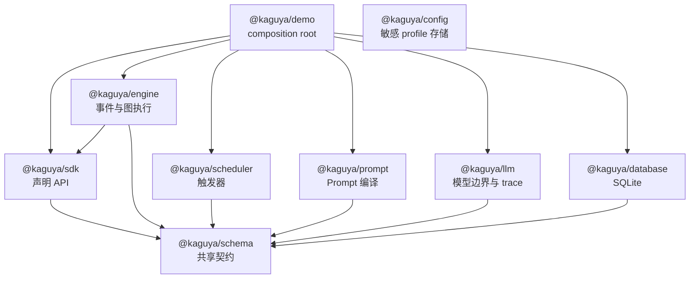
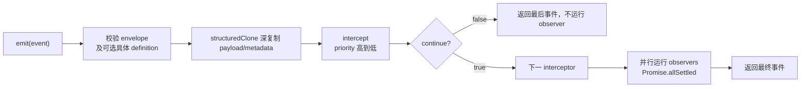
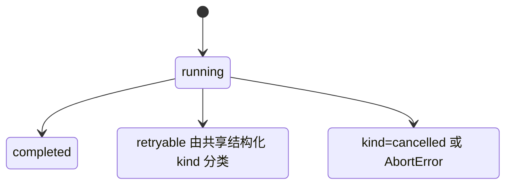
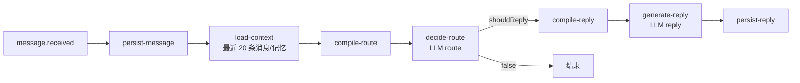
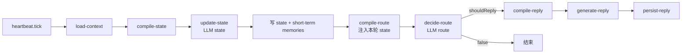
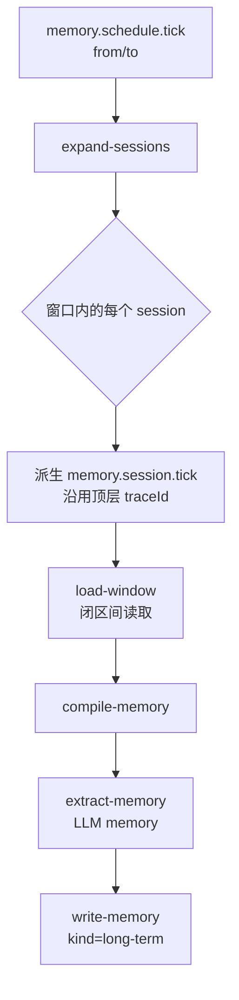
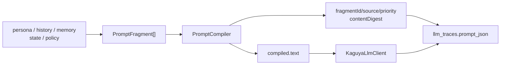
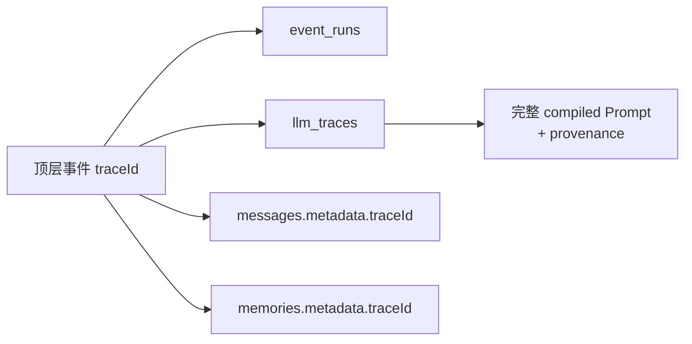

# Kaguya 架构

本文描述当前代码已经实现的 3.1 基础设施，不把设计文档中的后续设想当作现状。`@kaguya/config` 已提供本地敏感配置存储；平台适配器、真实 provider 的执行装配、配置 UI、平台/插件运行时接线、生产队列和跨进程调度仍不在当前范围内。

## 从会议 3.1 到代码

| 会议关注点                     | 实现位置               | 当前职责                                                                 |
| ------------------------------ | ---------------------- | ------------------------------------------------------------------------ |
| 事件包含什么、如何触发         | `@kaguya/schema`       | 定义统一事件信封及消息、记忆、Prompt、节点运行和 LLM trace 契约          |
| 快速定义事件、监听器、节点和边 | `@kaguya/sdk`          | `defineEvent`、`defineListener`、`defineNode`、`defineWorkflow`          |
| 特殊事件触发什么               | `@kaguya/engine`       | 拦截/观察监听器；校验并执行无环工作流；记录每个节点生命周期              |
| 心跳和长间隔任务               | `@kaguya/scheduler`    | 手动、固定间隔和六字段 cron 触发器；payload 与业务执行器由应用注入       |
| 多来源 Prompt 的来龙去脉       | `@kaguya/prompt`       | 按优先级稳定编译片段，转义边界字符，并生成每片段 SHA-256 provenance      |
| 找到并统一所有 LLM request     | `@kaguya/llm`          | 单一生成边界、四类输出校验、错误归一化、成功/失败 trace                  |
| 消息、memory 和运行记录        | `@kaguya/database`     | SQLite 迁移与 messages、memories、event_runs、llm_traces repositories    |
| 用户配置 profile 与会话选择    | `@kaguya/config`       | 明文 JSON profile 持久化、仅元数据列表、会话选择与默认 profile 回退      |
| 消息流转图和三类 bot 逻辑      | `@kaguya/demo`         | 组装消息、心跳、定时记忆工作流；注入数据库、事件总线、Prompt 与 LLM 服务 |
| 测试关键 Prompt                | `promptfooconfig.yaml` | 离线调用真实 PromptCompiler，验证 route/reply/state/memory 的精确结构    |

`apps/demo` 是 composition root。基础包只提供契约或能力，不知道具体业务 workflow；应用把实现放进 `WorkflowContext.services`，节点通过带类型检查的 getter 取回服务。

## 包与依赖方向



这些方向由 workspace 依赖和 TypeScript project references 共同表达。`schema` 不知道任何实现；`engine` 不直接创建数据库；`llm` 只通过 `LlmTraceWriter` 写 trace；业务 policy 和 workflow 只存在于应用层。`@kaguya/config` 是独立包，不依赖 `@kaguya/database`，当前也没有应用代码连接它。

## 用户配置边界

`@kaguya/config` 将一个调用方显式指定的配置根目录保存为以下布局；根目录整体均为敏感数据，`index.json` 中的元数据和会话绑定也不能公开。

```text
<config-root>/
├── index.json
└── profiles/
    └── profile_<uuid>.json
```

`FileUserConfigManager.open({ rootDir })` 创建或打开存储。它提供 `listProfiles()`（只返回元数据）、`getProfile()`、`createProfile()`、`updateProfile()`、`deleteProfile()`、默认 profile 读写、会话绑定/解绑和 `resolveProfile()`；未绑定会话解析到默认 profile。profile JSON 中的 API key、平台凭据和插件设置以明文保存，因此完整 profile 只应在运行时代码确有需要时读取。

在 POSIX 上，根目录和 `profiles/` 目录会校正为 `0700`，index、profile 和临时文件会校正为 `0600`。受管目录或文件中的符号链接、越出根目录的路径和不属于当前用户的 POSIX 路径会被拒绝。写入先同步唯一临时文件，再以原子替换落盘，并在支持时同步父目录；同一 manager 实例内会串行化修改。该实现不提供跨进程锁，同一配置根目录只能有一个写进程。Windows 不具备等价的 POSIX mode 保证，部署者必须配置只允许运行身份访问的 NTFS ACL。

该包当前只实现存储和选择语义，`apps/demo` 尚未消费 profile。配置 UI、真实 provider adapter/execution，以及平台和插件的运行时 wiring 仍须按 [人工待实现路线图](remaining-work.md) 完成；配置 package 不连接 SQLite database。

## 事件模型

所有事件使用 `EventEnvelope`：

```ts
interface EventEnvelope<TType = string, TPayload = unknown> {
  id: string;
  type: TType;
  source: string;
  occurredAt: string;
  traceId: string;
  sessionId?: string;
  payload: TPayload;
  metadata: Record<string, unknown>;
}
```

| 字段         | 语义                                                                            |
| ------------ | ------------------------------------------------------------------------------- |
| `id`         | 单个事件的唯一标识；派生事件获得新 ID                                           |
| `type`       | 路由监听器与校验业务 payload 的稳定类型                                         |
| `source`     | 适配器、调度器或工作流节点等事实来源                                            |
| `occurredAt` | ISO 8601 时间；schema 要求带合法时区信息                                        |
| `traceId`    | 一次顶层消息、心跳或记忆调度及其全部节点、派生事件和 LLM 调用共享的关联键       |
| `sessionId`  | 会话事件必填；当前只有全局 `memory.schedule.tick` 可以省略                      |
| `payload`    | 由具体事件入口再次用严格 Zod schema 校验的业务数据                              |
| `metadata`   | 不参与核心 schema 的扩展信息；派生记忆事件使用 `parentEventId`、`parentTraceId` |

应用层 `dispatchEvent` 接收具体 `EventDefinition`，在发布前检查信封、事件类型和具体 payload，并把事件的 `traceId`、`sessionId` 与 `WorkflowContext` 严格绑定；`EventBus` 还会在每个 interceptor 改写后重复这些检查。只有发布继续且最终事件仍有效时才会调用 `WorkflowEngine`，因此错误输入不会先创建 `event_runs`、消息、memory 或 LLM trace。

当前 demo 实际使用的输入与派生事件如下：

| 事件                     | 范围 | 触发/生产者                   | 结果                            |
| ------------------------ | ---- | ----------------------------- | ------------------------------- |
| `message.received`       | 会话 | demo；未来由平台 gateway 产生 | 启动消息工作流                  |
| `message.persisted`      | 会话 | 消息 repository 写入后        | 确认消息已经落库                |
| `heartbeat.tick`         | 会话 | demo 可执行文件直接 dispatch  | 启动短时状态与主动路由工作流    |
| `memory.schedule.tick`   | 全局 | demo 可执行文件直接 dispatch  | 在有效窗口内枚举 session        |
| `memory.session.tick`    | 会话 | `expand-sessions` 内部派生    | 经同一 dispatch 边界启动子流程  |
| `route.requested`        | 会话 | route LLM 调用前              | 标记真实路由边界                |
| `route.decided`          | 会话 | route LLM 成功后              | 暴露 `shouldReply` 与 reason    |
| `prompt.compiled`        | 会话 | 所有 compile 节点             | 暴露 kind 与 provenance         |
| `llm.requested`          | 会话 | 应用层 LLM lifecycle adapter  | 模型调用开始                    |
| `llm.completed`          | 会话 | 应用层 LLM lifecycle adapter  | 模型调用成功                    |
| `llm.failed`             | 会话 | 应用层 LLM lifecycle adapter  | 模型调用失败及规范化错误分类    |
| `memory.write.requested` | 会话 | memory repository 写入前      | 标记实际写入边界                |
| `memory.written`         | 会话 | memory repository 写入后      | 确认 memory ID 和 kind 已持久化 |
| `reply.generated`        | 会话 | reply LLM 成功后              | 暴露已校验的结构化回复文本      |

除内部 fan-out 使用的 `memory.session.tick` 外，上表事件都由 `apps/demo/src/events.ts` 中导出的 `defineEvent` 目录定义。工作流不会通过任意字符串构造这些事件。

## 监听器语义

`EventBus` 对同一事件类型先执行 intercept，再执行 observe：



- intercept 串行运行，可以返回改写后的事件；`continue: false` 立即停止。
- 初始信封在任何 handler 和克隆前校验；每个 interceptor 的改写在下一 handler/observer 前再次校验。
- emit 输入及每个 observe 都使用独立的深层结构化副本；observer 改写嵌套 payload/metadata 也不会污染调用者或业务结果。
- payload/metadata 含函数等不可结构化克隆的数据时，`EventCloneError` 会标明事件类型和失败字段；初始输入在 interceptor 前失败，observer 副本失败则按 observer error 处理。
- observer 失败交给 `onObserverError`，错误报告器自身失败也不会覆盖已完成的业务结果。
- 订阅返回幂等的取消函数。

当前总线是进程内发布/订阅，不是持久化队列；重启恢复、背压和跨进程投递属于后续能力。

## 节点、边与执行器

`WorkflowNode<I, O>` 接收上游输入和 `WorkflowContext`，异步返回输出。`WorkflowEdge` 连接两个节点，可用 `when(output)` 决定是否进入分支。`defineWorkflow` 在启动前保证：

- workflow 与 node ID 非空，node ID 唯一；
- 每条边的两端都存在；
- 图中不存在环；
- 未显式指定入口时恰好只有一个入度为零的节点。

执行器从入口开始按 FIFO 调度。节点只会被调度一次，因此多个前驱指向同一 join 节点时，当前实现把第一个到达的输出传给它；它不是等待所有前驱的 barrier。需要聚合时应在单一上游节点中显式聚合，或先扩展引擎语义和测试。

每次节点运行在 `event_runs` 形成生命周期：



执行器会先记录 `running`，再以相同 run ID 写最终状态。共享的结构化分类契约识别 `retryable`、`non-retryable` 和 `cancelled`，因此无需让 engine 依赖 llm 就能识别 `KaguyaLlmError.kind`。节点异常在记录后继续向调用方抛出；若终态记录也失败，原节点错误仍是主错误，并附带带 cause 的 `WorkflowRunRecordingError`。当前引擎只分类，不自动重试。

## 三条工作流

### 消息工作流



用户消息先落库，所以 route Prompt 能看到当前消息。route 包含 persona、历史、memory 和 route policy；reply 重新读取上下文，只包含 reply persona、历史、memory 和 reply policy。路由为 false 时条件边关闭，后续节点不会运行。

### 心跳工作流



state 输出必须包含 `mood`、`relationship` 和 `shortTermMemories`。状态概览以 `kind=state` 写入，数组项以 `kind=short-term` 分别写入。随后 route 读取最新数据库上下文，并额外注入本轮结构化 state。调度器只负责产生 tick；demo 使用手动触发，测试不真实等待。

### 定时记忆工作流



顶层事件没有 `sessionId`。`expand-sessions` 只枚举请求窗口内有消息的会话，为每个会话创建新 event ID，但保留顶层 `traceId`，并在 metadata 记录 parent。派生事件先经过 EventBus，拦截器可以跳过某个会话。`listWindow` 与 Promptfoo 用例都把 `from`、`to` 视为包含端点的闭区间。

当前 fan-out 按会话串行执行。默认每日 cron 是设计上的装配方式，不在 demo 内启动常驻真实计时器。

## Prompt 组装与 provenance

每个片段包含 `id`、`source`、`priority`、`content` 和 `metadata`。允许的来源是 `template`、`history`、`memory`、`persona`、`policy`、`state`。

编译过程：

1. 若 `metadata.scope` 是字符串，必须等于本次 `kind`。
2. 按 `priority` 从小到大排序；相同优先级保留传入顺序。
3. 转义 ID 属性和正文中的 XML 边界字符。
4. 生成 `<source source="fragment-id">…</source>` 文本。
5. 为每个原始 `content` 计算 SHA-256，并连同来源、优先级写入 provenance。



digest 用于识别内容，不用于恢复或隐藏内容；完整片段和最终 Prompt 也会保存在 trace 中。Prompt 可能包含用户内容，因此生产环境需要在保留可追踪性的同时补充访问控制与保留策略。

## LLM 边界与 trace

`KaguyaLlmClient.generate` 是工作流唯一的文本生成边界。请求必须携带 `kind`、`modelId`、完整 compiled Prompt、`traceId`、`workflowId` 和 `nodeId`。

四类响应在返回业务节点前严格解析：

| kind     | 结构                                                                  |
| -------- | --------------------------------------------------------------------- |
| `route`  | `{ shouldReply: boolean, reason?: string }`                           |
| `reply`  | `{ text: string }`                                                    |
| `state`  | `{ mood: string, relationship: string, shortTermMemories: string[] }` |
| `memory` | `{ memories: string[] }`                                              |

四个 schema 由 `@kaguya/llm` 统一导出并由 demo 直接复用。reply、state、可选 route reason 以及每条短期/长期 memory 都先 trim 再要求非空；memory 数组本身可以为空。空白结构会成为不可重试响应错误，不会到达消息或 memory repository。

每次调用无论成功或失败都先尝试写 trace：

- 成功保存响应、归一化 usage、起止时间和耗时；
- provider、JSON 或结构错误归一化为 `retryable`、`non-retryable`、`cancelled`；
- 成功调用若 trace 写入失败，抛出 `TracePersistenceError`，不假装业务成功；
- 模型本已失败且 trace 也写失败时，模型错误保持主错误，并附带 `traceWriteError`。

demo 注入 `MockLanguageModelV3` 并按调用顺序返回确定性 JSON；不配置真实 provider，不访问网络。

`apps/demo` 的 `LlmLifecycleClient` 包装上述生成边界，在应用层发布 `llm.requested/completed/failed`，因此 `@kaguya/llm` 和 `@kaguya/engine` 仍然彼此独立。

## SQLite schema

迁移在 `BEGIN IMMEDIATE` 事务中创建 `schema_migrations`，按整数 version 只执行一次，成功后与版本记录一起提交。

| 表                  | 关键列                                                                                                     | 用途                                           |
| ------------------- | ---------------------------------------------------------------------------------------------------------- | ---------------------------------------------- |
| `schema_migrations` | `version`, `migrated_at`                                                                                   | 已应用迁移                                     |
| `messages`          | `id`, `session_id`, `role`, `content`, `occurred_at`, `metadata_json`                                      | 用户、assistant、system 历史                   |
| `memories`          | `id`, `session_id`, `content`, `occurred_at`, `metadata_json`                                              | state、short-term、long-term，由 metadata 区分 |
| `event_runs`        | `id`, `trace_id`, `workflow_id`, `node_id`, `started_at`, `completed_at`, `status`, output/error/retryable | 工作流节点生命周期                             |
| `llm_traces`        | `id`, trace/workflow/node/kind/model、`prompt_json`、时间、status、response/usage/error JSON               | 完整 Prompt provenance 与模型结果              |

消息和记忆按 `(session_id, occurred_at)` 建索引；运行和 LLM trace 按 `(trace_id, started_at)` 建索引。写入使用参数化 SQL，业务 workflow/LLM 边界先校验输入；读取时 repository 用 Zod 重建完整记录，损坏的 JSON 或非法状态会作为 `DatabaseRecordError` 暴露，而不是静默返回部分数据。



SQLite 是当前单进程本地实现。表之间没有外键，因为 trace、workflow 和应用业务对象是逻辑关联；生产实现需要另行评估并发、备份、保留期限和敏感 Prompt 的访问控制。

## 调度器边界

- `ManualTrigger` 适合测试、CLI 和外部调度系统；未启动时 `fire` 明确失败。
- `IntervalTrigger` 要求 1 到 `2_147_483_647` 毫秒的整数间隔，取消后不再创建 payload。
- `CronTrigger` 接受六字段表达式，由注入的 `calculateNextRun` 计算下次时间；超出 Node 单次 timeout 上限时分段重新 arm。
- handler 错误交给 `onError`，interval 不等待前一次 handler 完成，调用方需自行决定是否允许重叠。

scheduler 不知道事件总线或 workflow；应用负责把 trigger payload 变成事件并选择执行器。

## 已知限制与演进原则

- EventBus、scheduler 和 workflow queue 都是进程内能力，没有持久投递或分布式锁。
- workflow 是 DAG；没有循环、补偿、自动重试或真正的多前驱 join。
- demo 的 service registry 是运行时 record，getter 负责类型守卫；以后可替换为更强的依赖注入。
- state 和不同期限 memory 共用一张表，以 metadata 区分；更复杂检索可在不改变事件信封的前提下替换 repository。
- 当前 Prompt 编译结果是单一文本，不是多模态 message array。
- 先扩展契约和失败测试，再扩展实现；应用层 policy 不应下沉到通用基础包。
