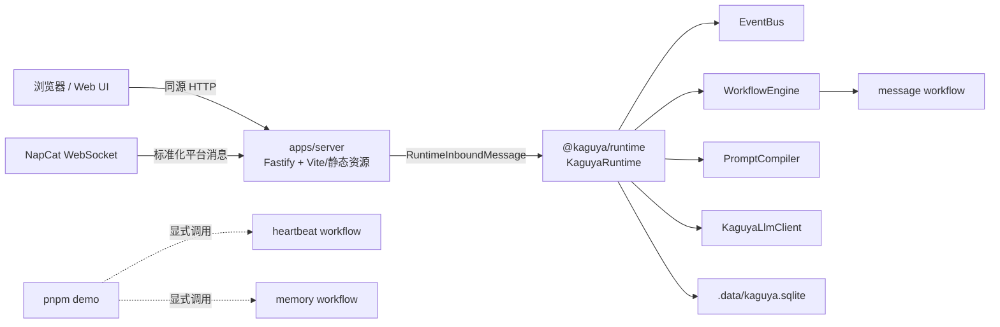
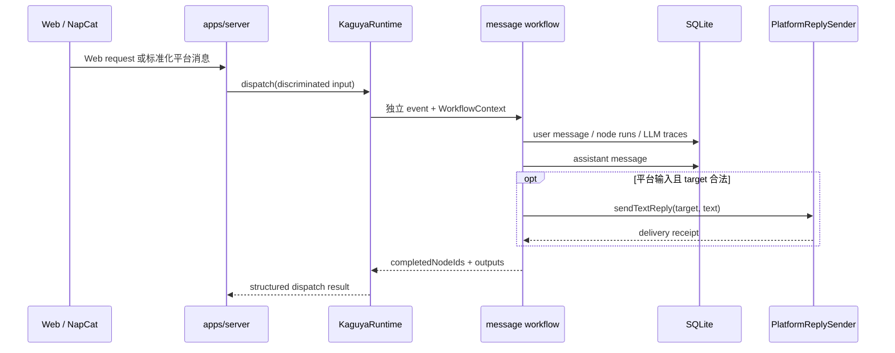

# Kaguya 架构

Kaguya 采用一个长期运行进程、一个应用入口和一个共享 Runtime。`apps/server` 是唯一 composition root；`@kaguya/runtime` 是唯一业务运行时。Web、HTTP API 和可选 NapCat 不再各自创建数据库、EventBus 或工作流组件。

## 运行形态



开发模式下，Vite middleware 和 HMR 挂在 Fastify 的 `127.0.0.1:3000` 上。生产模式下，同一个 Fastify 实例提供 `apps/web/dist`；SPA fallback 只处理浏览器页面路由，不覆盖 `/api/*` 或 `/healthz`。

NapCat 是可选入站。未启用、断线或重连时，HTTP 和 Web UI 保持可用。

## Composition root 与依赖方向

| 层             | 位置                                                   | 职责                                                           |
| -------------- | ------------------------------------------------------ | -------------------------------------------------------------- |
| 应用装配       | `apps/server`                                          | 配置、根 Logger、Runtime、Fastify、Web、NapCat、信号和关闭顺序 |
| 运行时         | `packages/runtime`                                     | dispatch、事件定义、LLM lifecycle、工作流及共用节点            |
| 演示           | `apps/demo`                                            | 显式执行 message、heartbeat、memory；不提供长期服务            |
| 执行基础       | `packages/engine`、`packages/sdk`                      | EventBus、工作流执行器和声明 API                               |
| 数据与模型边界 | `packages/database`、`packages/prompt`、`packages/llm` | SQLite、Prompt 编译、模型调用和 trace                          |
| 契约           | `packages/schema`、`packages/platform-adapters`        | 事件/数据 schema 与标准化平台消息/回复接口                     |

依赖方向为 `apps/server -> runtime -> 基础 packages`。Runtime 不读取 Server 环境变量，也不拥有 HTTP 或 WebSocket；Server 不重建 Runtime 内部组件。

## `KaguyaRuntime`

公开生命周期：

```ts
const runtime = new KaguyaRuntime({ databasePath, logger });
await runtime.start();
const result = await runtime.dispatch(message);
await runtime.close();
```

- `start()` 创建父目录、打开并迁移一个 SQLite 文件，然后初始化共享 EventBus、WorkflowEngine、PromptCompiler、LLM client、message workflow 和日志 observer。重复 `start()` 在已经启动时无副作用，关闭后不能重启。
- `dispatch()` 接受 Web/platform 判别联合类型。每次调用创建独立 `WorkflowContext`、`services`、事件和 trace scoped ID factory；当前事件、sender 或 session 不保存在共享可变字段中。
- `close()` 先停止接受新 dispatch，再等待所有在途 dispatch，最后关闭数据库；重复调用共享同一个结果并保持幂等。

Web trace 固定为 `webui-${requestId}`。平台消息保留 adapter 提供的 `traceId`、`sessionId`、`platform` 和标准化 metadata。返回结果包含 `traceId`、`workflowId`、完成节点、是否中断，以及平台消息可能产生的 delivery receipt。

## 消息链路



Web 输入没有 `PlatformReplySender`，因此绝不会触发平台发送。平台输入只携带该条消息对应的 sender；消息 workflow 在 sender 和合法 target 同时存在时才投递。

主程序的确定性模型按 LLM kind 解析，并可被并发 dispatch 安全复用。LLM trace record ID 由每次请求显式传入，不再固化在 client 构造阶段。真实 provider 和 config profile 尚未装配。

## 三条工作流

| 工作流    | 入口事件               | 长期 Server 是否触发         | 用途                                                       |
| --------- | ---------------------- | ---------------------------- | ---------------------------------------------------------- |
| message   | `message.received`     | 是，仅由 Web/NapCat 入站触发 | 持久化消息、加载上下文、route、reply、持久化和可选平台发送 |
| heartbeat | `heartbeat.tick`       | 否                           | 确定性 demo 中验证状态更新与主动路由                       |
| memory    | `memory.schedule.tick` | 否                           | 确定性 demo 中按时间窗口展开会话并写长期记忆               |

heartbeat/memory 的定义和共用节点位于 Runtime 包中，但 `apps/server` 不创建 scheduler、不注册 timer，也不自动 dispatch 它们。`pnpm demo` 是唯一现成执行入口。

## 数据边界

Runtime 默认只打开 `.data/kaguya.sqlite`。Web 和 NapCat 消息因而共享 messages、memories、event_runs 和 llm_traces repositories。旧 `.data/kaguya-api.sqlite` 与 `.data/kaguya-bot.sqlite` 留在磁盘，不读取、不迁移、不合并、不删除。

Runtime 将平台 raw payload 排除在业务持久化数据之外。普通日志同样不记录消息正文、Prompt、模型输出、raw payload、target ID、Token、WebSocket URL 或完整配置；Prompt/模型输出只进入受控数据库 trace。

## 关闭顺序

正常关闭和启动失败清理遵守同一资源所有权：

1. Fastify 停止 HTTP 新入站，NapCat supervisor 停止连接与重连；
2. 等待 HTTP/NapCat 在途调用结束；
3. Runtime 停止新 dispatch、等待其在途任务并关闭 SQLite；
4. 关闭 Vite dev server（生产静态资源没有额外进程）；
5. flush 并关闭根 Logger。

任何已经创建的资源在后续启动阶段失败时按逆序清理。NapCat 初次连接失败属于可恢复状态，不会让 Server 启动失败。

## 事件与日志上下文

所有业务事件使用 `EventEnvelope`，并由具体 `EventDefinition` 校验。`requestId` 在 HTTP hook 中进入日志上下文；Runtime 追加 `traceId/sessionId`；EventBus observer 和 recorder wrapper 再追加 `eventId` 或 `runId/workflowId/nodeId`。AsyncLocalStorage 让并发消息保持隔离。

日志模块固定为 `server`、`server:http`、`runtime`、`runtime:event`、`runtime:workflow`、`adapter:napcat`、`llm`。完整事件和排障表见 [结构化日志](logging.md)。
