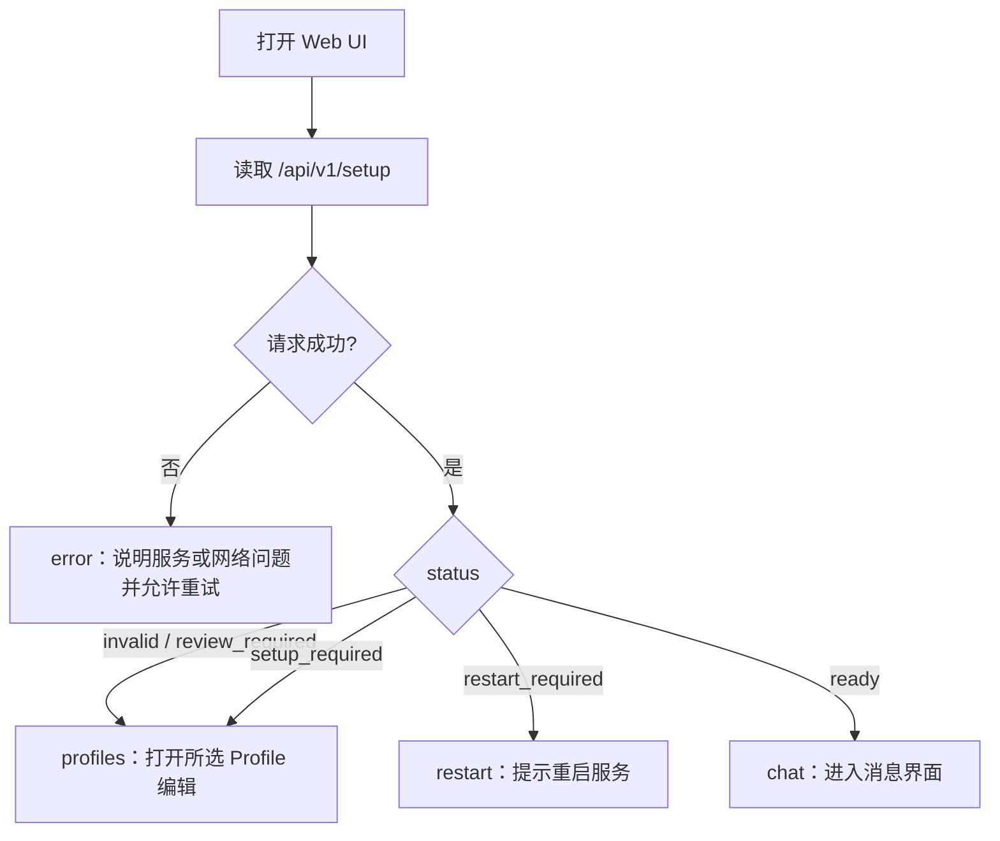

# 配置流程设计

配置界面的任务是把“Runtime 启动前必须满足的技术约束”翻译成用户能完成的步骤。用户不需要先理解 registry 或 dependency injection，但必须知道当前缺什么、保存是否成功、为什么需要重启。

## 页面决策流程

配置目录不存在时，Server 会先创建 v3 registry 和保留的 `default` Profile；因此当前正常服务流程通常直接看到 `invalid` 或 `review_required`，而不是要求用户手工建立目录。客户端仍保留 `setup_required` 兼容分支。

## Profile 管理页

**列表区域** — 显示 Profile 名称、标识和当前选中状态。选中是全局行为，不是只改变当前浏览器视图。

**创建** — 只创建一个未选中的空 Profile，不会立刻切换 Runtime。创建后应引导用户继续编辑，而不是暗示配置已生效。

**编辑** — 当前表单提供名称、OpenAI-compatible Base URL、API Key、light model、heavy model，以及对“平台和插件暂为空”的明确确认。light 与 heavy 必须是不同的模型目标。

**选择** — 改变全局 selected Profile。选择变化后，当前进程需要重启才能让 Runtime 使用新配置。

**删除** — 只能删除既不是 `default`、也不是当前选中的 Profile。界面应在操作前说明限制，并在服务端拒绝时保留原列表。

## 保存后的反馈

保存非选中 Profile 时，配置通常可以留待以后使用，不要求当前服务重启。保存当前选中 Profile，或切换选中 Profile，会返回 `restartRequired: true`；界面应进入独立的重启提示状态。

重启不是保存失败。磁盘配置已经写入，但当前 Runtime 的模型客户端是在启动阶段创建并冻结的。用户需要停止并重新运行 Server，然后刷新页面。

## 必须覆盖的异常状态

**加载中** — 保留稳定页面骨架，避免用户在 setup 请求完成前操作错误表单。

**字段错误** — 在相关字段附近说明原因，同时保留其他输入；不要只显示一个笼统 toast。

**认证失效** — Server 重启后随机 token 会变化。页面重新读取本实例 token，再重试受保护请求。

**配置不可用** — 配置损坏、权限不安全、符号链接或路径越界属于需要维护者处理的错误，界面不得自动覆盖原文件。

**网络或服务错误** — 展示可重试操作；若响应包含 requestId，应保留给日志排查。

**危险操作** — 删除 Profile 需要明确确认；禁止状态必须同时用文字说明，不能只降低透明度。

## 响应式与无障碍

桌面端可以并列显示 Profile 导航和编辑区；窄屏应改为顺序操作，先选择 Profile，再进入编辑。所有输入必须有可见标签，键盘焦点清晰，错误与成功反馈通过文字或 `aria-live` 被辅助技术感知。触控目标应留出足够尺寸，长 URL、模型 ID 和错误信息可以换行而不撑破视口。

## 文档与 UI 的分工

界面只提供完成当前操作所需的解释；完整的安装、安全和架构背景由文档承担。界面中的“了解更多”应链接到具体章节，而不是文档首页：配置字段链接到[配置 Kaguya](../guide/configuration)，重启原因链接到[配置生命周期](../developers/configuration-lifecycle)，错误处理链接到[故障排查](../guide/troubleshooting)。
