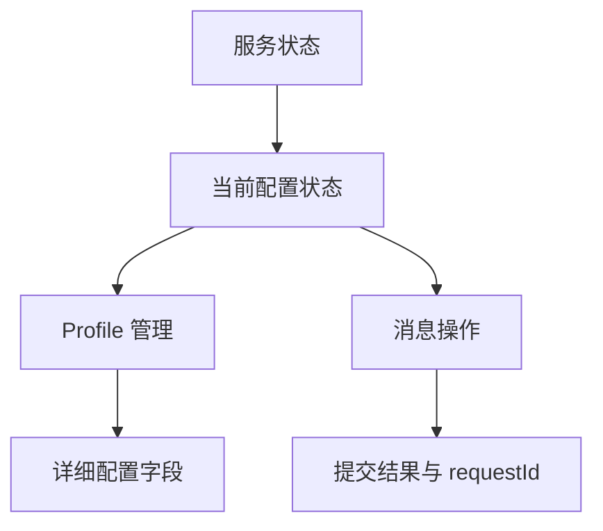

# 界面设计

Kaguya Web UI 属于 **Operate（操作型）** 界面：用户的主要目标不是浏览宣传内容，而是判断服务是否可用、完成配置并提交消息。界面应优先提供明确状态、可靠反馈和可恢复路径，而不是增加装饰性层级。

## 面向谁设计

**首次使用者** — 可能不了解 Provider、Profile 或进程重启，需要从“缺少什么”直接走到“下一步做什么”。

**日常使用者** — 希望快速确认当前 Profile，进入聊天，并在出现错误时知道消息是否已被系统接受。

**维护者** — 需要借助 requestId、配置状态和日志事件定位问题，但不应让普通用户先理解内部架构。

## 信息层级

页面先回答“现在能不能用”，再提供当前任务，最后才展示内部细节。Profile 列表和编辑表单属于配置任务；消息输入属于运行任务，两者不应在同一时刻争夺主要操作位置。

## 视觉系统

**品牌色** — 月牙图标中的橙色是主要强调色，用于主按钮、焦点和当前状态。浅色背景使用暖白，深色背景保持足够对比度。

**形状** — 圆角用于输入框、按钮和必要的状态容器；避免把每一段内容都包进嵌套卡片。

**层级** — 字号、字重、间距和边框共同表达层级。颜色不能成为区分错误、成功或选中状态的唯一手段。

**动效** — 只用于反馈加载、保存和页面状态切换；尊重 `prefers-reduced-motion`，不让动画阻碍操作。

**图标** — 复用项目月牙图标与现有图标体系。图标辅助文字，不单独承担不可猜测的操作含义。

## 当前页面状态

Web UI 当前以有限状态机组织首屏：`checking`、`profiles`、`restart`、`chat` 和 `error`。页面加载时携带本实例 token 读取 Profile readiness，再决定进入 Profile 管理、重启提示或消息界面。

设计与实现的对应关系详见[配置流程设计](./configuration-flow)。用户如何实际操作见[配置 Kaguya](../guide/configuration)和[使用 Web UI](../guide/webui)。

## 模块检查的信息组织

模块页先回答“发生了什么、为什么、依据是什么”，再展示配置与技术细节。调研参考了 MaiBot 的会话、表达习惯和记忆管理界面，以及 [MaiBot 数据与记忆 API](https://docs.mai-mai.org/develop/webui-api/data-and-memory-api) 与 [AstrBot WebUI 文档](https://docs.astrbot.app/use/webui.html)：可读名称、业务字段、列表筛选和详情追溯比直接铺开 JSON 更适合作为检查入口。

Kaguya 按模块职责组织视图：注意力展示门控结果、当时阈值与原因；表达展示情境、风格与验证结果；记忆展示实际文档和索引元数据；调度与回合展示历史及来源。每个第一方模块在 Manifest 中声明检查视图与机制说明，由检查 API 从已有事实账本生成可读字段，不另外维护一份运行事件库。

页面默认展示摘要，正文、完整字段和原始 JSON 可逐级展开。时间、实例和类型筛选在分页前执行，来源信息可继续追溯。历史记录不冒充当前活动状态，当前配置不冒充历史决策依据；未启用向量表与查询结果为空也分别说明。移动端将列表与详情纵向排列，选择记录后将焦点移至详情。

## 事实与后续设计

本栏目供界面维护者查阅，用户操作以[用户手册](../guide/)为准。Web 已支持整条回复和当前会话恢复，配置支持显式应用；逐字输出和旧会话列表尚未提供。新设计应标明哪些能力已实现，并同步更新对应的操作指南。
