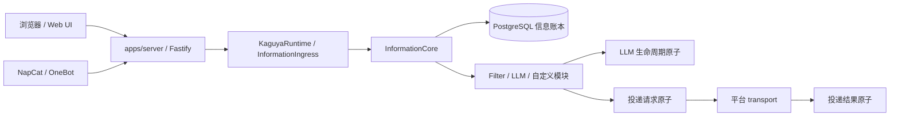
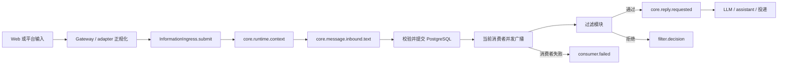

# 运行时架构

Kaguya 使用一个长期运行进程、一个 composition root 和一个共享 Runtime。`apps/server` 负责读取配置、冻结全局 Profile、连接数据库并装配 HTTP/Web/NapCat；`@kaguya/runtime` 负责唯一的 `InformationIngress`、信息 DAG、LLM 生命周期和投递结果。

Core 中每项运行事实都是不可变 `InformationAtom`，且只以 `informationId` 作为身份。外部平台消息 ID、HTTP request ID、用户与群组 ID 仍可作为领域数据，但它们不构成 Core 身份，也不建立 session 或隐式上下文隔离。

## 运行形态



开发模式把 Vite middleware 与 HMR 挂在 Fastify 内；生产模式由同一实例提供 `apps/web/dist`。NapCat 是可选 ingress 与 transport，连接失败不会停止 HTTP 服务或改变 `/healthz`。

## 持久化优先的信息流

`InformationCore.register()` 是唯一的原子写入入口。它生成信息原子并完成 Kind、payload 与引用校验，提交 PostgreSQL 账本；提交成功后，Core 取得该 Kind 的当前消费者快照并并发执行消费者。



提交失败时不会广播；提交成功后，即使没有消费者，原子也保留。广播只面向注册瞬间的消费者快照，多个消费者独立并发执行，不存在优先级、拦截器、短路或定向派发。后来注册的消费者不会收到历史原子。

## 显式 Kind 推进业务 DAG

默认模块链通过注册下一个 Kind 表达阶段关系：

```text
core.runtime.context
  -> core.message.inbound.text
  -> core.reply.requested
  -> core.llm.requested
  -> core.llm.completed
  -> core.message.assistant.text
  -> core.delivery.requested
  -> core.delivery.delivered | core.delivery.failed

core.llm.requested
  -> core.llm.failed（终止该分支）
```

每条派生边都带有直接输入的 `core:caused-by` 引用，并继承唯一的 `core:context`。过滤器通过时显式注册 `core.reply.requested`；拒绝时只注册 `filter.decision`，其中记录 `accepted: false`、原因和过滤器定义 ID。Core 不解释“下一过滤器”或成功标记，也不负责模块执行顺序。

LLM 失败与投递失败同样是账本中的事实，分别以 `core.llm.failed` 与 `core.delivery.failed` 表达。平台发送成功后注册 `core.delivery.delivered`；外部平台消息 ID 如有需要保存在该结果 payload 内。

## 消费者失败不会回滚已提交事实

订阅者抛出或 reject 时，Core 追加 `consumer.failed`。其中包含稳定的消费者身份与脱敏后的错误类别，不保存 stack、原始 provider 错误、凭据或数据库 URL。输入原子不会回滚，其他消费者不会被取消，原始 `register()` 调用也不会因该消费者失败而失败。

`consumer.failed` 的消费者若再次失败，或失败事实无法提交，Core 只交给 bootstrap 诊断边界，不递归生成失败原子。因此系统没有自动重试，也没有内建工作队列。

## 配置、模型与数据边界

`KAGUYA_DATABASE_URL` 是必填的 PostgreSQL 连接 URL。Server 通过 `KaguyaDatabase.connect()` 建立连接，Runtime 启动时在一个数据库事务中执行可重复的迁移。`information_atoms.payload` 使用 `JSONB`，Kind、原子和显式引用由外键保护；原子、引用与日志投影 outbox 在同一事务写入，随后才由 outbox runner 投影日志。原子与引用由数据库触发器保持 append-only。Runtime 不写 SQLite 消息表、trace 表或出站审计表，旧 SQLite 数据不会自动迁移。

Profile Registry 维护一个全局 `selectedProfileId`。Server 在启动时只读取该 Profile 并构造共享 light/heavy 模型解析器；模块 settings、入站 payload 和信息原子不携带 `profileId`，也没有回退到其他 Profile、Provider 或模型的路径。

## 启动与关闭顺序

准备就绪的 Server 会加载配置、解析选中的 Profile、连接 PostgreSQL、构造 Runtime，注册 transport，启动 Core 和 ModuleHost，最后开放 HTTP 与平台 ingress。选中的 Profile 未就绪时，Server 只提供配置相关 HTTP/Web UI，Runtime、数据库连接和 NapCat ingress 不启动。

关闭时先停止 HTTP 与平台 ingress，再等待 Runtime 在途链路完成，取消模块订阅并关闭 Core，最后关闭数据库、Web 资源与 Logger。这个顺序防止新输入进入已经开始释放的资源。

## 有意保留的边界

当前实现没有持久订阅、离线补投、工作队列、自动重试、去重、热更新或模块沙箱。信息账本可供按显式引用查询，但它不是消费者回放机制；任何后续能力都应继续以 `informationId` 和显式 Kind 为边界。
