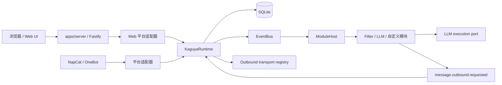
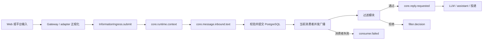

# 运行时架构

Kaguya 使用一个长期运行进程、一个 composition root 和一个共享 Runtime。`apps/server` 负责读取配置、冻结全局 Profile、连接数据库并装配 HTTP/Web/NapCat；`@kaguya/runtime` 负责唯一的 `InformationIngress`、信息 DAG、LLM 生命周期和投递结果。

Core 中每项运行事实都是不可变 `InformationAtom`，且只以 `informationId` 作为身份。外部平台消息 ID、HTTP request ID、用户与群组 ID 仍可作为领域数据，但它们不构成 Core 身份，也不建立 session 或隐式上下文隔离。

## 运行形态



开发模式把 Vite middleware 与 HMR 挂在 Fastify 内；生产模式由同一实例提供 `apps/web/dist`。Web 消息也先规范化为平台 `web`、adapter `web.ui.main` 的入站消息，再异步交给 Runtime。NapCat 是可选 ingress 与 transport，连接失败不会停止 HTTP 服务或改变 `/healthz`。

## 持久化优先的信息流

`InformationCore.register()` 是唯一的原子写入入口。它生成信息原子并完成 Kind、payload 与引用校验，提交 PostgreSQL 账本；提交成功后，Core 取得该 Kind 的当前消费者快照并并发执行消费者。



提交失败时不会广播；提交成功后，即使没有消费者，原子也保留。广播只面向注册瞬间的消费者快照，多个消费者独立并发执行，不存在优先级、拦截器、短路或定向派发。后来注册的消费者不会收到历史原子。

Web HTTP 请求只允许文本和 requestId。Web adapter 会补齐平台、sender 与 target 等规范字段；其他平台入站还包含经过 schema 校验的 adapter、平台消息 ID、self ID、destination、sender 和 mentions。adapter 原始 payload 不进入事件或持久化 metadata。

HTTP `202 accepted` 在 Web gateway 接收消息后立即返回；Runtime dispatch 在后台继续。该状态不证明事件链、模型调用或投递已经完成。

默认模块链通过注册下一个 Kind 表达阶段关系：

```text
core.runtime.context
  -> core.message.inbound.text
  -> core.reply.requested
  -> core.llm.requested
  -> core.llm.completed
  -> core.message.assistant.text
  -> core.delivery.requested
  -> core.delivery.delivered | core.delivery.failed

core.llm.requested
  -> core.llm.failed（终止该分支）
```

每条派生边都带有直接输入的 `core:caused-by` 引用，并继承唯一的 `core:context`。过滤器通过时显式注册 `core.reply.requested`；拒绝时只注册 `filter.decision`，其中记录 `accepted: false`、原因和过滤器定义 ID。Core 不解释“下一过滤器”或成功标记，也不负责模块执行顺序。

LLM 失败与投递失败同样是账本中的事实，分别以 `core.llm.failed` 与 `core.delivery.failed` 表达。平台发送成功后注册 `core.delivery.delivered`；外部平台消息 ID 如有需要保存在该结果 payload 内。

## 消费者失败不会回滚已提交事实

Server 启动时打开 Profile Registry，检查全局 selected Profile，再为 light/heavy target 创建模型客户端。Provider key 只存在于权限保护的 Profile JSON、配置管理器和 provider factory，不进入模块 settings、事件、Prompt 或日志。配置未 ready 时，HTTP 与 Web UI 仍可用，但 Runtime 和 NapCat ingress 不创建；完整流程见[配置生命周期](./configuration-lifecycle)。

`consumer.failed` 的消费者若再次失败，或失败事实无法提交，Core 只交给 bootstrap 诊断边界，不递归生成失败原子。因此系统没有自动重试，也没有内建工作队列。

## 配置、模型与数据边界

`KAGUYA_DATABASE_URL` 是必填的 PostgreSQL 连接 URL。Server 通过 `KaguyaDatabase.connect()` 建立连接，Runtime 启动时在一个数据库事务中执行可重复的迁移。`information_atoms.payload` 使用 `JSONB`，Kind、原子和显式引用由外键保护；原子、引用与日志投影 outbox 在同一事务写入，随后才由 outbox runner 投影日志。原子与引用由数据库触发器保持 append-only。Runtime 不写 SQLite 消息表、trace 表或出站审计表，旧 SQLite 数据不会自动迁移。

Profile Registry 维护一个全局 `selectedProfileId`。Server 在启动时只读取该 Profile 并构造共享 light/heavy 模型解析器；模块 settings、入站 payload 和信息原子不携带 `profileId`，也没有回退到其他 Profile、Provider 或模型的路径。

仓库还包含追加式 InformationLedger、PostgreSQL/PGlite 仓储和持久日志 outbox。这是下一阶段数据核心，当前未替换上述 SQLite 消息、LLM trace 与 outbound audit 路径；详见[信息账本](./information-ledger)。

## 启动与关闭顺序

正常启动先解析环境变量并打开配置管理；selected Profile ready 时，再打开并迁移 SQLite、注册 transport、创建 ModuleHost 与 Runtime，最后开放 HTTP 和可选 adapter ingress。若配置未 ready，只开放可用于修正配置的 HTTP 与 Web UI。

正常关闭先停止 ingress，等待 Runtime 在途 dispatch，停止 ModuleHost，再关闭数据库、Web 资源和 Logger。这个顺序避免新消息进入已经开始释放的基础设施。
