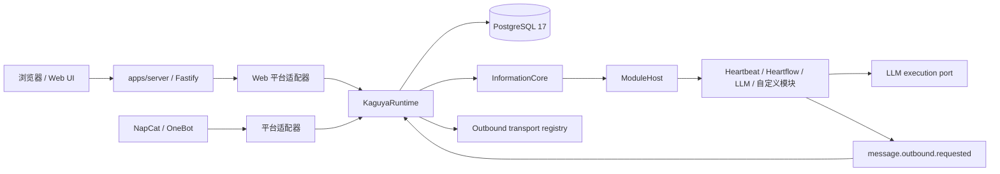
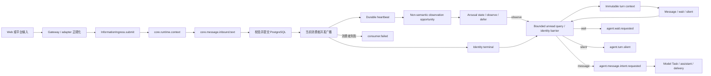

# 运行时架构

Kaguya 的正式服务使用一个长期运行进程。`apps/server` 负责读取配置、冻结全局 Profile、连接数据库并装配 HTTP/Web/NapCat；Server 与 `apps/demo` 通过 `@kaguya/composition` 共用 Runtime 业务装配。`@kaguya/runtime` 负责唯一的 `InformationIngress`、信息 DAG、LLM 生命周期和投递结果。

Core 中每项运行事实都是不可变 `InformationAtom`，且只以 `informationId` 作为身份。外部平台消息 ID、HTTP request ID、用户与群组 ID 仍可作为领域数据，但它们不构成 Core 身份，也不建立 session 或隐式上下文隔离。

## 运行形态



开发模式把 Vite middleware 与 HMR 挂在 Fastify 内；生产模式由同一实例提供 `apps/web/dist`。Web 消息也先规范化为平台 `web`、adapter `web.ui.main` 的入站消息，再异步交给 Runtime。NapCat 是可选 ingress 与 transport，连接失败不会停止 HTTP 服务或改变 `/healthz`。

## Runtime Composition 边界

`packages/composition/src/index.ts` 是 Server 与 Demo 共用的正式组装入口，不依赖任一应用。`createMessageCatalog(identity?)` 加载一方 Prompt 模板，将 Runtime 的 Model Task capability 和生命周期 Kind 注入 `@kaguya/modules` 的 Catalog 工厂；Server 的数据库 Kind 检查也使用该入口。

`createMessageComposition(resolveModelSelection, options)` 根据 `moduleConfigs` 校验并生成激活集合，注入身份、Memory 开关与可选 embedding/cognition provider、Model Task 审批及 LLM client，并绑定 Runtime 提供的 one-shot scheduler。返回值直接展开到 `new KaguyaRuntime(...)` 的参数中。模块定义与默认实例仍集中在 `packages/modules/src/first-party/catalog.ts`：新增或移除普通一方模块时，在这里调整目录和默认配置，并更新已有实例配置，无须分别修改 Server 和 Demo。若模块需要新的宿主能力，则只在共享 composition 中接线。

Server 传入 selected Profile 的模型解析器、身份、Memory 开关和已加载的模块配置；启动与配置热应用都走同一工厂。Demo 传入演示使用的模块配置，省略解析器时使用 `createDeterministicModelSelectionResolver()` 的固定模型回答，Memory 默认关闭。Demo 自己保留固定消息、时间、演示 transport 和账本统计输出，不维护模块目录或模型能力接线。

Composition 构造本身不连接数据库或调用模型，也不启动 timer。应用负责连接数据库、注册 transport、调用 `runtime.start()` / `runtime.close()` 并关闭自己拥有的资源；Runtime 统一管理模块、调度与任务生命周期。`pnpm dev`、`pnpm start` 和 `pnpm demo` 的入口不变。

## 持久化优先的信息流

`InformationCore.register()` 是唯一的原子写入入口。它生成信息原子并完成 Kind、payload 与引用校验，提交 PostgreSQL 账本；提交成功后，Core 取得该 Kind 的当前消费者快照并并发执行消费者。



提交失败时不会广播；提交成功后，即使没有消费者，原子也保留。广播只面向注册瞬间的消费者快照，多个消费者独立并发执行，不存在优先级、拦截器、短路或定向派发。后来注册的消费者不会收到历史原子。

Web HTTP 请求只允许文本和 requestId。Web adapter 会补齐平台、sender 与 target 等规范字段；其他平台入站还包含经过 schema 校验的 adapter、平台消息 ID、self ID、destination、sender 和 mentions。adapter 原始 payload 不进入事件或持久化 metadata。

HTTP `202 accepted` 在 Web gateway 接收消息后立即返回；Runtime dispatch 在后台继续。该状态不证明事件链、模型调用或投递已经完成。

默认在线链由 Heartflow 以可重放事实推进：

```text
core.runtime.context
  -> core.message.inbound.text
  -> agent.attention.arousal.activity -> 空闲休眠 one-shot deadline
  -> memory.identity.person.context.completed
  -> agent.heartbeat.scheduled
  -> core.schedule.one-shot.requested
  -> core.schedule.one-shot.due
  -> agent.heartbeat.fired
  -> agent.turn.candidate
  -> agent.attention.arousal.state.recorded
  -> agent.attention.arousal.completed
     -> awake 或收到唤醒信号: observe
     -> asleep 且无唤醒信号: defer -> agent.turn.terminal -> 等待周期 deadline 或直接通知
     -> observe: agent.turn.claimed -> agent.turn.started -> identity terminal
        -> agent.turn.context.completed -> agent.turn.plan.completed
     -> message: agent.message.intent.requested -> core.model.task.* -> core.message.assistant.text
               -> core.delivery.requested -> core.delivery.delivered | core.delivery.failed
               -> agent.turn.completed | agent.turn.failed
               -> core.model.task.failed | cancelled -> agent.turn.failed
     -> wait: agent.wait.requested -> agent.turn.waiting -> 下一代 heartbeat
     -> silent: agent.turn.silent
```

同一 destination scope 的 claim 带单调 generation。新 candidate 若在旧 claim 作出 Planner decision 前到达，会先赢得旧 claim 的 decision gate，再写入旧 turn 的 `superseded` 终态；旧分支不能继续产生 message intent。Candidate 不携带正文引用；Arousal 从最新 `agent.attention.arousal.state.recorded` 读取全局唤醒状态，没有事实时默认 `awake`。无消息与夜间休眠策略默认关闭，启用后分别以持久化绝对 deadline 实现预设两分钟无消息休眠、23:00–07:00 夜间休眠和五分钟周期唤醒。私聊、Web、@、回复、Focus 与周期复查重新确认 `awake`；`awake` 下普通机会也 observe。Heartflow 仅在 observe 后按候选的注册水位上下界读取未读，并等到每条 inbound 都具有 identity terminal 后冻结多输入 turn context。`message`、`wait`、`silent` 只由 Planner 决定，默认链中没有 inbound 直达 turn context、always-reply 或 speech-to-reply 桥接旁路。

每条派生边都带有直接输入的 `core:caused-by` 引用，并继承唯一的 `core:context`。跨入站合并时，模块只能把 context 重定位到当前 handler 通过声明式 Selector 选出的 `core.runtime.context`。Model Task、消费者重试耗尽和投递失败都是账本事实；平台发送成功后注册 `core.delivery.delivered`，并由 Heartflow 写入唯一 turn terminal。

## 消费者失败不会回滚已提交事实

Server 启动时打开 Profile Registry 与六个显式模块实例文件，检查全局 selected Profile，并先验证数据库连接、PostgreSQL 17、严格数据库 schema v1、`attention-observation.v1` 协议标记与 Runtime Kind。随后才为 light/heavy target 创建模型客户端。Provider key 只存在于权限保护的 Profile JSON、配置管理器和 provider factory，不进入模块 settings、信息原子、Prompt 或日志。AI 与数据库连接检查独立执行；schema 不兼容则在任何监听前退出。完整流程见[配置生命周期](./configuration-lifecycle)。

`consumer.failed` 的消费者若再次失败，或失败事实无法提交，Core 只交给 bootstrap 诊断边界，不递归生成失败原子。Core 不自动重试该失败通知，也没有内建工作队列。

## 配置、模型与数据边界

selected Profile 的 `runtime.databaseUrl` 是 PostgreSQL 连接真值，必填的 `databaseMode` 区分开发工具可管理的本地实例与完全外部的实例。Server 通过 `KaguyaDatabase.connect()` 建立连接并拒绝非 PostgreSQL 17；Runtime 启动时在一个数据库事务中执行可重复的迁移。`information_atoms.payload` 使用 `JSONB`，Kind、原子和显式引用由外键保护；原子、引用与日志投影 outbox 在同一事务写入，随后才由 outbox runner 投影日志。原子与引用由数据库触发器保持 append-only。

Profile Registry 维护一个全局 `selectedProfileId`。Server 在启动时只读取该 Profile 并构造共享 light/heavy 模型解析器；模块 settings、入站 payload 和信息原子不携带 `profileId`，也没有回退到其他 Profile、Provider 或模型的路径。

同一 Profile 还提供 host、port、Web 路径、CORS、可信代理、限流、日志、allowlist、Memory、平台与插件。应用环境只定位 `KAGUYA_CONFIG_ROOT`。Gateway Token 是每次启动生成的临时 capability，不写入 Profile。NapCat UI/API 只读写 selected Profile 的平台条目。

### 结构化模型输出

Planner、Composer 等结构化 Model Task 需要符合业务 schema 的结果。Server 按每个 tier 实际选中的 Provider 解析输出能力：只有 `settings.supportsStructuredOutputs === true` 才把 `generationOptions.structuredOutputMode` 设为 `schema`；缺省或为 `false` 时设为 `json`。能力选择与同一 tier 的思考参数、硬超时和推荐时长一起传给 LLM client，不跨 Provider 继承。

`json` 模式通过 `Output.json()` 请求 JSON，再由 LLM client 使用任务输入 schema 本地校验；`schema` 模式通过 `Output.object({ schema })` 请求服务端 JSON Schema 约束。Chat Completions 接受 JSON 格式并不证明服务端支持 JSON Schema，系统不会因此把 Provider 的支持标志改为 `true`。当前 OpenAI-compatible 路径仍使用 Chat Completions，不新增 Responses API 能力。

JSON 模式首次出现空输出、JSON 解析失败、schema 不匹配或截断时，至多重试一次；schema 模式只进行一次结构化尝试。重试共用该逻辑调用的硬超时和取消信号，并累计已知 token usage，不能重置预算或产生第二组 Runtime 任务生命周期。格式恢复失败后，`core.model.task.failed` 和日志通过 `structuredOutputFailure` 区分 `empty`、`invalid-json`、`schema-mismatch` 与 `truncated`，并记录 `attemptCount`；诊断不持久化模型原始响应或 Provider 响应体。

客户端的输入校验器由任务的 JSON Schema 重建；完整任务 schema 的自定义 refinement 与 transform 仍由 Model Task 执行，冻结索引和目标授权继续由业务模块检查。这些上层检查失败仍安全闭合，不属于格式重试范围。

## 启动与关闭顺序

启动先读取基础配置并创建 AdapterHost，再独立检查 AI 与数据库。两者就绪时由 Host 注册 transport 并启动 Runtime；成功后一次性开放 ingress。随后启动 HTTP，再并发启动各 Adapter。下游失败仅使服务降级，Profile 不可读、基础配置无效或 HTTP 无法监听仍终止启动。

正常关闭先停止 ingress，等待 Runtime 在途 dispatch，停止 ModuleHost，再关闭数据库、Web 资源和 Logger。这个顺序避免新消息进入已经开始释放的基础设施。

## AdapterHost

HostedAdapter 定义身份、平台、可选 outbound transport、只读 targetDirectory、start/stop 和状态上报回调。Server 的 AdapterHost 统一负责生命周期、allowlist、入站日志、提交和内存快照。单个 Adapter failed 不改变 Host 的 running 状态。状态采用 lifecycle、connectivity、ingress 三个正交维度；connected 不代表可以处理消息，Web connectivity 固定为 not_applicable。

Runtime 绑定在启动时固定，修复后重启，不支持热绑定、缓存或重放。为兼容 Runtime 的既有约束，transport 在 Runtime start 前注册，ingress 在 start 成功后才开放。

## 独立 Memory 后台链

Memory 开启时，composition 自动加入原始写回模块；配置相应 provider 后才加入索引与认知模块。三者均属于 `@kaguya/modules`，使用 Reliable Runner、版本化 Memory capability 和唯一终态。Runtime 只创建仓储、检索策略、宿主 capability 与生命周期，不编写提取或演化规则。Reliable Runner 按订阅保持至多一个在途任务，空闲订阅独立领取下一条，慢后台 provider 不阻塞在线链后续步骤。

原始消息、可重建 pgvector 投影和外部认知结果分层。回填使用有界 keyset page 与显式 continuation；认知只接收同范围的已持久化文档快照。在线 Heartflow 仅消费此前已完成且带直接证据的快照。详细配置与限制见 [Memory 认知层](./memory.md)。

## 跨会话目标授权

Server 将当前生效 GatewayAllowlist 和 AdapterHost 目录注入 Runtime。MessageTargetService 只向管理路由暴露解析与两阶段批准，向 Composer 注入的 capability 则是仅含 prepare/stage 的冻结门面，不暴露 Core、目录或批准方法。授权事实本身不构成权限；Runtime 的私有授权记录绑定具体 intent、assistant、目标、连接代次及有效期，重启后默认失效。

管理端批准的说明保存在 `agent.message.target.authorized`，作为独立冻结上下文。跨会话 intent 沿用 target/turn/memoryInformationIds 契约，引用该上下文及独立 candidate/claim；candidate 保留原观察触发溯源并标记 managementAuthorizationId，Heartflow 不为它重复规划。Association 不扩展其 Memory。正文确认产生 `agent.message.content.confirmed`，唤醒 Composer 共用的 release 函数创建原有 delivery 请求。

最终目的地检查覆盖错误模块输出、重放及配置显式应用后的恢复领取；拒绝使用不含目标 ID 的失败 payload。成功投递的跨会话 assistant 可通过确认因果链进入目标会话历史。接口见 [HTTP API](../reference/http-api.md)，操作见[跨会话消息](../guide/message-targets.md)。

## 观察式调度与创建阶段防积压

系统在入站通知注册时直接为所属 scope 产生非语义观察机会，不把每条消息定义为必须回复的回合。Arousal 不调用模型、不读取正文，维护初始为 `awake` 的持久化唤醒状态，并按通知、Focus、周期复查和 one-shot 时间事实决定 `observe | defer`。observe 后 Planner 才独占相关性、话题选择、参与价值及 `message | wait | silent`。正文生成仍只发生在获准 message 后。`turn`、`candidate`、`claim` 是持久化调度、幂等与并发控制事实，不保证逐条回复。

Heartbeat 以 `openScope` 和成功观察水位聚合同 scope 通知，不为普通入站安排 timer。Arousal awake 时普通机会直接 observe；asleep 时 defer，消息继续积攒且不推进水位。全局活动更新最近消息和空闲 deadline，但不会自行唤醒 asleep；夜间边界和五分钟周期唤醒各有独立 one-shot，周期到期为仍有积压的会话创建 recheck。私聊、Web 输入、@机器人、回复机器人、全体提及和有效 Focus 可重新唤醒；回复归属优先使用平台 senderId，缺失时核对同目标的已投递消息标识。Planner 的 wait 继续使用独立预算。

候选注册携带 `openScope`，数据库在同 scope 的 head 行锁内竞争。并发通知或到期信号只得到一个开放 candidate；每个信号的操作别名仍指向原赢家，所以旧信号重放不会开启新一轮。等待 schedule 记录前驱 candidate，避免旧等待到期信号在后续观察完成后重新启动模型。指定 `agent.turn.terminal` 终态释放槽，平台投递和授权边界保持原有职责。

开放期间入站账本保存待观察集合，普通和即时唤醒分别按 candidate 去重。Candidate 只冻结上次成功观察之后的排他下界、本次机会的包含上界、未读数量和平台信号，不冻结正文集合。Arousal defer、重复 delivery、调度失败或进程重启都不推进水位；只有 Heartflow 成功冻结 turn context 才记录 `observedThroughInformationId`。observe 后的有界查询最多读取 1000 条，上界之前进入当前 turn，上界之后留给下一次观察。水位按持久化位置而非消息时间戳推进，因此相同或迟到时间戳不能越界。

## 恢复阶段一次爬楼

重启或竞争遗留开放 candidate 时，Heartflow 只推进已有 Arousal observe 的机会，并继续使用候选冻结的上下水位；defer 和未决机会不会读取正文。claim 的 `core:uses-context` 引用只在 observe 后写入。身份屏障尚未就绪或身份结果迟到时，恢复仍读取同一有界集合。Planner 决策提交和最终发送继续由既有操作槽、终态槽与执行租约保护；迟到结果在派发前重新检查当前终态。

在线 Selector 从 `information_lifecycle` 的开放集合读取 candidate，并按 scope 的注册位置索引读取最近 claim。该投影和 `information_scope_heads` 可变，业务原子和引用保持只追加。数据库启动时首次建立并回填投影，后续启动不重复扫描历史；写入原子、关闭投影和可靠执行意图同事务提交。历史规模与恢复测试分别验证开放索引查询和合并动作唯一性。
