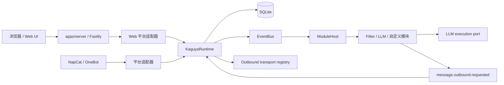
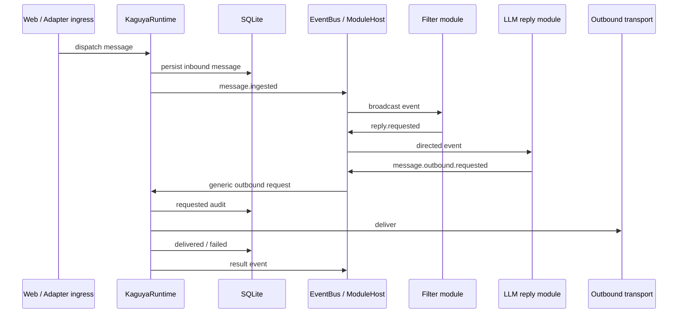

# 运行时架构

Kaguya 使用一个长期运行进程、一个 composition root 和一个共享 Runtime。`apps/server` 负责配置与资源装配；`@kaguya/runtime` 负责通用 ingress、模块事件分发、LLM execution port 和 outbound transport。

## 运行形态

开发模式把 Vite middleware 与 HMR 挂在 Fastify 内；生产模式由同一实例提供 `apps/web/dist`。Web 消息也先规范化为平台 `web`、adapter `web.ui.main` 的入站消息，再异步交给 Runtime。NapCat 是可选 ingress 与 transport，连接失败不会停止 HTTP 服务或改变 `/healthz`。

## 消息模块链

默认演示模块链展示了完整路径，但不是 Core 内置的固定回复工作流。模块可以不回复、使用自己的状态，或把输出发送到与触发消息无关的目标。

## 入站边界

Web HTTP 请求只允许文本和 requestId。Web adapter 会补齐平台、sender 与 target 等规范字段；其他平台入站还包含经过 schema 校验的 adapter、平台消息 ID、self ID、destination、sender 和 mentions。adapter 原始 payload 不进入事件或持久化 metadata。

HTTP `202 accepted` 在 Web gateway 接收消息后立即返回；Runtime dispatch 在后台继续。该状态不证明事件链、模型调用或投递已经完成。

平台白名单在消息落库之前执行。任一已配置维度未命中时，消息不会写入消息表，也不会发布 `message.ingested`，因此不会触发 Prompt、LLM 或 transport。

## Core 不维护对话分组

消息表和运行上下文不包含对话分组键，repository 也没有按用户、群聊或来源自动查询历史的 API。私聊与群聊既不会天然共享，也不会天然隔离上下文。

`requestId`、`traceId`、`eventId` 和因果字段用于观测与审计，不构成授权或会话隔离。后续信息原子和 DAG 会通过显式引用表达关系，而不是恢复隐式 conversation/session。

## 事件身份与错误传播

模块派生事件自动继承 `traceId`，并写入逐级 `causationEventId`、`rootEventId`、`moduleDefinitionId` 和 `moduleInstanceId`。模块 metadata 与 EventBus interceptor 不能改写这些字段。

广播事件等待全部匹配模块完成并聚合错误；定向事件只交给目标实例。嵌套模块和 LLM 错误在普通日志中只保留安全分类与失败数量，不序列化 provider cause、Token 或消息内容。

## 配置与 LLM 边界

Server 启动时打开 Profile Registry，检查全局 selected Profile，再为 light/heavy target 创建模型客户端。Provider key 只存在于权限保护的 Profile JSON、配置管理器和 provider factory，不进入模块 settings、事件、Prompt 或日志。配置未 ready 时，HTTP 与 Web UI 仍可用，但 Runtime 和 NapCat ingress 不创建；完整流程见[配置生命周期](./configuration-lifecycle)。

`@kaguya/llm` 使用 Vercel AI SDK Core 的统一 `LanguageModel` 接口。业务工作流不导入供应商 SDK；结构化输出、usage 和错误在这一层归一化，并写入受控 SQLite trace。

## 数据与出站审计

SQLite 保存规范化入站消息、LLM trace 和 outbound audit。每个 outbound request 先以 `requested` 状态落库；transport 完成后再原子更新为 `delivered` 或 `failed`。

当前没有持久事件队列、自动重试或去重。transport 失败会被记录和发布结果事件，但不会在 Core 中静默重试。

仓库还包含追加式 InformationLedger、PostgreSQL/PGlite 仓储和持久日志 outbox。这是下一阶段数据核心，当前未替换上述 SQLite 消息、LLM trace 与 outbound audit 路径；详见[信息账本](./information-ledger)。

## 启动与关闭顺序

正常启动先解析环境变量并打开配置管理；selected Profile ready 时，再打开并迁移 SQLite、注册 transport、创建 ModuleHost 与 Runtime，最后开放 HTTP 和可选 adapter ingress。若配置未 ready，只开放可用于修正配置的 HTTP 与 Web UI。

正常关闭先停止 ingress，等待 Runtime 在途 dispatch，停止 ModuleHost，再关闭数据库、Web 资源和 Logger。这个顺序避免新消息进入已经开始释放的基础设施。
