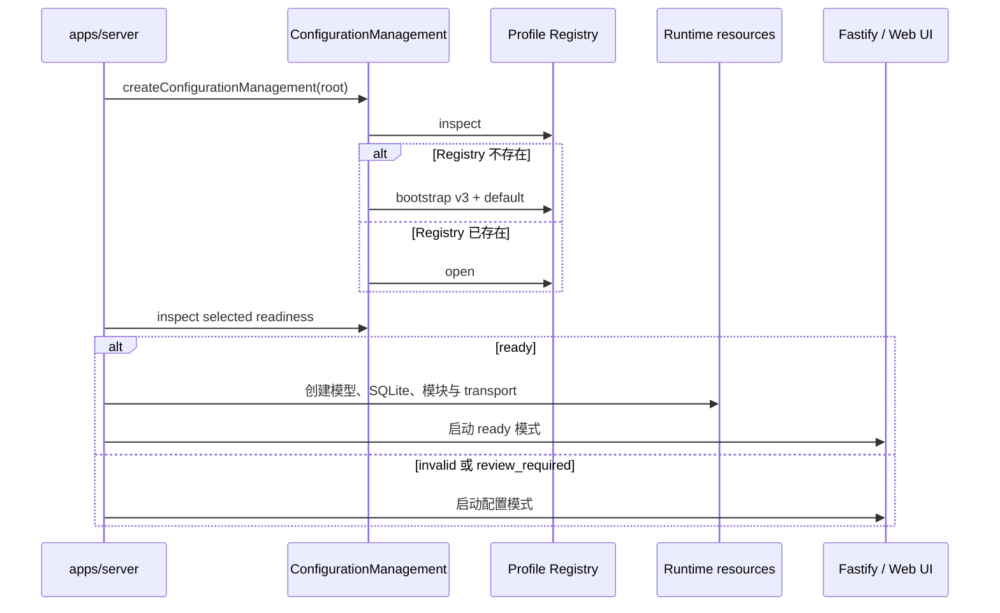

# 配置生命周期

`apps/server` 是唯一 composition root。它负责把磁盘配置变成运行对象，并明确区分“配置已写入”与“当前进程已采用”。这个边界让模型选择、密钥使用和故障范围保持可预测。

## 启动阶段

`/healthz` 表示 HTTP 进程存活，不等于 Runtime 一定可接收消息。配置模式仍提供 Web UI、受保护的 setup 状态和 Profile 管理接口；消息接口返回 `configuration_setup_required`。每次 Server 启动的随机 Gateway Token 只在进程内保存，并在成功监听后通过终端访问链接交给用户。

## 为什么只使用 selected Profile

Registry 可以保存多个 Profile，但 Server 只用一个显式 selected Profile 装配全局 Runtime。它不会因为模型调用失败而自动切换，也不会根据单条消息隐式选择其他 Profile。

这种约束避免同一进程中同时出现不可追踪的 Provider、密钥和模型路由。模块若支持显式 `profileId`，仍必须通过受控的 resolver，而不是自行读取配置文件。

## 变更何时需要重启

**创建 Profile** — 新 Profile 未选中，不改变当前 Runtime，通常不要求重启。

**编辑未选中 Profile** — 只改变磁盘中的备用配置，通常不要求重启。

**编辑 selected Profile** — 磁盘配置变化，但当前模型客户端仍持有旧配置，返回 `restartRequired: true`。

**切换 selected Profile** — 全局选择变化，返回 `restartRequired: true`。

**删除 Profile** — 只允许非 `default`、非 selected Profile，因此不会直接影响当前 Runtime。

`restartRequired` 是当前 ConfigurationManagement 实例维护的进程内状态。它不会热替换已创建的 Runtime；重启后重新从磁盘计算 readiness。

## Readiness 的含义

Profile 的 Provider、models、默认 Provider、light/heavy targets 和引用关系必须通过 schema 与一致性检查。启用的 Provider 必须声明模型；默认 Provider 必须启用；light/heavy 必须引用已启用 Provider 中已声明的不同模型目标。

缺少 Base URL、API Key，或平台、插件为空，可能形成 warning。用户必须显式确认允许的 warning；完整替换 Profile 时，旧 acknowledgement 不会自动继承，避免把过去的确认误用到新配置。

## 资源创建与关闭

ready 启动会创建模型 resolver、SQLite 仓储、Runtime、模块、Web gateway 和可选 NapCat supervisor。资源按依赖顺序建立，失败时回滚已创建部分。

关闭时先停止 ingress，避免新消息进入；再等待 Runtime 在途 dispatch，停止模块和 transport，最后关闭数据库、Web 资源与 Logger。配置变更要求重启，正是为了重新走完这条受控生命周期。

## 安全边界

Profile 文件包含明文密钥。配置管理器拒绝符号链接和路径逃逸，使用原子替换，并要求安全权限；但它不提供加密或跨进程锁。同一根目录只能有一个活动写入者，部署层仍需限制文件系统和网络访问。
