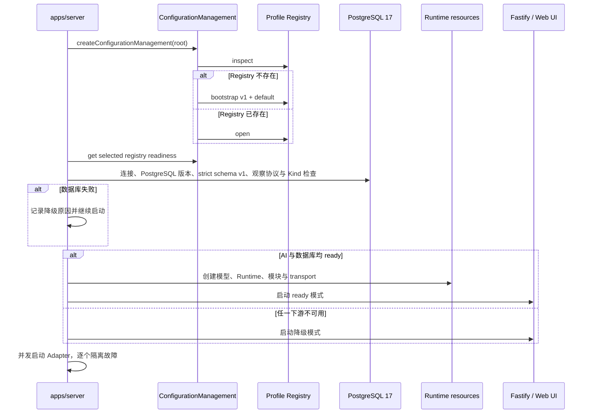

# 配置生命周期

`apps/server` 是正式服务的配置与资源生命周期入口，Runtime 业务装配统一调用 `@kaguya/composition`。它负责把磁盘配置变成运行对象，并明确区分“配置已写入”与“当前进程已采用”。这个边界让模型选择、密钥使用和故障范围保持可预测。

## 启动阶段

`/healthz` 表示 HTTP 存活，不代表 Runtime 就绪。AI 未配置也独立检查数据库连接和 Kind；暂时连接失败可进入不可用状态。数据库 schema 不兼容是启动致命错误，在 HTTP 或 Adapter 监听前退出。启动期随机 Gateway Token 保存在进程内，通过终端访问链接交给用户。

Runtime 原因限定为 configuration_not_ready、database_unavailable、runtime_start_failed。AI 与数据库同时失败时，启动日志保留全部原因，状态接口优先显示 configuration_not_ready。连接或 Kind 同步失败归为 database_unavailable；schema 不兼容不进入该降级分支。无效 NapCat 设置只让该 Adapter failed。

## 为什么只使用 selected Profile

Registry 可以保存多个 Profile，但 Server 只用一个显式 selected Profile 装配全局 Runtime。数据库、Server runtime、模型路由、`memory.enabled` 和平台都在这一步冻结；模块实例则从配置根的 `modules/` 独立加载。Server 不会因为模型调用失败而自动切换，也不会根据单条消息隐式选择其他 Profile。

这种约束避免同一进程中同时出现不可追踪的 Provider、密钥和模型路由。模块若支持显式 `profileId`，仍必须通过受控的 resolver，而不是自行读取配置文件。

## 保存、选择与应用

创建或编辑 Profile 只持久化配置；切换 selected Profile 只改变下一次要应用的方案。顶栏的编辑对象与全局 selected Profile 也不是同一状态。

`ConfigurationApplicationCoordinator` 记录已选中与已生效版本。显式应用时，在配置写锁内校验 revision、预检新配置、停止旧运行实例并启动新实例。模型、Memory、平台、白名单和模块参数可通过这条路径更新；消息入口在切换期间短暂暂停，Gateway Token 不变。

应用失败会尝试恢复旧快照；关闭失败或回滚失败时保持降级，不能把保存成功当成应用成功。操作步骤见[配置概览](../guide/configuration#保存后怎样生效)。

## 仍需重启的变更

`host`、`port`、`databaseMode`、`databaseUrl`、`webDistPath`、`corsOrigins`、`trustProxy`、限流和日志字段属于进程参数。应用协调器发现变化时返回 `restart_required` 和字段名，不热替换这些资源。

名称、别名、人设及其他 Prompt local 文件保存后也需要重启，不能仅应用 Profile。重启会生成新 Gateway Token。

## Readiness 的含义

Profile 的 Provider、models、默认 Provider、light/heavy targets 和引用关系必须通过 schema 与一致性检查。启用的 Provider 必须声明模型；默认 Provider 必须启用；light/heavy 必须引用已启用 Provider 中已声明的模型目标，也可以共享同一个目标。

新建 Profile 的 `memory.enabled` 显式写为 `false`。关闭时不装配内置 PostgreSQL Memory 召回或 capability，但 association terminal 仍会以 unavailable 结果推进回复；这不是一次返回空命中的真实检索。

缺少 Base URL 或 API Key 可能形成 warning。用户必须显式确认当前实际存在的 warning；完整替换 Profile 时，旧 acknowledgement 不会自动继承，避免把过去的确认误用到新配置。

Gateway allowlist 是 `platform:group|private:target_id` 字符串数组。平台和目标支持 `*`，规则按 OR 匹配，每个空数组只拒绝对应方向的非 Web 消息；非法规则在 Runtime 解析时静默忽略。Web 入口绕过该策略并继续由 Gateway Token 鉴权。

## 资源创建与关闭

Server 先创建 AdapterHost，再独立检查 AI 与数据库。满足条件时由 Host 注册 transport 并启动 Runtime；下游失败后清理部分资源，清理异常不阻止降级启动。显式应用通过协调器切换运行实例及其 ingress。

关闭先将 ingress 标为 stopping，再停止 HTTP 和全部 Adapter；随后排空 Runtime、关闭数据库与 Web 资源，最后关闭 Logger。单项失败不跳过其他清理。应用暂停期间不应把请求失败当成已接收；修复后按应用结果继续处理。

## 安全边界

Profile 文件包含明文密钥。配置管理器拒绝符号链接和路径逃逸，使用原子替换，并要求安全权限；但它不提供加密或跨进程锁。同一根目录只能有一个活动写入者，部署层仍需限制文件系统和网络访问。
