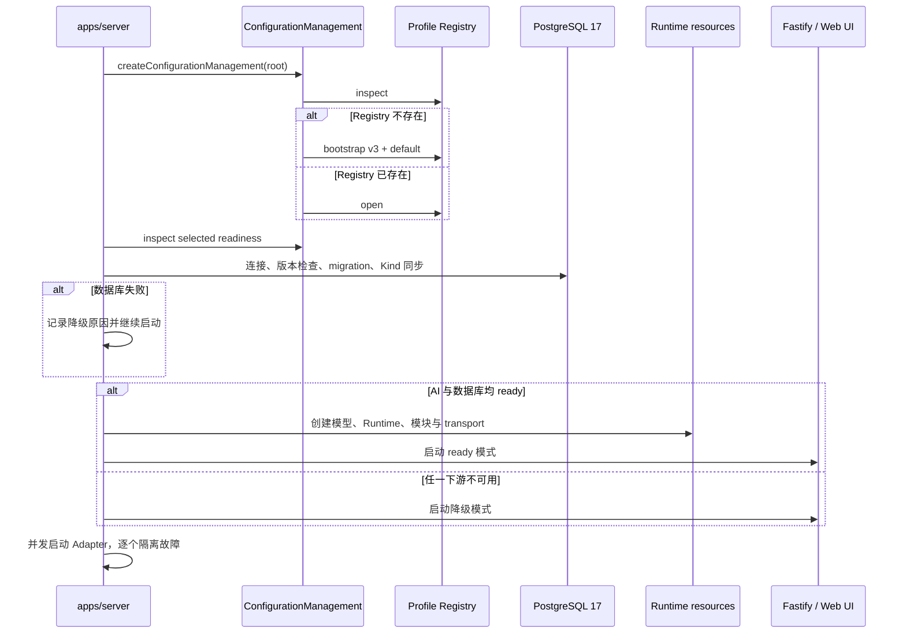

# 配置生命周期

`apps/server` 是唯一 composition root。它负责把磁盘配置变成运行对象，并明确区分“配置已写入”与“当前进程已采用”。这个边界让模型选择、密钥使用和故障范围保持可预测。

## 启动阶段

`/healthz` 表示 HTTP 存活，不代表 Runtime 就绪。AI 未配置也独立检查数据库连接、migration 和 Kind 同步；失败不阻止 HTTP 或 Adapter。Web 返回 runtime_unavailable / 503，NapCat 记录拒绝并丢弃。启动期随机 Gateway Token 保存在进程内，通过终端访问链接交给用户。

Runtime 原因限定为 configuration_not_ready、database_unavailable、runtime_start_failed。AI 与数据库同时失败时，启动日志保留全部原因，状态接口优先显示 configuration_not_ready。migration 或 Kind 同步失败归为 database_unavailable。无效 NapCat 设置只让该 Adapter failed。

## 为什么只使用 selected Profile

Registry 可以保存多个 Profile，但 Server 只用一个显式 selected Profile 装配全局 Runtime。数据库、Server runtime、模型路由、`memory.enabled`、平台和插件都在这一步冻结；Server 不会因为模型调用失败而自动切换，也不会根据单条消息隐式选择其他 Profile。

这种约束避免同一进程中同时出现不可追踪的 Provider、密钥和模型路由。模块若支持显式 `profileId`，仍必须通过受控的 resolver，而不是自行读取配置文件。

## 变更何时需要重启

**创建 Profile** — 新 Profile 未选中，不改变当前 Runtime，通常不要求重启；Web 管理门面会继承 selected Profile 的隐藏 runtime。

**编辑未选中 Profile** — 只改变磁盘中的备用配置，通常不要求重启。

**编辑 selected Profile** — 磁盘可见配置变化，但当前进程仍持有旧对象，返回 `restartRequired: true`。Web 完整替换不会覆盖隐藏 runtime。

**切换 selected Profile** — 全局选择变化，返回 `restartRequired: true`。

**删除 Profile** — 只允许非 `default`、非 selected Profile，因此不会直接影响当前 Runtime。

`restartRequired` 是当前 ConfigurationManagement 实例维护的进程内状态。它不会热替换已创建的 Runtime；重启后重新从磁盘计算 readiness。

## Readiness 的含义

Profile 的 Provider、models、默认 Provider、light/heavy targets 和引用关系必须通过 schema 与一致性检查。启用的 Provider 必须声明模型；默认 Provider 必须启用；light/heavy 必须引用已启用 Provider 中已声明的不同模型目标。

`memory.enabled` 缺省为 `false`。关闭时不装配内置 PostgreSQL Memory 召回或 capability，但 association terminal 仍会以 unavailable 结果推进回复；这不是一次返回空命中的真实检索。

缺少 Base URL、API Key，或平台、插件为空，可能形成 warning。用户必须显式确认允许的 warning；完整替换 Profile 时，旧 acknowledgement 不会自动继承，避免把过去的确认误用到新配置。

## 资源创建与关闭

Server 先创建 AdapterHost，再独立检查 AI 与数据库。满足条件时由 Host 注册 transport 并启动 Runtime；下游失败后清理部分资源，清理异常不阻止降级启动。Runtime ingress 只在启动时绑定，不做热接入。

关闭先将 ingress 标为 stopping，再停止 HTTP 和全部 Adapter；随后排空 Runtime、关闭数据库与 Web 资源，最后关闭 Logger。单项失败不跳过其他清理。消息不缓存、不排队、不重放，修复后重启。

## 安全边界

Profile 文件包含明文密钥。配置管理器拒绝符号链接和路径逃逸，使用原子替换，并要求安全权限；但它不提供加密或跨进程锁。同一根目录只能有一个活动写入者，部署层仍需限制文件系统和网络访问。
