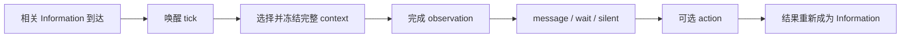

# 持续 Agent 设计原则

Kaguya 的目标不是把每条输入转换成一条回复，而是让同一个 Agent 持续连接多个场景：新信息到达时能够继续感知正在发生的事情，根据情境选择行动、等待或沉默，并让有来源的共同经历逐渐形成记忆与个性。

群聊是这套设计最直接的检验场景。消息零碎、多人交错，也经常没有人在向 Agent 提问；live、语音、工具和设备只是在频率、模态与反馈方式上不同。它们共同要求系统区分“世界发生了变化”和“现在必须完成一个回合”。

## 已确定的约束

**Information 到达可以成为 tick。** 相关 Information 的到达可以唤醒感知，让 Agent 重新检查某个场景。并非所有内部原子都自动广播为全局 tick；哪些 Information 与哪个场景相关，应由接入或模块契约明确。

**Tick 不是 turn。** Tick 只说明“发生了值得重新查看的变化”。它不承诺立即观察、不自动创建回复，也不直接产生长期记忆。多个 tick 可以合并理解，一次行动也可以使用多个 tick。

**触发单位不等于语义处理单位。** 模块订阅某个 Information Kind，只说明它如何被唤醒。模块实际需要理解的内容可能是一条证据、一组未读变化、冻结上下文或更长的经历，不能从订阅单位中自动推导。

**InformationAtom 是证据与触发载体。** 原子提供不可变事实、来源和因果引用。它可以独立保存和审计，但不因此自动成为一次观察、一次行动或一条长期认识。

**自然互动允许不行动。** `message`、`wait` 与 `silent` 都是正常结果。新信息不保证得到逐条回复，等待和沉默也不是失败路径。

**持续感知不等于持续调用模型。** 系统需要保持可被新信息唤醒，并能从持久水位继续理解；是否立即读取正文、调用模型或合并更多变化属于后续策略。

**输入与输出可按各自节奏推进。** 这是一项用于检查模块耦合的实现哲学，不是产品宣传语，也不强制所有能力遵循同一种并发、取消或重规划协议。

## 领域术语

**Agent** — 持续运行并共享身份、运行事实与能力的辉夜实例。一个 Agent 可以连接多个场景，不等于每个聊天各创建一份人格副本。

**Scene / Scope** — Scene 是人能理解的互动场景，例如群聊、私聊或 live 房间；scope 是当前实现用于隔离目标、上下文、权限和水位的技术范围。两者在常见聊天入口中通常对应，但不是长期协议上的同义词。

**Information** — Agent 可以保存、引用或处理的事实。`InformationAtom` 是当前 Core 中不可变、可追溯的持久化表示。

**Tick** — 相关 Information 到达所形成的唤醒机会。Tick 可以与该 Information 来自同一次接收，不要求额外复制一份内容原子。重复或合并 tick 不应替代真实事实与水位。

**Context** — 为理解当前变化而选择的完整语义范围。它可以包含此前状态、多个新 Information、人物和场景事实；触发模块的原子只是入口之一。

**Observation** — Agent 对某个场景截至明确水位所完成的一次有界读取。它与 tick 的数量不是一一对应关系；只有成功观察才能证明相应变化已经被理解到哪个位置。

**Action** — Agent 决定采取的行为，例如发送消息、调用工具或控制设备。`wait` 与 `silent` 不是外部副作用，但同样是自然互动中的有效决策结果。

**Turn** — 当前协议仍使用的实现术语，用于组织 candidate、claim、context、plan 与 terminal。它不表示“收到一条用户消息就必须完成一轮回复”。新设计讨论优先使用 tick、context、observation 与 action；协议是否重命名由后续 Issue 单独决定。

**Memory** — 对原始证据、派生认识和可召回经历的统称。逐条保存 raw evidence 是合理的数据边界；人物认识、关系、自我、表达习惯等派生结果应明确自己的完整证据范围。

## 从信息到自然互动

这张图表达职责关系，而不是强制所有模块实现同一条同步流水线。Tick 可以被合并或延期；Observation 可以不产生 Action；工具或投递结果也可以作为后续 Information 再次唤醒系统。

## 模块设计检查项

新增或重构模块时，需要在相邻 README 或对应开发文档中回答以下问题：

1. **什么会唤醒模块？** 列出触发的 Information Kind，并说明它为什么与该职责相关。
2. **完整业务输入是什么？** 说明处理单条原子、未读范围、冻结 context、证据集合还是其他单位。
3. **如何确认进度？** 说明水位、终态或幂等键何时推进，以及失败后如何重新读取未完成信息。
4. **会产生什么结果？** 区分派生事实、决策、外部副作用和无动作结果。
5. **如何保留来源？** 派生结果需要能回到直接证据，空结果和失败不能被解释为新的领域事实。

逐条订阅本身不是问题。Identity 可以逐条正规化发送者，raw Memory 可以逐条保存消息，投递结果也可以逐项确认。需要避免的是：仅因为一条 atom 触发了 handler，就未经说明地把它当成全部情境或完整经历。

## 当前实现映射

当前代码已经具备部分持续感知基础，但仍保留早期的 turn 术语：

**Heartbeat candidate** — 接近某个 scope 的 wake opportunity。它记录水位、未读数量和非语义通知信号，不复制正文；它不是一次完整观察。

**Attention Arousal** — 在读取正文前决定 `observe | defer`。这证明被唤醒与完成观察是两个阶段。

**Heartflow turn context** — 在 `observe` 后按上下水位读取多条未读并冻结完整输入，接近当前实现中的 observation snapshot。

**Planner 与 Composer** — Planner 面向冻结输入选择 `message | wait | silent`，Composer 只为已经获准的 message 编写正文。收到 Information 与生成消息之间没有逐条直连旁路。

**Memory writeback** — 逐条保存原始 inbound，是证据层行为，不应仅因处理单位为单条消息而被移除。

**Memory cognition** — 当前由每条 writeback 完成触发，再读取同场景最近最多 32 条消息形成有界快照。它没有只读触发消息，但会随每条新消息产生高度重叠的窗口；长期认知应如何形成仍是待讨论设计。

**Knowledge 与 Expression** — Knowledge 已能保存 event、claim 与 episode，但在线消息主要仍先投影为单个 event；Expression 已按多条来源批次学习。它们说明不同 Memory 职责可以选择不同的业务输入单位。

现有实现细节以[运行时架构](./architecture)、[信息模块 SDK](./information-modules)和[Memory 认知层](./memory)为准。本页定义项目故事和设计检查项，不把待讨论方向描述为已经交付的协议。TML Interaction Models、GPT-Live 与 MaiBot 的可借鉴部分和适用边界集中记录在[外部设计参考](./design-references)。

## 术语迁移边界

本轮只调整文档语言，不重命名 `agent.turn.*` Information Kind、Heartbeat、Heartflow、数据库结构或模块配置。旧术语继续精确描述当前接口；新的项目讨论不再用 `session` 或单条“回合”暗示请求—回复模型。

如果后续 Issue 决定调整协议名称，应单独说明兼容、迁移、历史数据和检查界面影响，不能仅做字符串替换。
