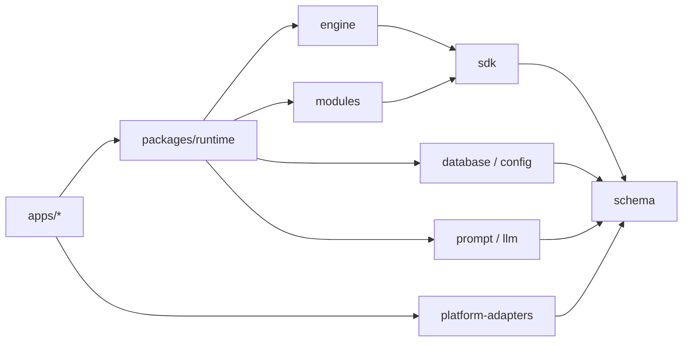

# 开发文档

Kaguya 采用 pnpm workspace 和 TypeScript project references。应用负责装配；基础包通过公开入口提供信息原子、Kind、模块、数据、模型与配置能力。运行期事实通过 `informationId` 和显式引用组织，不使用事件身份或隐式 session。

## 仓库结构

**`apps/server`** — 唯一 composition root，装配配置、Logger、PostgreSQL、Runtime、Fastify、Web UI、NapCat 和关闭顺序。

**`apps/web`** — React/Vite 同源浏览器客户端。

**`apps/demo`** — 使用确定性模型运行最小信息 DAG，输出根 `informationId` 与 Kind 计数。

**`packages/runtime`** — `InformationIngress`、信息 DAG 组合、LLM 生命周期、transport registry 与投递结果。

**`packages/engine`** — `InformationCore`、Kind Registry、并发广播、`consumer.failed` 与 ModuleHost。

**`packages/modules`** — 入站、过滤、回复、assistant 与投递请求 Kind，以及默认 filter/LLM 模块。

**`packages/database`** — PostgreSQL 信息账本、append-only schema、`JSONB` payload、外键保护的引用查询与日志投影 outbox；PGlite 与 CI 真实 PostgreSQL 共用账本契约。

**`packages/config`** — Profile Registry、`selectedProfileId`、readiness、权限和安全写入。

**`packages/llm`** — Vercel AI SDK Core 边界、结构化输出和错误归一化。

**`packages/prompt`** — Prompt 编译和 provenance。

**`packages/logger`** — 结构化日志、上下文传播和脱敏。

**`packages/schema`** — 跨包数据契约，不依赖其他 Kaguya 包。

**`packages/sdk`** — Information Kind 与模块定义 API。

**`packages/platform-adapters`** — OneBot/NapCat/Web 正规化、窄 ingress 契约与 transport 类型。

**`packages/scheduler`** — 显式调度原语。

## 依赖方向

基础包不得导入 `apps/*`，也不得通过相对路径越过另一个包的公开入口。供应商 SDK 只能存在于适配边界，业务模块不直接依赖具体模型供应商。

## 从哪里开始

### 理解信息 DAG

阅读[运行时架构](./architecture)，了解持久化优先的注册顺序、显式过滤 Kind、失败事实与投递边界。

### 编写模块

阅读[信息模块 SDK](./information-modules)，使用 `onInformation` 消费输入并以 `context.register()` 派生下一原子。

### 修改代码

阅读[参与贡献](./contributing)，准备固定版本工具链并运行构建、测试和检查。

### 修改文档

阅读[文档编写规范](./markdown-features)，遵守中文单语言目录、代码组和右侧目录约定。

### 查询接口

进入[参考资料](../reference/)，查阅 HTTP API 与环境变量的精确定义。
