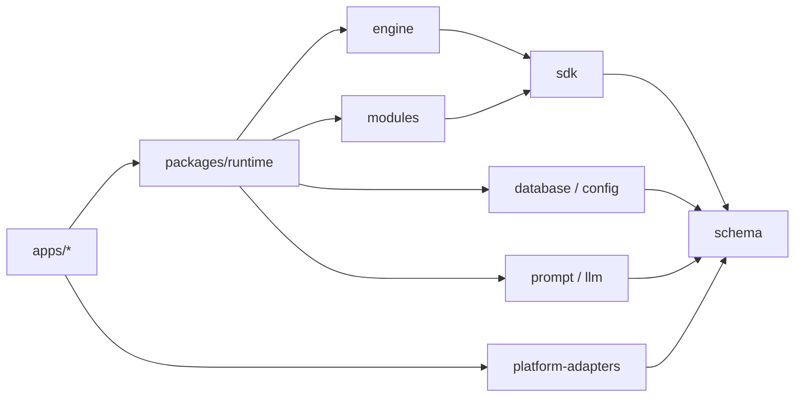

# 开发文档

Kaguya 采用 pnpm workspace 和 TypeScript project references 组织代码。应用只负责装配，基础包通过公开入口提供 schema、事件、模块、数据与模型能力。

## 仓库结构

**`apps/server`** — 唯一 composition root，装配配置、Logger、Runtime、Fastify、Web UI、NapCat 和关闭顺序。

**`apps/web`** — React/Vite 同源浏览器客户端。

**`apps/demo`** — 使用确定性模型运行最小消息模块链，数据写入独立 SQLite。

**`packages/runtime`** — 消息 ingress、模块装配、LLM execution port、transport registry 与出站审计。

**`packages/engine`** — EventBus、ModuleHost 与显式 WorkflowEngine。

**`packages/modules`** — 标准 `message.*` 事件和最小 filter/LLM 演示模块。

**`packages/database`** — SQLite 迁移、repository 和行映射。

**`packages/config`** — Profile store、readiness、权限和安全写入。

**`packages/llm`** — Vercel AI SDK Core 边界、结构化输出、错误归一化和 trace。

**`packages/prompt`** — Prompt 编译和 provenance。

**`packages/logger`** — 结构化日志、上下文传播和脱敏。

**`packages/schema`** — 跨包数据契约，不依赖其他 Kaguya 包。

**`packages/sdk`** — 事件、模块、节点和工作流定义 API。

**`packages/platform-adapters`** — OneBot/NapCat 规范化和 transport 实现。

**`packages/scheduler`** — 显式调度原语。

## 依赖方向

基础包不得导入 `apps/*`，也不得通过相对路径越过另一个包的公开入口。供应商 SDK 只能存在于适配边界，业务工作流不直接依赖具体模型供应商。

## 从哪里开始

### 理解消息链

阅读[运行时架构](./architecture)，了解统一 Server、Runtime、事件分发和 outbound transport。

### 修改代码

阅读[参与贡献](./contributing)，准备固定版本工具链并运行构建、测试和检查。

### 修改文档

阅读[文档编写规范](./markdown-features)，遵守中文单语言目录、代码组和右侧目录约定。

### 查询接口

进入[参考资料](../reference/)，查阅 HTTP API 与环境变量的精确定义。

