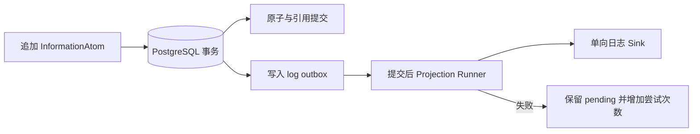

# 信息账本

信息账本是正在分阶段接入的下一代数据核心。它已经在 schema、SDK、engine、database 与 logger 包中实现并有测试，但 **尚未替换 `apps/server` 当前使用的 SQLite 消息、LLM trace 与 outbound audit 主链**。

::: warning 当前边界
“代码已实现”不等于“用户启动 Server 后已经使用”。除非后续 composition root 明确装配 InformationCore，否则线上行为仍以现有 Runtime/SQLite 文档为准。
:::

## 信息原子

InformationAtom 是不可变 JSON 快照，包含 `informationId`、`kind`、`occurredAt`、`source`、`payload` 和显式 `references`。状态变化通过追加新原子表达，不更新或删除旧原子。

引用只依赖目标 `informationId`，并用 relation 说明关系。系统不会从用户、群聊或会话字段隐式推断上下文；关系必须由生产该信息的模块明确写出。

## Kind Registry

每个 Kind Definition 声明 payload schema、允许的引用关系和日志策略。Core 内建 Kind 使用保留的 `core.*` 命名；业务 Kind 不能占用该前缀。

InformationCore 启动时 seal Registry，并把完整 Kind 集合同步到存储。数据库中已有 Kind 集合与当前定义不一致时会失败，避免不同进程用不一致 schema 解释同一批事实。

## 追加与读取

InformationLedger 是异步端口，只暴露受控操作：

**`append`** — 原子追加，并在同一事务中校验引用规则与目标 Kind。

**`get` / `getMany`** — 按显式 informationId 读取。

**`query`** — 查询哪些原子通过指定 relation 引用了某个 informationId。

没有 update、delete、TTL 或 compaction。重复 informationId、缺失目标、未声明 relation、违反单值规则或目标 Kind 不匹配都会被拒绝。

## PostgreSQL 与 PGlite

`packages/database` 提供 PostgreSQL 协议的追加式实现和迁移；测试可以使用 PGlite 验证相同语义。原子、引用、Kind 集合与日志 outbox 在事务中维护，数据库触发器阻止事实表被修改。

这不是“SQLite 账本实现”。项目路线已经从早期的 SQLite 过渡方案调整为 PostgreSQL/PGlite 基础设施；现有 SQLite 仍服务旧 Runtime 数据路径。

## 日志投影为什么用 outbox

日志是事实的投影，不是事实来源。需要日志的 Kind 在追加事务中写 outbox；事务提交后，Runner 才把原子交给单向 sink。sink 不能通过该路径再追加原子，因此日志失败不会递归产生新日志事实。

投影失败不会回滚已经提交的原子。任务保留为 pending，记录稳定错误类型，并在以后调用或进程重启后再次处理。

## 后续接入点

后续工作需要在 `apps/server` 中装配 InformationCore，把现有消息、Prompt、模型与模块数据逐步映射为 Kind，并在保持兼容与迁移策略清晰的前提下切换事实来源。在此之前，开发者应把它视为可用的底层能力，而不是已完成的用户功能。
