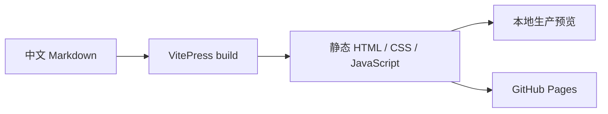

# 文档编写规范

本文档站只维护中文。公开页面直接放在 `guide/`、`developers/`、`reference/` 和 `project/`，不创建英文镜像或语言目录。

## 页面结构

每页只使用一个一级标题。二级和三级标题会自动进入右侧“本页目录”，因此标题应表达信息层级，而不是只用于放大文字。

::: info 内容页避免表格
字段说明优先采用“粗体字段名 — 解释”的定义式写法，保证移动端可读性。只有确实需要二维比较时才考虑其他展示方式。
:::

## 提示容器

::: tip 建议
用于不会影响正确性的推荐实践。
:::

::: warning 注意
用于安全、兼容性或需要在继续前确认的条件。
:::

::: danger 风险
用于可能导致数据损坏、凭据泄漏或服务中断的操作。
:::

## Mermaid 图表



图表用于解释流程、关系和状态变化。只包含一两个简单事实时，使用短段落更清楚。

## 代码组与图标

独立命令或代码示例放在代码组中，并在标签里显式指定 Iconify 图标。

::: code-group

```bash [本地开发 ~vscode-icons:file-type-shell~]
pnpm --ignore-workspace docs:dev
```

```bash [生产预览 ~vscode-icons:file-type-shell~]
pnpm --ignore-workspace docs:build
pnpm --ignore-workspace docs:preview
```

:::

## 内容事实来源

用户行为以根 README、实际 Web UI 和 Server 代码为准；架构以 `packages/runtime`、`packages/engine` 和现有测试为准；配置以 `apps/server/src/config.ts` 与 `packages/config` 为准。

尚未实现的 Issue 或设计方案必须标为“规划中”。不要把注释、旧 MaiBot 文档或过期方案直接描述成当前能力。

## 导航与链接

新增页面后更新 `.vitepress/sidebar.ts`。站内链接使用相对路径或以站点根开始的路径，不手写 `/Kaguya/` 前缀；VitePress 会根据 `base` 自动处理部署路径。

## 静态资源

内容图片放在 `public/images/`，正文使用 `/images/...` 引用。项目 Logo 等站点级资源放在 `public/` 根目录，并提供有意义的替代文本。

## 提交前检查

::: code-group

```bash [文档检查 ~vscode-icons:file-type-shell~]
pnpm --ignore-workspace docs:build
git diff --check
git status --short
```

:::

构建通过后，还要在桌面与移动宽度检查顶部导航、左侧章节导航、右侧页内目录、代码块和 Mermaid 图表。
