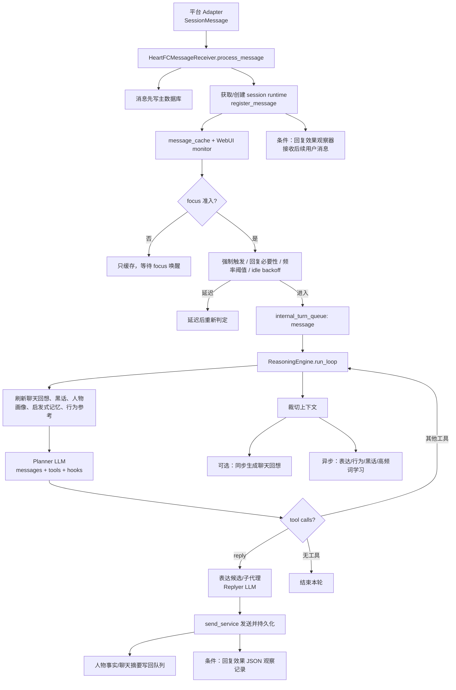
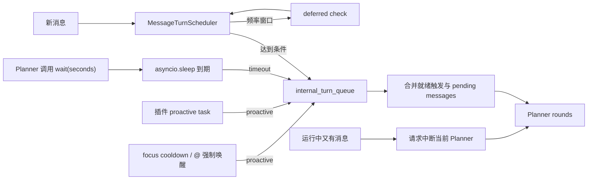
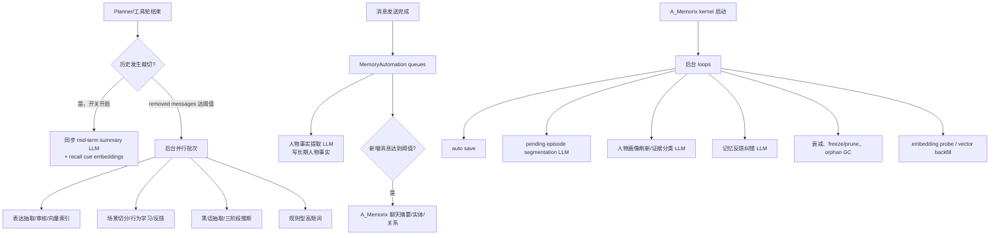

# MaiBot 事件循环与 LLM 调用调研

## 范围与方法

本报告用于回答会议 3.1 的三个问题：消息如何唤醒 Bot、每次 LLM 请求的 Prompt 从哪里来、输出流向哪里。结论来自对相邻只读仓库 `MaiBot` 的静态源码检查：

- 检查日期：2026-07-23；
- 本地提交：`5dfffee80`；
- 重点目录：`src/maisaka`、`src/chat/replyer`、`src/chat/image_system`、`src/emoji_system`、`src/learners`、`src/services`、`src/A_memorix`、`src/mcp_module` 和相关 WebUI router；
- 检索方式：枚举 `LLMServiceClient`、`EmbeddingServiceClient`、`generate_response*`、`generate_with_resolved_model`、底层 `LLMOrchestrator` 直调，再反向追踪调用者、开关、Prompt builder 和写入端。

这是源码可达性分析，不代表每个功能在某次部署都已启用。MaiBot 的配置、插件 hook 和模型任务可以改变实际调用。状态标记：

| 标记     | 含义                                                       |
| -------- | ---------------------------------------------------------- |
| 主链     | 正常消息处理可以直接到达                                   |
| 条件启用 | 代码可达，但需要配置、数据量、模型或 feature flag          |
| 后台任务 | 由队列、裁切阈值或周期 loop 到达，不阻塞主消息链           |
| 手动诊断 | 只有 WebUI/API 操作触发，不是 Bot 自动决策                 |
| 兼容路径 | 仍可运行的 fallback/旧格式入口，不等于死代码               |
| 保留未达 | 当前仓库没有找到生产调用者，或上游条件在当前实现中恒不成立 |
| 注释     | 只出现在注释中的日志/旧逻辑，不参与运行                    |

## 核心结论

1. 当前主循环不是固定 30 秒或 1 分钟轮询。它是每 session 一个 `MaisakaHeartFlowChatting`，由消息、延迟判定、`wait` 到期、插件主动任务和 focus 冷却唤醒共同写入内部 `asyncio.Queue`。
2. “Planner 决定动作”和“Replyer 生成可见文本”是两次独立 LLM 调用。Planner 通常调用 `reply` 工具；该工具再组装更窄的真实聊天上下文、表达习惯和回复指引，调用 replyer 模型并发送结果。
3. LLM 调用已大体收口到 `src/services/llm_service.py`，但 WebUI 模型测试/人设生成仍直接构造 `LLMOrchestrator`。`LLMServiceClient` 记录模型统计与 Prompt cache 指标，不提供类似 Kaguya `traceId` 的跨事件统一 trace。
4. 长时学习不是“每天一次”的单一路径。表达、行为、黑话学习由上下文裁切和最小消息/间隔阈值触发；聊天摘要由发送消息数量阈值触发；A_Memorix 另有 autosave、episode、画像刷新、反馈纠错和 memory maintenance 等后台 loop。
5. Prompt 来源是多层组合：文件模板、运行配置、会话历史、数据库召回、工具定义、当前时间、一次性 ReferenceMessage 和插件 hook。调试预览会保存组装后的消息，但没有统一的片段 ID/digest provenance。

## 入站消息主链

`src/chat/heart_flow` 的名字是历史沿用，但其中 manager 和 message processor 正被 `src/chat/message_receive/bot.py` 等当前入口导入，不能因为目录名就标为 legacy。

## 短间隔/运行时唤醒

`wait`、延迟判定和 focus cooldown 都是按需创建的 timer；源码中没有一个无条件对所有 session 每 30/60 秒执行 Planner 的全局 heartbeat。因此，会议里的“短间隔心跳”在 MaiBot 当前实现中更接近“可延期、可主动唤醒的 session runtime”，而不是固定 interval job。

## 长间隔学习与 memory

表达/行为/黑话批次以“上下文被裁切 + 最小条数 + 最小间隔”为门槛，不是 cron。A_Memorix 的 loop 才具有明确的分钟/小时级周期；例如人物画像刷新默认按配置分钟数检查，memory maintenance 按 `base_decay_interval_hours` 衰减和清理。

## 统一服务边界

| 状态     | 入口                                               | 输入与调用                                                                                                                                                                                                      | 输出消费者与持久化                                                                                                                                                                                                                                   |
| -------- | -------------------------------------------------- | --------------------------------------------------------------------------------------------------------------------------------------------------------------------------------------------------------------- | ---------------------------------------------------------------------------------------------------------------------------------------------------------------------------------------------------------------------------------------------------- |
| 主链边界 | `src/services/llm_service.py`                      | `generate_response`、message factory 和 image；转给 `LLMOrchestrator`                                                                                                                                           | 返回统一 response/reasoning/tool calls/token；记录模型使用和 Prompt cache 统计，不保存统一业务 trace                                                                                                                                                 |
| 条件启用 | `LLMServiceClient.transcribe_audio`，同文件 `:325` | 入站 `VoiceComponent` 且 `voice.enable_asr` 开启时，`get_voice_text` 把原始 bytes 编成 base64，以 `voice` task/`audio` request 调 `generate_response_for_voice`；插件也可调用 `llm.transcribe_audio` capability | 主链把 `.text` 写成组件内容 `[语音: ...]`，汇入 `SessionMessage.processed_plain_text`，随后供过滤、Planner/history 消费并随入站消息写主数据库；插件调用只返回 text/content，由插件决定是否落库。本入口丢弃 `session_id`，不另建转写记录或 cache 统计 |
| 主链边界 | `src/services/embedding_service.py`                | 单条/批量文本转给 orchestrator embedding                                                                                                                                                                        | 返回向量与模型名；具体索引/数据库由调用者写入                                                                                                                                                                                                        |
| 兼容路径 | `LLMServiceClient.embed_text`                      | 创建 `EmbeddingServiceClient` 再委托                                                                                                                                                                            | 没有额外模型调用；注释明确推荐直接使用 embedding client                                                                                                                                                                                              |
| API 边界 | `llm_service.generate(LLMServiceRequest)`          | 把字符串或 message dict 统一成 message factory                                                                                                                                                                  | 能力 API、A_Memorix、WebUI replay 使用；错误被包装为 `success=false`                                                                                                                                                                                 |
| 后台任务 | `src/services/memory_flow_service.py` 人物事实写回 | 用户原始证据、邻近上下文、bot 回复和内联 JSON 指令；`utils` 文本模型                                                                                                                                            | 严格只接受用户证据支持的稳定事实，经 `store_person_memory_from_answer` 写 A_Memorix                                                                                                                                                                  |
| 后台任务 | 同文件聊天摘要写回                                 | 发送消息累计达到阈值后调用 `memory_service.ingest_summary`                                                                                                                                                      | 间接进入 A_Memorix SummaryImporter；以 metadata 游标避免重启后立即重复摘要                                                                                                                                                                           |

service 层是调用协议的统一边界，不是 Prompt 组装器。业务模块仍各自管理模板、history selection、JSON 修复和落库。

## 实时对话、路由与回复

| 状态     | 类别与证据                                                           | 触发                                                           | Prompt 来源                                                                                                                                                                    | 模型调用与输出消费                                                                                                                                                             | 持久化影响                                                                                           |
| -------- | -------------------------------------------------------------------- | -------------------------------------------------------------- | ------------------------------------------------------------------------------------------------------------------------------------------------------------------------------ | ------------------------------------------------------------------------------------------------------------------------------------------------------------------------------ | ---------------------------------------------------------------------------------------------------- |
| 主链     | Planner：`src/maisaka/chat_loop_service.py:981`                      | `message`、`timeout` 或 `proactive` 进入 run loop              | `maisaka_chat`/`maisaka_chat_focus`；人格、群/私聊配置、memory 使用规则、选中历史、工具结果、黑话/行为/聊天回想 Reference、人物画像、启发式记忆、当前时间、聊天专属提示、tools | `planner` task 的 message call；输出 reasoning 与 tool calls，写回内存 chat history，驱动 reply/wait/switch_chat/query_memory/插件工具；before/after hook 可改消息、工具和输出 | Prompt 预览 JSON/HTML 与 cache/usage 统计；具体业务写入取决于工具。新消息可中断在途 Planner          |
| 条件启用 | 表达选择子代理：`src/maisaka/builtin_tool/reply.py:33`               | replyer 构建上下文且表达功能有候选                             | 表达候选 ID/情境/风格组成 selector system Prompt；最多 10 条真实 `SessionBackedMessage`，当前时间                                                                              | `run_sub_agent(... request_kind="expression_selector")` 最终仍到 `chat_loop_step`；解析选中 ID，失败回退直接注入                                                               | 更新 Expression 的 `last_active_time`；选中表达组成一次性 expression habits 注入 replyer             |
| 条件启用 | 行为场景分析子代理：`src/maisaka/reasoning_engine.py:197`            | Planner 前行为 reference 召回且行为功能开启                    | analyzer 生成的场景 system Prompt、裁切后的真实上下文、固定结构约束                                                                                                            | `request_kind="behavior_scenario_analyzer"`；输出场景 tag/profile，规则/权重算法据此选行为。最终行为选择本身不再用 LLM                                                         | 标记 behavior pattern activation/selection，并把参考作为内存 `ReferenceMessage` 注入；不直接生成回复 |
| 条件启用 | Replyer：`src/chat/replyer/maisaka_generator_base.py:1092`           | Planner 成功调用 `reply` 工具                                  | `maisaka_replyer`；人格、群/私聊/会话提示、真实聊天历史、目标消息、reply guide/reference、Planner thought fallback、表达习惯、关键词反应、附件、当前时间、retry/hook 约束      | `replyer` 模型；纯文本经 hook 审查，可带约束重试，然后解析附件、发送并回填 tool result                                                                                         | 已发送消息由发送链写主消息库；保存 reply Prompt 预览与 metrics；可创建回复效果观察 JSON              |
| 条件启用 | 回复效果评分：`src/maisaka/runtime.py:1415`、`reply_effect/judge.py` | 成功发送后观察到足够后续消息、负反馈、超时或 runtime 停止      | bot 回复、最多 5 条后续消息和五维 rubric；额外固定 system 要求严格 JSON                                                                                                        | `request_kind="reply_effect_judge"` 子代理；输出 social presence、warmth、competence、appropriateness、uncanny risk，解析失败使用中性分                                        | `logs/maisaka_reply_effect/<chat>/*.json` 从 pending 更新为 finalized；不改回复正文                  |
| 条件启用 | 启发式长期记忆：`src/maisaka/memory/heuristic_injector.py:181`       | Planner 前；开关开启、历史达到窗口、缓存/间隔/新增消息门槛通过 | `heuristic_memory_impression` 模板：chat identity + 最近消息窗口                                                                                                               | `utils` 模型生成当前聊天“印象”，再调用 `memory_service.search`；结果经过 session/person/cross-chat scope 过滤                                                                  | 只更新 runtime recall cache，把命中作为内部参考注入；不会因为召回而写新 memory                       |
| 条件启用 | 中期聊天回想：`src/maisaka/memory/mid_term.py:155,357,687`           | 上下文裁切；或每次 Planner continuation 前尝试召回             | 摘要模板含时间范围、参与者和被裁切的真实 user messages，可按模型能力带图；输出 summary + recall cues                                                                           | `mid_memory` 文本模型生成摘要；embedding 模型编码 cues 和当前 query，相似度达到阈值时生成 memory Reference                                                                     | 摘要作为 `ComplexSessionMessage` 留在该 runtime history，cue 向量存消息 payload；没有独立数据库写入  |
| 条件启用 | 表达向量：`src/chat/replyer/expression_vector_index.py:263,964,1312` | 向量表达模式初始化/学习写入/每次查询                           | 固定 profile probes；`situation + style`；Planner 传来的结构化 expression intent/query                                                                                         | embedding profile 标定、批量索引、query 相似检索与聚类候选                                                                                                                     | `.npz`/metadata 向量索引；校验模型名和维度，学习批次后重建聚类                                       |

### Planner Prompt 的实际顺序

`MaisakaChatLoopService._build_request_messages` 的消息层次是：

1. system：聊天模板与人格、注意事项、memory 规则；
2. 选中的 history：真实消息、assistant thought、tool result、一次性 reference；planner 会排除原始 mid-term summary message；
3. 跨日期时插入时间边界；
4. 一次性 user 注入：deferred tool 提醒、启发式 memory、人物画像；
5. 当前时间；
6. focus tail 与当前聊天专属提示；
7. 最后一条 assistant reminder；
8. 独立 tool definitions。

插件的 `maisaka.planner.before_request` 可以重写 messages 与 tools，`after_response` 可以重写 response、tool calls 和 token 数。因此只读模板文件不能完整解释最终请求；调试或 Kaguya provenance 必须记录 hook 后的实际输入。

### Replyer 与 Planner 的隔离

replyer 会过滤 `ReferenceMessage`、`ToolResultMessage`、工具媒体和 mid-term summary，只保留真实聊天及可见 assistant 回复。Planner 检索到的 memory/behavior 不会自动泄漏给 replyer；需要回复时，Planner 应通过 `reply_guide` 和 `reference_info` 明确传递必要信息。这是 Kaguya 将 route/reply policy 分开的直接借鉴点。

## 图片与表情包

| 状态     | 类别与证据                                                       | 触发与 Prompt                                                                                                                                                                                                                                                                                            | 输出消费者                                                                                                                                                                   | 持久化影响                                                                                                                                                                                                      |
| -------- | ---------------------------------------------------------------- | -------------------------------------------------------------------------------------------------------------------------------------------------------------------------------------------------------------------------------------------------------------------------------------------------------- | ---------------------------------------------------------------------------------------------------------------------------------------------------------------------------- | --------------------------------------------------------------------------------------------------------------------------------------------------------------------------------------------------------------- |
| 条件启用 | 发送表情选择子代理：`src/maisaka/builtin_tool/send_emoji.py:341` | `experimental.enable_rich_reply=false` 时 Planner 可调用 `send_emoji`；从库存随机取 `emoji_send_num`（上限 64），制成带序号的近方形 PNG 拼图。`emoji_selection` system Prompt 注入数量/行列，子代理另带最多 12 条 runtime context、一次性 JSON 任务提示和候选拼图；按 emoji/planner/vlm 任务选择视觉模型 | `run_sub_agent(... request_kind="emotion")` 解析 `{emoji_index, reason}`；解析失败或越界回退第一张，before/after-select hook 仍可中止或改选，最终交 `send_emoji_for_maisaka` | 非 CLI 成功后经 Platform IO 发送，`storage_message=true` 写主消息库并以 `guided_reply` 同步 Maisaka history，同时更新 emoji `query_count`/`last_used_time`；CLI 只渲染预览、更新 usage 并由工具补入内存 history |
| 条件启用 | 图片描述：`src/chat/image_system/image_manager.py:462`           | 新图或已发送图片缺描述；`image_description` 模板 + base64 image                                                                                                                                                                                                                                          | VLM 文本描述供聊天可见文本和后续 Prompt                                                                                                                                      | Images 记录、文件状态和 description；后台识别可不阻塞发送                                                                                                                                                       |
| 条件启用 | 表情替换：`src/emoji_system/emoji_manager.py:902`                | 表情库到上限，需要决定是否替换；`emoji_replace` + 抽样库存/次数/时间/新描述                                                                                                                                                                                                                              | 解析“取消注册编号 N”或不替换                                                                                                                                                 | 取消旧表情注册并注册新表情；文件与 emoji DB 改变                                                                                                                                                                |
| 条件启用 | 表情内容审核：`src/emoji_system/emoji_manager.py:965`            | 注册前 `content_filtration` 开启                                                                                                                                                                                                                                                                         | VLM 返回含“否”则拒绝                                                                                                                                                         | 通过后才允许注册；模型错误默认拒绝                                                                                                                                                                              |
| 条件启用 | 表情标签：`src/emoji_system/emoji_manager.py:1019,1031`          | 新表情缺描述；GIF 转静帧；内联“最多 5 个标签”Prompt                                                                                                                                                                                                                                                      | 纯文本情绪/场景标签                                                                                                                                                          | 标签写入 emoji 记录；无 VLM 时跳过识别                                                                                                                                                                          |

这些路径调用的是同一 service 统计边界，但 image base64 在 cache 统计中只保存尺寸和 SHA-256，不直接把原始 base64 当作统计 Prompt 文本。

## 裁切后的学习链

`ReasoningEngine._post_process_chat_history_after_cycle` 只有在历史实际变化时才处理。被移除的上下文与刚清掉的 behavior reference 进入后台批次；同一 session 已有批次运行时会跳过新批次。

| 状态     | 类别与证据                                                 | Prompt 来源                                                                              | 模型输出与消费者                                                        | 持久化影响                                                                                         |
| -------- | ---------------------------------------------------------- | ---------------------------------------------------------------------------------------- | ----------------------------------------------------------------------- | -------------------------------------------------------------------------------------------------- |
| 后台任务 | 表达抽取：`src/learners/expression_learner.py:398`         | `learn_style`；bot 名；每条消息独立 user message，带 source_id/speaker/name/time/content | 解析 `(situation, style, source_id)`，验证 source、过滤专名/图片/表情等 | upsert Expression；记录 Prompt 预览；向量模式同步 expression index                                 |
| 条件启用 | 表达 AI 审核：`src/learners/expression_utils.py:167`       | `expression_evaluation` + situation/style + 通用性标准                                   | JSON `suitable/reason`；只有通过才写                                    | AI review log；Expression 可标为 AI 修改/待人工审核                                                |
| 保留未达 | 表达情境概括：`src/learners/expression_learner.py:901`     | 多个相似 situation 的内联概括 Prompt                                                     | `expression.summary` 返回不超过 20 字摘要                               | 当前 `_find_similar_expression` 只返回完全相同且 similarity=1，调用条件 `similarity < 1` 恒不成立  |
| 后台任务 | 行为场景切分：`src/learners/behavior_learner.py:1157`      | behavior scenario analyzer system Prompt + 带 source_id 的学习消息                       | 把窗口拆成 1–3 个 segment/tag profiles                                  | 场景画像供本批次使用并保存 Prompt 预览                                                             |
| 保留未达 | 单场景 helper：`src/learners/behavior_learner.py:1121`     | 与场景切分相同的单 profile 版本                                                          | 返回一个 `BehaviorScenarioProfile`                                      | 当前只找到定义，生产批次调用的是 segmented helper；fallback 在 segmented 方法内部直接调用 analyzer |
| 后台任务 | 行为抽取：`src/learners/behavior_learner.py:891`           | `learn_behavior`；bot 名；场景 segments；逐条真实消息                                    | 解析 action/outcome/actor/learning_type/source_ids，过滤后最多写 12 条  | 批量 upsert behavior experience paths，随后衰减/禁用/合并维护                                      |
| 后台任务 | 行为反馈：`src/learners/behavior_learner.py:712`           | `evaluate_behavior_feedback`；已有 behavior references + 后续 timeline items             | JSON score/status/reason/outcome/source_ids，严格校验证据               | `apply_behavior_feedback` 更新 score、成功/失败及 action log                                       |
| 后台任务 | 黑话抽取：`src/learners/jargon_learner.py:447`             | `learn_jargon`；bot 名；带 source_id/speaker/time/content 的消息                         | 解析 jargon 与来源；结合缓存候选                                        | 写入/累加 jargon 证据和处理日志                                                                    |
| 后台任务 | 黑话三阶段推断：`src/learners/jargon_miner.py:449,488,515` | ① 上下文证据+上次含义；② 只看词面；③ 比较两次结果                                        | 判断 meaning、信息是否足够、上下文义是否不同；达到计数阈值后可完成      | 更新 jargon meaning、`is_jargon`、`last_inference_count`、完成状态并保存每阶段 Prompt 预览         |
| 后台任务 | 高频词                                                     | 同批次真实消息；规则统计，不调用 LLM                                                     | 更新词频                                                                | 高频词存储；不要把它误列为 LLM 请求                                                                |

学习输入明确区分 `speaker=SELF` 与用户；SELF 只作上下文。source_id 校验和证据写回值得借鉴，因为它防止模型生成无法对应原消息的“学到内容”。

## A_Memorix 调用与后台任务

A_Memorix 不只是一个向量搜索函数。它维护 metadata、graph、paragraph/graph vectors、sparse index、episode、person profile、反馈任务和检索调参；文本生成通过 `core/utils/model_routing.py` 选择 task/具体模型，再回到宿主 `llm_service`。

| 状态     | 类别与证据                                                             | 触发与 Prompt                                                                          | 输出消费者                               | 持久化影响                                                           |
| -------- | ---------------------------------------------------------------------- | -------------------------------------------------------------------------------------- | ---------------------------------------- | -------------------------------------------------------------------- |
| 后台/API | 聊天摘要：`core/utils/summary_importer.py:558`                         | 消息阈值自动写回或显式 ingest；聊天记录、之前摘要、bot 人格、`SUMMARY_PROMPT_TEMPLATE` | JSON summary/entities/relations          | paragraph、entity/relation graph、vector、source metadata 和触发游标 |
| 后台任务 | episode segmentation：`core/utils/episode_segmentation_service.py:286` | pending paragraphs 的 source/time window/content                                       | JSON episodes，校验 paragraph hashes     | episode rows、参与者、关键词、时间与 LLM confidence                  |
| 后台/API | 人物画像证据分类：`core/utils/person_profile_service.py:742`           | relation/vector evidence、memory traits、person ID/name/aliases                        | LLM 分桶与规则 fallback 合并             | person profile snapshots/refresh task 状态；失败不会阻断规则画像     |
| API/后台 | Web/知识导入：`core/utils/web_import_manager.py:3731`                  | 网页抽取 chunk 与 extraction 指令；带 timeout/retry                                    | 解析实体、关系和正文结构                 | import task、paragraph、graph 与 vectors                             |
| API      | 摘要导入等模型路由：`core/utils/model_routing.py:137`                  | 任务名或具体模型 selector + 调用方 Prompt                                              | 统一 `LLMServiceResult`                  | 由调用方落库；单模型路径临时钉住 orchestrator task config            |
| 条件启用 | 检索调参：`core/utils/retrieval_tuning_manager.py:1660,1715`           | SPO anchor 生成自然语言评测问题；失败摘要生成候选 profile                              | NL cases 或限定字段的 retrieval profiles | tuning task/cases/results/profile；LLM 失败时回退规则/随机候选       |
| 条件启用 | 记忆反馈分类：`core/runtime/sdk_memory_kernel.py:5445`                 | 原 query、候选 hit briefs、后续反馈；仅有否定/纠正信号时调用                           | confirm/reject/correct/supplement/none   | feedback task、action log、relation 修正/失活/补充                   |
| 手动/API | 模糊修改计划：`core/runtime/sdk_memory_kernel.py:8529`                 | 用户修改请求、scope/person/chat 与可删除候选；`memory_fuzzy_modify_plan`               | 有限 operations + confidence             | 通过后修改 paragraph/relation，记录操作并可刷新画像                  |
| 后台任务 | 周期维护                                                               | 不调用文本 LLM：autosave、embedding probe/backfill、衰减、freeze/prune、orphan GC      | 存储维护                                 | graph/vector/metadata；与 LLM 提取任务应分开计数                     |

此外，`scripts/process_knowledge.py` 也通过相同 model routing 执行离线知识处理，但它是脚本，不属于在线 Bot event loop。

### A_Memorix 的周期 loop

kernel 启动后按配置维护：

- auto-save；
- pending episode 处理；
- embedding fallback probe 与 paragraph vector backfill；
- active person profile 定期刷新和持久 refresh queue；
- feedback correction 与 reconcile；
- memory 权重衰减、freeze/prune 和 orphan GC；
- 必要时进行 dual-vector 自动迁移。

这些 loop 彼此独立。异常通常记录并降级，不应在 Kaguya 中被压成一个含糊的“每天整理 memory”节点；更合适的抽象是多个可观察、可重试的 workflow。

## MCP Sampling

| 状态     | 证据                                   | 触发与 Prompt                                                                                         | 输出与持久化                                                                                                                   |
| -------- | -------------------------------------- | ----------------------------------------------------------------------------------------------------- | ------------------------------------------------------------------------------------------------------------------------------ |
| 条件启用 | `src/mcp_module/host_llm_bridge.py:89` | MCP server 发起 `sampling/createMessage`；server messages、systemPrompt、tools、temperature/maxTokens | 宿主 `planner` task 返回 MCP `CreateMessageResult`/tool calls；required tool 未调用则返回协议错误。除模型统计外不写 Bot 业务库 |

该桥允许外部 MCP server 消耗宿主模型预算。它不经过 Maisaka Planner 的 persona/history 组装，Prompt 的信任边界来自 MCP 请求本身。

## WebUI 手动诊断入口

下列入口代码可达，但都需要人主动调用，不应画进自动消息主链：

| 状态     | 入口与证据                                                         | Prompt/调用                                                                  | 返回与持久化                                                                      |
| -------- | ------------------------------------------------------------------ | ---------------------------------------------------------------------------- | --------------------------------------------------------------------------------- |
| 手动诊断 | `POST /api/webui/models/test-model`，`webui/routers/model.py:155`  | 固定能力测试 messages，可带视觉与 tool definition；直接用单模型 orchestrator | 返回文本、reasoning、tool call、token、延迟；不写业务数据                         |
| 手动诊断 | 同 endpoint 的 embedding 分支，`model.py:413`                      | 固定文本“MaiBot 模型可用性测试”                                              | 返回向量维度和延迟；不写索引                                                      |
| 手动工具 | `/api/webui/config/prompt-generator/generate`，`config.py:1748`    | 用户文段 + 输出 personality/reply_style JSON 的 instruction；钉住选中模型    | 返回 config blocks/TOML；生成 endpoint 不自动应用，另一个 apply endpoint 才写配置 |
| 手动诊断 | `/api/webui/behavior/retrieval-debug`，`behavior.py:236`           | 一句话 scene + 与生产相同的 behavior scenario analyzer                       | 返回场景 tag/profile 供 UI 调试；不写 behavior pattern                            |
| 手动诊断 | `/api/webui/reasoning-process/replay`，`reasoning_process.py:1870` | 可编辑的已保存 messages，可恢复本地 image，选择模型/tools/temperature        | 通过 `LLMServiceRequest` 返回重放结果与 token；不覆盖原 Prompt 预览或业务记录     |

WebUI 的 model test 和 persona generator 绕过 `LLMServiceClient`，直接子类化 `LLMOrchestrator`；这说明“所有 LLM 必须过同一可审计门面”在 MaiBot 当前代码中尚未完全成立。

## 活跃、兼容、保留和注释的边界

### 确认活跃但名称容易误判

- `src/chat/heart_flow/heartflow_manager.py` 与 `heartflow_message_processor.py` 是当前消息入口，目录名不是废弃证据。
- `MaisakaExpressionSelector._sample_legacy_expression_candidates` 是向量不可用或配置为旧候选模式时的真实 fallback。
- A_Memorix 的 legacy vector/schema 代码大多用于离线迁移与兼容检查；不能据此认为整个 A_Memorix 是 legacy。
- `LLMServiceClient.embed_text` 是仍可调用的兼容入口，但会立即委托新 embedding service。

### 确认保留但当前主链未到达

- `expression.summary` 客户端仍创建；当前表达匹配只返回完全相同项，`similarity < 1` 的概括分支不会触发。
- BehaviorLearner 的 `_analyze_learning_scene` 单 profile helper 没有找到生产调用者；活跃批次使用 `_analyze_learning_scene_segments`。
- WebUI legacy import、旧 schema migration 和旧 vector migration 是运维/导入能力，不是在线 LLM 主链。

### 只有注释，不是运行调用

- mid-term memory 中“打印完整 Prompt messages”的 `logger.info` 被注释；实际 LLM call 和 Prompt preview 保存仍然活跃。
- reasoning engine 和 replyer 中多处详细开始/结束 logger 被注释；不影响相邻 Planner/Replyer 调用。
- HeartFC message processor 中 adapter 已接管的 mention 计算和旧引用替换是注释逻辑，当前只保存 adapter 产出的消息字段。

静态分析不应把注释中的旧行为、只读调试展示或 migration 脚本计入在线调用次数。

## 对 Kaguya 的直接启发

### 值得保留

- 消息先持久化再路由，避免 route 看不到触发消息；
- Planner 与 Replyer 拆分，各自只拿需要的 policy 和上下文；
- session runtime 同时接受消息、timeout 和 proactive 触发，而不是只依赖固定轮询；
- history 裁切、学习批次和 memory maintenance 分离；
- 模型提取结果必须校验 source/evidence，再允许写入；
- WebUI replay 和 Prompt preview 对调试很有价值。

### Kaguya 应更明确的地方

- 用统一 `EventEnvelope.traceId` 串起触发、节点、派生事件、Prompt 和 LLM trace；
- Prompt 不是一个不可解释的大字符串，而是带来源、scope、顺序和 digest 的 fragments；
- 区分 intercept 与 observe，观察失败不能破坏主链；
- route/reply/state/memory 输出在统一边界严格校验；
- 定时任务、消息阈值任务和 history-trim 任务分别建 workflow，不用“心跳”概括所有后台工作；
- 所有诊断和业务 LLM 都应经过同一审计边界，避免 WebUI 直连形成盲区。

### 不应照搬

- 当前 session queue、Prompt preview 与多个学习日志各有自己的关联方式，缺少一个跨模块 trace；
- 大量 feature flag、fallback 和 JSON repair 会提高韧性，也可能掩盖契约漂移；Kaguya 初始版本选择严格失败；
- 内存 history 中的 mid-term summary 与持久长期 memory 语义相近但生命周期不同，Kaguya 应在 metadata/schema 中明确期限；
- A_Memorix 是完整子系统，不应让其内部存储模型渗透到通用 event/workflow SDK。
