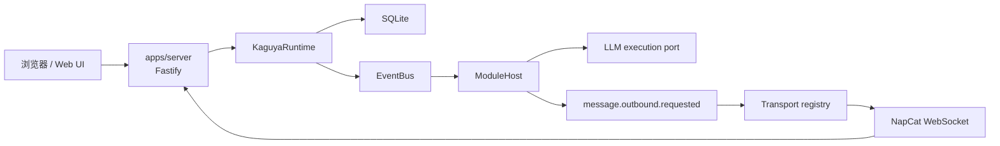
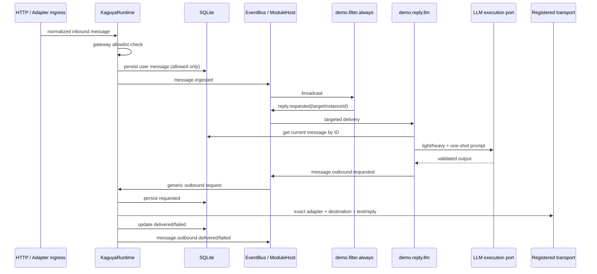

# Kaguya 架构

Kaguya uses one long-running process, one composition root, and one shared Runtime. `apps/server` assembles configuration and resources; `@kaguya/runtime` owns generic ingress, module event dispatch, the LLM execution port, and outbound transports. Core does not maintain message grouping and has no fixed reply workflow.

## 运行形态

开发模式下 Vite middleware 和 HMR 挂在同一个 Fastify 实例；生产模式由该实例提供 `apps/web/dist`。NapCat 是可选 ingress 与 transport，连接失败不会停止 HTTP 服务。

正常启动顺序为：加载并冻结配置 profile registry，打开并迁移数据库，注册 transport，创建并启动 ModuleHost，最后启动 HTTP 与 adapter ingress。若 profile store 尚未初始化、当前全局选中的 profile 不完整或可选项尚未确认，则进入 setup mode，只启动 HTTP 与 Web UI；当 selected Profile 仍处于 `invalid` 或 `review_required` 时，页面继续显示 readiness 状态。只有当用户选择某个 Profile，或完整替换当前 selected Profile，且该 selected Profile 已 ready 时，页面才会进入 `restart_required`，用户重启后 Runtime 和 adapter ingress 才会继续加载。配置文件损坏、路径或权限异常仍会拒绝启动，不会由引导流程覆盖。

## 包职责

| 层级       | 包                                                                        | 职责                                                                       |
| ---------- | ------------------------------------------------------------------------- | -------------------------------------------------------------------------- |
| 应用装配   | `apps/server`                                                             | 配置、Logger、Runtime、Fastify、NapCat 和关闭顺序                          |
| 运行时     | `packages/runtime`                                                        | 入站持久化、事件发布、ModuleHost 装配、LLM port、transport registry 与审计 |
| 模块协议   | `packages/modules`                                                        | `message.*` 标准事件以及最小 filter/LLM demo 模块                          |
| 执行基础   | `packages/engine`、`packages/sdk`                                         | EventBus、ModuleHost、强类型模块/事件 API；保留显式 workflow API           |
| 数据与模型 | `packages/database`、`packages/prompt`、`packages/llm`、`packages/config` | SQLite、Prompt、模型调用/trace、profile/tier 配置                          |
| 平台契约   | `packages/schema`、`packages/platform-adapters`                           | 公共 schema、OneBot 规范化和稳定 outbound transport                        |

依赖方向是 `apps/server → runtime → 基础 packages`。Runtime 不读取 Server 环境变量；Server 不重建 Runtime 内部组件。

## 消息模块链

`reply.*` 只是 demo 模块间协议。模块可以不回复、使用自己的状态/历史，或把输出发送到与触发消息无关的私聊或群聊。Core 不从 message ID、sender、mention 或来源推导 destination，也不检查 outbound 是否在回复当前消息。

`message.ingested` 对所有已持久化入站消息广播。平台事件包含公开且 schema 校验后的 adapter、平台消息 ID、self ID、destination、sender 和 mentions；adapter `raw` 不进入事件或持久化 metadata。OneBot 数组段与 CQ 字符串生成一致的 text/mentions，`@` 只是模块输入，不是 Core 触发条件。

平台白名单在 Runtime 入站边界执行。平台、用户或群组任一已配置维度未命中时，消息会被记录为 `message.dispatch.filtered` 并在落库、事件发布和 LLM 调用之前结束；未配置的维度不参与筛选。

The platform allowlist runs at the Runtime ingress boundary. If any configured platform, user, or group dimension does not match, the Runtime records `message.dispatch.filtered` and stops before persistence, event publication, or LLM execution. Unconfigured dimensions do not participate in filtering.

HTTP input contains only text plus the gateway-generated `requestId`. The default reply module performs one LLM request but does not infer an outbound transport destination for Web input.

## Messages have no grouping identifier

`ExecutionContext`, `WorkflowContext`, `ModuleHandlerContext`, and `EventEnvelope` retain only runtime and causal identifiers. The message table has no grouping column, and repositories do not query history by conversation grouping. Legacy SQLite formats are rejected before any write; the application never migrates or deletes them automatically.

Private chats, groups, and users neither inherently share nor isolate context. Future information atoms and the message DAG will organize data through explicit typed references and module subscriptions. The current Runtime provides no heartbeat or legacy Memory placeholder workflows.

## 事件身份与错误边界

模块派生事件自动继承 `traceId`，并写入逐级 `causationEventId`、`rootEventId`、`moduleDefinitionId` 与 `moduleInstanceId`。这些字段不能被模块 metadata 或 EventBus interceptor 改写。它们只用于观测和审计，不构成授权或隔离。

广播等待全部匹配模块完成后聚合错误；定向事件只交给目标实例。关闭先停止 ingress，再等待 Runtime 在途 dispatch，停止 ModuleHost，关闭数据库、Web 资源和 Logger。嵌套模块/LLM 错误在日志中只保留安全分类与失败数量，不序列化 provider cause、token 或消息内容。

## 配置、LLM 与数据

Server 从 `KAGUYA_CONFIG_ROOT` 加载 profile registry，并在启动时解析唯一的 `selectedProfileId`。每个模块 LLM request 只声明 `{modelTier}`；模块、消息和请求都不能覆盖 Profile。`light` 与 `heavy` 必须指向两个不同、有效、enabled 的 provider/model target，可跨 provider。选中 Profile 缺失、未知或未就绪时，Runtime 不启动，也不 fallback 到其他 Profile、provider 或模型。

Provider key 只存在于权限保护的 profile JSON、配置管理器与 provider factory。模块 settings、事件、Prompt、trace 和日志都不接收 key。完整存储约束见 [`@kaguya/config`](../packages/config/README.md)。

SQLite 保存规范化入站消息、LLM trace 和 outbound audit。每个 outbound request 先以 `requested` 落库，transport 完成后原子更新为 `delivered` 或 `failed`；receipt 只保留非敏感字段。系统不提供持久事件队列、自动重试或去重。
