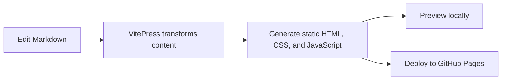

# Developer Guide

This section is for contributors who need to understand repository responsibilities, development workflows, and documentation conventions.

## Documentation flow

## Directory responsibilities

- `zh/` contains Simplified Chinese content.
- `en/` contains English content with matching routes.
- `.vitepress/` contains the site configuration, navigation, theme, and plugins.
- `public/` contains assets copied directly to the generated site.

## Contribution checklist

- Keep the Chinese and English navigation aligned.
- Add new pages to the correct sidebar group.
- Use headings to create a useful right-hand outline.
- Verify internal links under the `/Kaguya/` deployment base.
- Complete the documentation build locally.

Continue with [Markdown Features](./markdown-features) for the supported authoring patterns.

