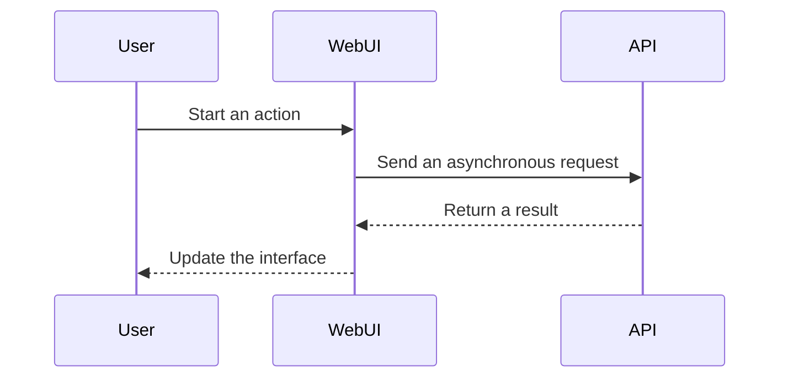

# Markdown Features

Kaguya documentation uses VitePress Markdown plus a small set of extensions. These patterns keep pages readable while supporting diagrams, timelines, and grouped examples.

## Headings and the right outline

Second- and third-level headings automatically appear in the independent outline on the right. Use headings to express the page structure instead of styling ordinary text as a heading.

## Custom containers

::: info Background information
Use `info` for context that helps interpretation but is not a required step.
:::

::: tip Recommended practice
Use `tip` for a safer or more efficient approach.
:::

::: warning Check before continuing
Use `warning` when the reader must verify a condition.
:::

::: danger Irreversible or security-sensitive action
Use `danger` sparingly for actions with serious consequences.
:::

## Code groups with icons

Use code groups when readers choose between equivalent files or commands. Every fenced block should declare a language and an explicit Iconify icon.

::: code-group

```typescript [TypeScript] icon="logos:typescript-icon"
export async function loadArchive(): Promise<string[]> {
  return ['example']
}
```

```python [Python] icon="logos:python"
async def load_archive() -> list[str]:
    return ["example"]
```

:::

## Mermaid diagrams

Use diagrams when relationships are harder to understand as prose.



## Timeline

Use timelines for milestones or release histories.

::: timeline 2026
- Documentation framework established.
- Chinese and English navigation aligned.
:::

## Assets and links

- Place images under `public/images/` and reference them with root-based paths such as `/images/example.webp`.
- Prefer relative links between documentation pages.
- Add descriptive alternative text for every meaningful image.
- Avoid links that only work from the repository root but fail under the GitHub Pages base path.

