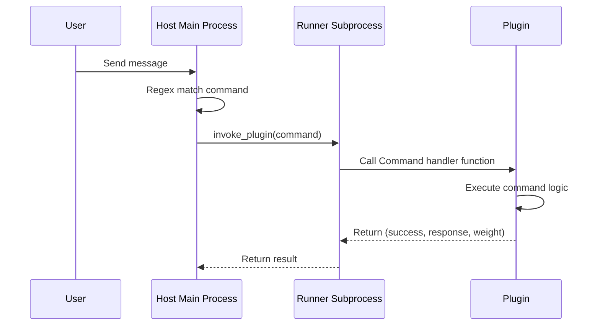

# Command Component

`@Command` is a command component based on regex matching. When a message sent by a user matches a Command's regex pattern, MaiBot will dispatch and execute the corresponding Command handler function.

## Decorator Signature

::: code-group

```python [Python ~vscode-icons:file-type-python~]
from maibot_sdk import Command

@Command(
    name: str,                    # Command name (required)
    description: str = "",        # Command description
    pattern: str = "",            # Regex matching pattern
    aliases: list[str] | None = None,  # Command alias list
    **metadata,                   # Additional metadata
)
```

:::

### Parameter Description

- **`name`** `str` — Command name, must be unique within the plugin
- **`description`** `str` — Command description
- **`pattern`** `str` — Regex matching pattern string. Triggers this command when a user message matches this pattern
- **`aliases`** `list[str] | None` — Command alias list, providing additional trigger methods

## Basic Usage

::: code-group

```python [Python ~vscode-icons:file-type-python~]
from maibot_sdk import MaiBotPlugin, Command


class MyPlugin(MaiBotPlugin):
    @Command("hello", pattern=r"^/hello")
    async def handle_hello(self, **kwargs):
        await self.ctx.send.text("Hello!", kwargs["stream_id"])
        return True, "Hello!", 2
```

:::

### Command with Aliases

::: code-group

```python [Python ~vscode-icons:file-type-python~]
@Command("greet", pattern=r"^/greet", aliases=["/hi", "/hey"])
async def handle_greet(self, **kwargs):
    await self.ctx.send.text("Hello!", kwargs["stream_id"])
    return True, "Hello!", 2
```

:::

Using `/greet`, `/hi`, or `/hey` will all trigger this command.

### Command with Regex Capture Groups

::: code-group

```python [Python ~vscode-icons:file-type-python~]
import re

@Command("echo", pattern=r"^/echo\s+(?P<text>.+)$")
async def handle_echo(self, **kwargs):
    matched = kwargs.get("matched_groups", {})
    text = matched.get("text", "").strip()
    stream_id = kwargs["stream_id"]
    await self.ctx.send.text(f"Echo: {text}", stream_id)
    return True, f"Echo: {text}", 1
```

:::

## Handler Function Parameters

Command handler functions receive `**kwargs`, which contains the following parameters:

- **`stream_id`** `str` — Current chat stream ID, used for sending messages
- **`matched_groups`** `dict` — Regex named capture group matching results
- **`raw_message`** `str` — Original message text sent by the user
- **`message`** `dict` — Complete message object

### Return Value

Command handler functions must return a triplet:

::: code-group

```python [Python ~vscode-icons:file-type-python~]
return success, response, weight
```

:::

- **`success`** `bool` — Whether the command executed successfully
- **`response`** `str` — Text description of the command execution result
- **`weight`** `int` — Command priority weight; the higher the value, the higher the priority

::: code-group

```python [Python ~vscode-icons:file-type-python~]
# Command executed successfully
return True, "Operation successful", 2

# Command execution failed
return False, "Parameter error", 1
```

:::

## Regex Pattern Writing Guide

### Recommended Patterns

::: code-group

```python [Python ~vscode-icons:file-type-python~]
# Exact match /hello
pattern=r"^/hello$"

# Match /hello with optional parameters
pattern=r"^/hello(?P<name>.+)?$"

# Match /echo with required parameters
pattern=r"^/echo\s+(?P<text>.+)$"

# Match /set with key-value pairs
pattern=r"^/set\s+(?P<key>\w+)\s+(?P<value>.+)$"
```

:::

### Using Named Capture Groups

It is recommended to use `(?P<name>...)` named capture groups, which allow you to access matching results by name via `kwargs["matched_groups"]`:

::: code-group

```python [Python ~vscode-icons:file-type-python~]
@Command("ban", pattern=r"^/ban\s+(?P<user>\w+)(?:\s+(?P<reason>.+))?$")
async def handle_ban(self, **kwargs):
    matched = kwargs.get("matched_groups", {})
    user = matched.get("user", "")
    reason = matched.get("reason", "No reason")
    await self.ctx.send.text(f"Banned {user}, reason: {reason}", kwargs["stream_id"])
    return True, f"Banned {user}", 2
```

:::

## Command Execution Flow



## Command Authorization (since 1.2.0) {#command-authorization}

Since 1.2.0, a command can be declared as **operator level** (`permission="operator"`) and the main program authorizes it uniformly at trigger time:

::: code-group

```python [Python ~vscode-icons:file-type-python~]
@Command(
    "management",
    pattern=r"^/pm",
    permission="operator",  # mark as an operator-level command
)
async def handle_management(self, **kwargs):
    ...
```

:::

Commands without `permission="operator"` are open to all users.

### Evaluation Logic

Operator-level commands are evaluated uniformly by `has_command_permission()`, allowing execution in the following order:

1. **Operator list** — the user matches a `platform:id` in `[plugin].permission` (e.g. `qq:123456789`)
2. **Command-level allow rules** — the command's `command_permissions` rule matches (`allow_users` matches the user, or `allow_chats` matches a real chat flow)
3. **No rule matches** — execution is refused and the user is told "no permission"

### Configuring Command-Level Allow Rules

Configure them in the `[plugin]` section of `bot_config.toml`:

::: code-group

```toml [TOML ~vscode-icons:file-type-toml~]
[plugin]
permission = ["qq:123456789"]  # operator list

[plugin.command_permissions.my-plugin.my-command]
allow_users = ["qq:987654321"]  # extra allowed users
allow_chats = ["chat-xxxx"]     # extra allowed real chat flow IDs
```

:::

These rules can also be maintained visually in the WebUI **Bot Config → Commands** editing mode, see [WebUI Command Management](../manual/webui/command-management.md).

## Command-Related Hooks

There are built-in Hook points before and after command execution available for `@HookHandler` subscription:

- `chat.command.before_execute`: Triggered before command execution, can abort or modify parameters
- `chat.command.after_execute`: Triggered after command execution, can modify the return result

## Complete Example

::: code-group

```python [Python ~vscode-icons:file-type-python~]
from maibot_sdk import MaiBotPlugin, Command, Tool
from maibot_sdk.types import ToolParameterInfo, ToolParamType


class AdminPlugin(MaiBotPlugin):
    async def on_load(self) -> None:
        self.ctx.logger.info("Admin plugin loaded")

    async def on_unload(self) -> None:
        pass

    async def on_config_update(self, scope: str, config_data: dict, version: str) -> None:
        pass

    @Command("status", pattern=r"^/status$")
    async def handle_status(self, **kwargs):
        """View system status"""
        stream_id = kwargs["stream_id"]
        await self.ctx.send.text("System running normally ✅", stream_id)
        return True, "System running normally", 1

    @Command("echo", pattern=r"^/echo\s+(?P<text>.+)$")
    async def handle_echo(self, **kwargs):
        """Echo message"""
        matched = kwargs.get("matched_groups", {})
        text = matched.get("text", "").strip()
        stream_id = kwargs["stream_id"]
        await self.ctx.send.text(text, stream_id)
        return True, text, 1

    @Command("help", pattern=r"^/help$", aliases=["/帮助"])
    async def handle_help(self, **kwargs):
        """Display help information"""
        stream_id = kwargs["stream_id"]
        help_text = "Available commands:\n/status - View status\n/echo <text> - Echo message\n/help - Display help"
        await self.ctx.send.text(help_text, stream_id)
        return True, "Help information sent", 1


def create_plugin():
    return AdminPlugin()
```

:::
