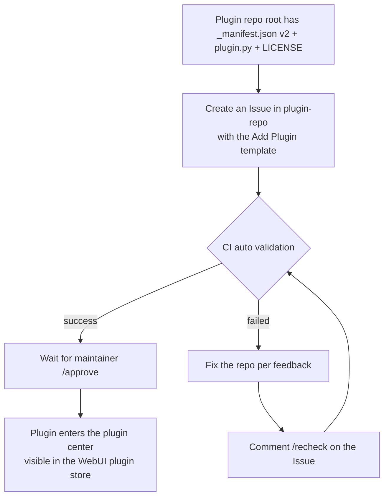

# Submitting a Plugin

Once your plugin is written and verified locally, you can submit it to the official MaiBot plugin center so all users can find and install it through the WebUI plugin store.

## What Is the Plugin Center

The plugin center ([plugins.maibot.chat](https://plugins.maibot.chat/)) is powered by the official repository [Mai-with-u/plugin-repo](https://github.com/Mai-with-u/plugin-repo). Plugins themselves live as **independent public GitHub repositories**; the plugin center only maintains a `plugins.json` index and validates every submission through automated workflows.

Submitting is **completely open source and free** — no fees or invitations required. Once approved, your plugin appears in plugin store search results.

## Before You Submit: Plugin Repository Requirements

Your plugin must be a **public GitHub repository** whose root directory contains the following files:

**`_manifest.json`** — The plugin manifest, using the **manifest v2** structure; field spec in [Manifest System](./manifest.md)
**`plugin.py`** — The plugin entry file, containing the `create_plugin()` factory function
**`LICENSE`** — A license file whose type matches the `license` field in `_manifest.json`
**`README.md`** — Recommended: feature introduction, installation instructions, configuration notes, and usage examples

::: tip What "plugin repository" means
The plugin repository is **your own standalone (or project) GitHub repository** (e.g. `https://github.com/you/my-plugin`) — not MaiBot's `plugins/` directory. The plugin center locates it via the `urls.repository` field in `_manifest.json`.
:::

## Submission Method: Issue Submission (Recommended)

Submit via an Issue template — **no fork or local Git operations needed**, and it avoids merge conflicts from multiple people editing `plugins.json` at once.

1. Open the [plugin-repo repository](https://github.com/Mai-with-u/plugin-repo) [New Issue](https://github.com/Mai-with-u/plugin-repo/issues/new/choose) page and choose the **"Add Plugin / 添加插件"** template.
2. Fill in the information:
   - **Plugin ID**: recommended to match the `id` in your `_manifest.json`.
   - **Repository URL**: the full public GitHub HTTPS URL, e.g. `https://github.com/username/my-plugin`.
3. After submitting, CI automatically reads the `_manifest.json` at the root of your plugin repository and validates it, commenting the result on your Issue.
4. Once validation passes, a maintainer approves it with `/approve` — your plugin is then added to the plugin center.

### Status Labels

**`pending-validation`** — Waiting for automatic validation
**`validated`** — Validation passed, waiting for maintainer approval
**`validation-failed`** — Validation failed, fix according to the feedback
**`approved`** — Approved and added to the plugin center
**`rejected`** — Rejected by a maintainer

### What If Validation Fails

1. Fix your plugin repository according to the error messages in the Issue.
2. After fixing, comment `/recheck` on the Issue.
3. CI re-validates and comments the result on the Issue again.

## Submission Flow Overview

## Submission Checklist

Go through this list before submitting:

- [ ] Plugin repository is a **public** GitHub repository
- [ ] Root directory contains `_manifest.json` (`manifest_version: 2`), `plugin.py`, and `LICENSE`
- [ ] `id` is stable and unique — no spaces, no path characters
- [ ] All versions are three-part (`x.y.z`)
- [ ] `author` is a `{ name, url }` object
- [ ] `urls.repository` is a public HTTPS URL without a `.git` suffix
- [ ] `capabilities` declares only what the plugin actually needs
- [ ] Plugin loads and runs correctly with a real MaiBot instance locally

## Further Reading

- [Plugin Store](https://plugins.maibot.chat/) — browse all accepted plugins
- [plugin-repo repository](https://github.com/Mai-with-u/plugin-repo) — plugin index and contribution guide
- [Manifest System](./manifest.md) — full `_manifest.json` field reference
- [Development Guide](./) — start writing a plugin from scratch
