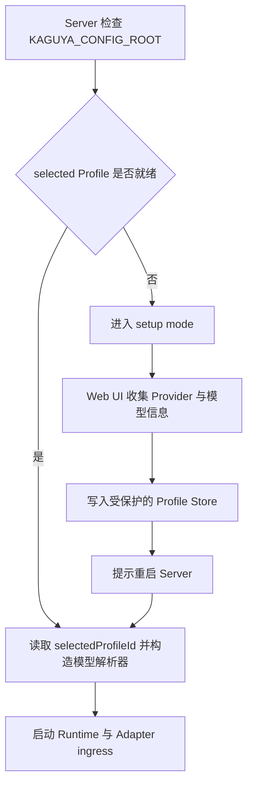

# 配置 Kaguya

Kaguya 把服务运行参数和用户模型配置分开管理：监听地址、端口、PostgreSQL URL 和平台连接来自环境变量；Provider、API Key 与模型目标保存在 Profile Registry。

## 首次配置流程

以下情况会进入 setup mode：配置目录尚未初始化、当前 `selectedProfileId` 指向的 Profile 不完整，或平台和插件等可选配置尚未明确确认。此时 `/healthz`、Web UI 和配置接口可用，消息 Runtime 与 NapCat ingress 不启动。`KAGUYA_DATABASE_URL` 仍是启动配置的必填项；只有 selected Profile ready 后 Server 才会连接数据库并启动 Runtime。

配置文件损坏、路径越界、符号链接或权限错误不会进入自动修复流程，Server 会拒绝启动并保留原文件。

## Web UI 需要填写什么

**Profile 名称** — 1 至 100 个字符，用于标识当前配置。

**Base URL** — OpenAI-compatible Provider 的完整 URL。

**API Key** — 仅提交给 Server，并写入权限受保护的 profile JSON。

**Light Model** — 用于轻量任务的模型 ID。

**Heavy Model** — 用于重量任务的模型 ID，必须与 Light Model 不同。

平台与插件不是 Provider 配置的必填项。NapCat 使用独立的 WebUI 页面配置，保存到 `KAGUYA_CONFIG_ROOT/napcat.json`，并在重启后由 Server 创建连接。

保存成功会返回 `restartRequired: true`。重启是必要步骤，因为模型客户端、profile registry 和 NapCat supervisor 都在服务启动时创建并冻结。

## Profile 与模型选择

每个 Profile 包含 AI Provider、light/heavy 模型层级、平台和插件配置。Registry 只维护一个显式 `selectedProfileId`；Server 在启动时读取它一次，并为全部模块共享同一个模型解析器。模块只能声明 `modelTier`，不能指定 `profileId`；消息和信息原子也不能覆盖或选择 Profile。

选中的 Profile 或模型失败时，系统不会自动回退到默认 Profile、另一个 Provider 或另一个模型。创建 Profile 不会改变当前选择；显式选择 Profile，或完整替换当前 selected Profile 后，必须重启 Server 才能让 Runtime 使用新配置。

## 敏感文件边界

Profile JSON 中的 API Key 和凭据以明文保存，因此整个配置根目录都是敏感数据。

**POSIX 权限** — 目录应为 `0700`，托管文件应为 `0600`。

**Windows 权限** — 生产环境应设置 NTFS ACL，只允许运行 Kaguya 的账号访问。

**单写入者** — 同一配置根目录任意时刻只能有一个活动 `FileUserConfigManager` 或写入进程。

**原子写入** — 配置管理器通过同步临时文件和原子替换降低写入中断风险。

::: danger 凭据泄漏
如果真实密钥进入 Git，应先撤销或轮换密钥，再检查访问记录。只删除最新文件或添加 `.gitignore` 不能恢复已经泄漏的凭据。
:::

## 环境变量与旧配置

完整服务变量见[环境变量参考](../reference/environment-variables)。Server 不从 `KAGUYA_LLM_API_KEY`、`KAGUYA_LLM_BASE_URL` 或 `KAGUYA_LLM_MODEL` 读取模型配置；检测到这些旧变量会在启动前失败，并提示迁移到 profile store。

旧版配置索引会被明确拒绝，不会自动迁移或删除。升级前应先备份敏感目录，并在受控环境中建立新格式配置。
