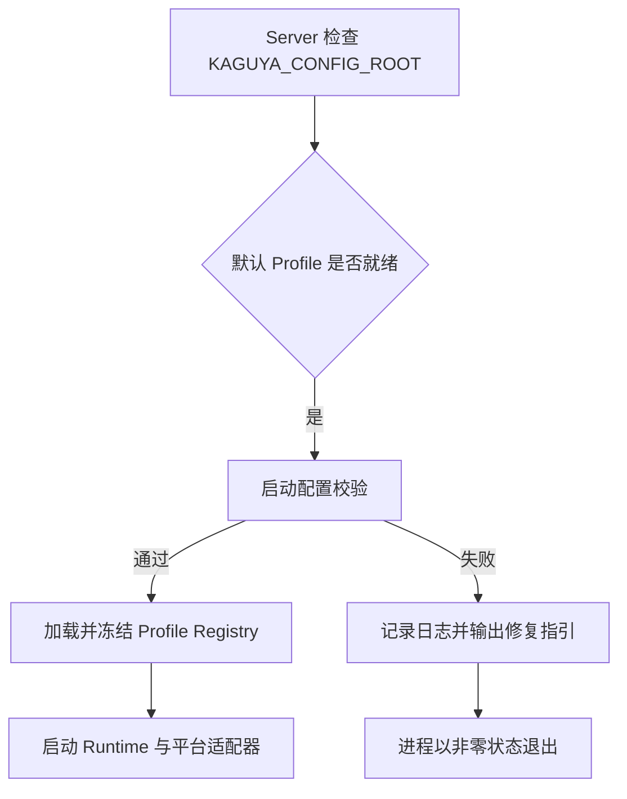

# 配置 Kaguya

Kaguya 将启动所需的运行参数与模型、平台配置统一保存在 selected Profile 中。服务只通过固定的默认目录 `.data/kaguya-config`（或 `KAGUYA_CONFIG_ROOT` 指定的目录）定位 Profile，不再从环境变量读取端口、白名单、NapCat 或模型参数。

## 首次配置流程

启动配置校验会依次检查 Registry 文件、selected Profile、runtime 字段、AI provider/model tier 和平台适配器。校验失败时不会启动 Runtime、NapCat、HTTP 或 Web UI；终端会显示错误码、字段路径和修复提示，Pino 日志会记录同一组脱敏后的结构化 issue。

配置文件损坏、路径越界、符号链接或权限错误不会进入自动修复流程，Server 会拒绝启动并保留原文件。

## Web UI 需要填写什么

**Profile 名称** — 1 至 100 个字符，用于标识当前配置。

**Base URL** — OpenAI-compatible Provider 的完整 URL。

**API Key** — 仅提交给 Server，并写入权限受保护的 profile JSON。

**Light Model** — 用于轻量任务的模型 ID。

**Heavy Model** — 用于重量任务的模型 ID，必须与 Light Model 不同。

**可选配置确认** — 必须明确确认当前可以暂不配置平台与插件；系统不会替用户静默作出决定。

## Profile 中的运行配置

**`runtime`** — 保存监听地址、端口、网关令牌、数据库路径、Web 静态目录、CORS、代理信任、限流、日志级别、日志格式和网关白名单。

**平台条目** — NapCat 使用通用平台结构 `id/type/enabled/credentials/settings`，其中 `type` 为 `napcat` 时，`settings` 至少包含 `adapterId`、`wsUrl` 和 `reconnectMs`。

**外部平台要求** — Web UI 是内建适配器，不写入 Profile，也不计入平台数量。至少一个已启用的非 Web 平台是启动硬条件；插件可以为空，但仍必须符合 schema。

配置凭据仍以明文保存在受保护的 Profile 文件中。校验日志只记录字段路径和错误摘要，不记录 API key、access token 或完整配置正文。

保存成功会返回 `restartRequired: true`。重启是必要步骤，因为模型客户端和 profile registry 在 Runtime 启动时创建并冻结。

## Profile 与模型选择

每个 profile 包含 AI Provider、light/heavy 模型层级、平台和插件配置。模块可以显式指定 `profileId` 与 `modelTier`；未指定 profile 时使用默认 profile。

选中的 profile 或模型失败时，系统不会自动回退到默认 profile、另一个 Provider 或另一个模型。这样可以让执行结果和错误边界保持可审计。

## 敏感文件边界

Profile JSON 中的 API Key 和凭据以明文保存，因此整个配置根目录都是敏感数据。

**POSIX 权限** — 目录应为 `0700`，托管文件应为 `0600`。

**Windows 权限** — 生产环境应设置 NTFS ACL，只允许运行 Kaguya 的账号访问。

**单写入者** — 同一配置根目录任意时刻只能有一个活动 `FileUserConfigManager` 或写入进程。

**原子写入** — 配置管理器通过同步临时文件和原子替换降低写入中断风险。

::: danger 凭据泄漏
如果真实密钥进入 Git，应先撤销或轮换密钥，再检查访问记录。只删除最新文件或添加 `.gitignore` 不能恢复已经泄漏的凭据。
:::

## 环境变量与旧配置

环境变量只用于定位 Profile 根目录：`KAGUYA_CONFIG_ROOT` 未设置时使用 `.data/kaguya-config`。端口、令牌、数据库、白名单、NapCat、日志和模型配置都必须写入 Profile。旧环境变量不会被读取、迁移或覆盖 Profile；旧版 Registry 仍会被明确拒绝，升级前应备份敏感目录并建立新格式配置。

