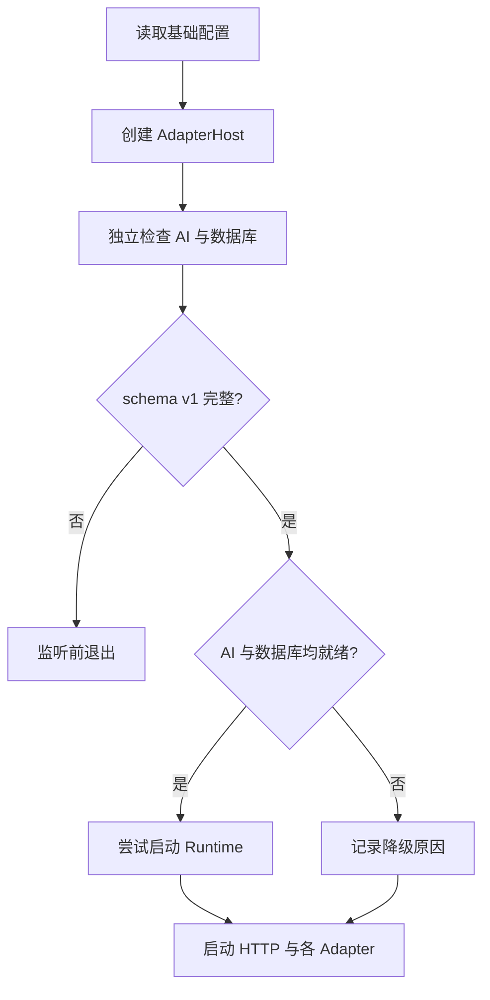

# 配置 Kaguya

Profile Registry 保存 runtime、数据库、AI、Memory、平台与 review；全局 selected Profile 是这些字段的运行真值。模块实例配置独立位于同一配置根的 `modules/`。环境只用 `KAGUYA_CONFIG_ROOT` 定位配置根。

## 首次启动会发生什么

开发模式不需要手工创建配置目录。目录缺失时，`pnpm dev` 会建立 Registry、保留的 `default` Profile 和托管数据库 runtime；这个初始 Profile 的 AI 尚不完整，Web UI 会引导你填写，数据库失败不阻止页面启动。生产 `pnpm start` 不管理 Docker，也不补 runtime。

## Runtime 与数据库

Profile 的 `runtime` 保存 host、port、必填的 `databaseMode`、`databaseUrl`、Web 路径、CORS、proxy、限流、日志和 gateway allowlist。外部数据库只通过 Profile JSON 配置；Web API 不返回或接收完整 runtime，只安全投影并更新其中的 gateway allowlist。

`databaseMode: "managed"` 表示开发命令可以管理固定的本地容器；`databaseMode: "external"` 表示所有命令都只连接 Profile URL，不调用 Docker。两种模式都检查 PostgreSQL 17。连接暂时不可用可进入降级状态；旧 schema、缺失 metadata、版本不符或结构不完整会在任何监听前终止启动。

Gateway Token 不写入 runtime，也不是 runtime 的合法字段。它在每次进程启动时安全随机生成，只存在于当前进程和访问链接。

## 看懂配置状态

**`invalid`** — 所选 Profile 缺少必填项或引用不一致。按页面列出的 issue 修正字段。

**`review_required`** — 必填项有效，但当前配置仍有需要明确确认的警告。阅读警告后决定补充或确认。

**`restart_required`** — 磁盘上的所选配置已经更新，但当前进程仍使用启动时的旧对象。重启 Server 后生效。

**`ready`** — 所选 Profile 可以用于创建 Runtime。

配置文件损坏、权限不安全、路径越界或符号链接不会被自动“修好”。Server 会拒绝危险读取或写入，避免覆盖原数据。

## 填写模型配置

**Profile 名称** — 1 至 100 个字符，用于人类识别；Profile ID 是系统生成的稳定标识。

**Base URL** — OpenAI-compatible Provider 的服务地址，例如供应商提供的 `/v1` 入口。

**API Key** — 只提交给当前 Kaguya Server，并以明文写入受保护的 Profile JSON。不要粘贴到 Issue、PR 或截图。

**Light Model** — 面向轻量任务的模型 ID。

**Heavy Model** — 面向重量任务的模型 ID；可以与 Light Model 使用同一个 `provider:model` 目标。

**网关白名单规则** — 每行一条 `platform:group|private:target_id`。群聊目标是 group ID，私聊目标是 user ID；`platform` 与目标 ID 支持 `*`。规则按 OR 匹配，空列表拒绝所有平台消息，非法非空行会保存但不生效。Web 消息不经过该白名单。

**启用 Memory** — 初始化 Profile 显式写为关闭；请求与文件都必须包含该字段。关闭时 Runtime 仍保留联想与 Prompt 的处理形状，但不会读取、写入、召回或主动提取实际 Memory；显式开启后才使用内置 PostgreSQL 稀疏召回。

**配置警告确认** — 当前 UI 只允许确认 selected Profile 实际存在的警告；过期或未知 warning ID 会校验失败。

当前表单用一个 ID 为 `default-provider` 的 OpenAI-compatible Provider 建立初始配置。底层 Profile 支持更完整的 Provider和平台结构，但页面只呈现已经实现并验证的操作。

## 配置模块实例

首次启动时，如果整个 `modules/` 不存在，Kaguya 会生成六个一方实例的完整 v1 文件。此后只读取文件，不补缺失内容：目录已存在时，缺少实例、出现未知实例、版本错误、身份不匹配或 settings 缺字段都会阻止启动。

每个 `<KAGUYA_CONFIG_ROOT>/modules/<instanceId>/config.json` 必须显式包含 `version`、`instanceId`、`definitionId`、`enabled` 和完整 `settings`。修改后重启；当前不提供 HTTP 或 Web 管理接口。

## 管理多个 Profile

一个 Registry 可以保存多个 Profile，但任意时刻只有一个全局 selected Profile 用于 Runtime。

**新建** — 创建未选中的 Profile，并继承当前 selected Profile 的隐藏 runtime，避免切换后失去数据库与 Server 配置。AI 和平台从空值开始，Memory 显式写为关闭。

**编辑** — 对可见字段做完整替换，而不是局部 patch；Server 只把顶层 `gatewayAllowlist` 合并回隐藏 runtime，并原样保留其他 runtime 字段。目标 Profile 缺少 runtime 时会明确拒绝保存。保存当前选中的 Profile 会要求重启；编辑未选中的 Profile 通常不会影响正在运行的 Runtime。

**选择** — 把某个 Profile 设为全局 selected。切换后需要重启。

**删除** — 只允许删除非 `default` 且非 selected 的 Profile。若要删除当前 Profile，先选择另一个 Profile并重启，再执行删除。

::: warning 没有自动回退
所选 Profile 或模型失败时，Kaguya 不会静默改用默认 Profile、其他 Provider 或其他模型。显式失败能保持行为与审计一致。
:::

## 重启让配置生效

Profile 保存成功和 Runtime 已采用新配置是两个时刻。Provider 客户端、light/heavy 路由和 Runtime 在进程启动时创建；运行中修改磁盘文件不会热重载它们。

在运行 `pnpm dev` 的终端按 `Ctrl+C`，再重新执行 `pnpm dev`。页面刷新后若状态为 `ready`，即可进入消息界面。技术原因见[配置生命周期](../developers/configuration-lifecycle)。

## 保护配置目录

**POSIX 权限** — 目录应为 `0700`，托管文件应为 `0600`。

**Windows 权限** — 生产环境应设置 NTFS ACL，只允许运行 Kaguya 的账号访问。

**单写入者** — 同一配置根目录任意时刻只运行一个管理器或写入进程；当前实现没有跨进程协调。

**原子写入** — 管理器写临时文件、同步并原子替换，降低中断造成半个文件的风险。

::: danger 凭据泄漏
如果真实密钥进入 Git，应立即撤销或轮换，再检查访问记录。删除最新文件或补 `.gitignore` 不能清除历史泄漏。
:::

完整运行字段见[环境变量与运行配置](../reference/environment-variables)，配置接口见[Profile API](../reference/profile-api)。Registry 与 Profile 都使用严格的 `version: 1`，旧结构不迁移、不双读。
