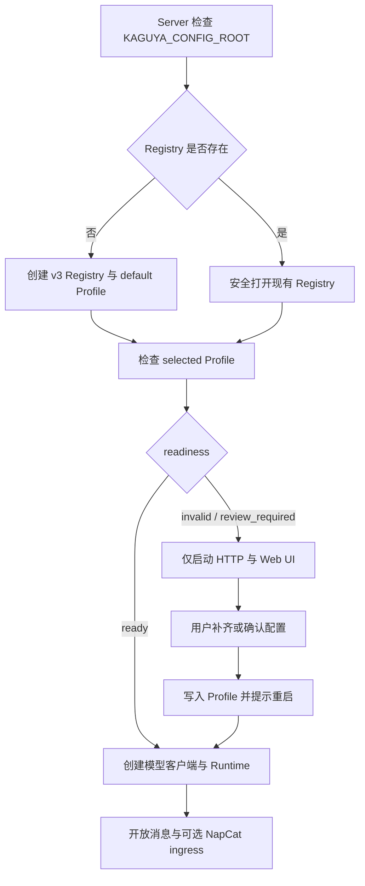

# 配置 Kaguya

Kaguya 把配置分成两层：监听地址、数据库、NapCat 和日志等服务参数来自环境变量；Provider、API Key、模型目标、平台与插件保存在 Profile Registry。Web UI 主要管理第二层。

## 首次启动会发生什么

不需要手工创建配置目录。目录缺失时，Server 会自动建立 Registry 和保留的 `default` Profile；这个初始 Profile 尚不完整，Web UI 会引导你填写。

## 看懂配置状态

**`invalid`** — 所选 Profile 缺少必填项或引用不一致。按页面列出的 issue 修正字段。

**`review_required`** — 必填项有效，但平台、插件等可选部分仍需明确确认。阅读警告后决定补充或确认暂时留空。

**`restart_required`** — 磁盘上的所选配置已经更新，但当前进程仍使用启动时的旧对象。重启 Server 后生效。

**`ready`** — 所选 Profile 可以用于创建 Runtime。

**`setup_required`** — 配置库底层仍定义该状态，当前 Server 通常会在返回页面前自动 bootstrap；客户端保留它用于兼容。

配置文件损坏、权限不安全、路径越界或符号链接不会被自动“修好”。Server 会拒绝危险读取或写入，避免覆盖原数据。

## 填写模型配置

**Profile 名称** — 1 至 100 个字符，用于人类识别；Profile ID 是系统生成的稳定标识。

**Base URL** — OpenAI-compatible Provider 的服务地址，例如供应商提供的 `/v1` 入口。

**API Key** — 只提交给当前 Kaguya Server，并以明文写入受保护的 Profile JSON。不要粘贴到 Issue、PR 或截图。

**Light Model** — 面向轻量任务的模型 ID。

**Heavy Model** — 面向重量任务的模型 ID，必须与 Light Model 形成不同的 `provider:model` 目标。

**可选配置确认** — 当前 UI 会要求明确确认平台与插件可以暂时留空；系统不会替用户静默接受警告。

当前表单用一个 ID 为 `default-provider` 的 OpenAI-compatible Provider 建立初始配置。底层 Profile 支持更完整的 Provider、平台和插件结构，但页面只呈现已经实现并验证的操作。

## 管理多个 Profile

一个 Registry 可以保存多个 Profile，但任意时刻只有一个全局 selected Profile 用于 Runtime。

**新建** — 创建未选中的空 Profile。先填写并保存，再决定是否切换过去。

**编辑** — 对目标 Profile 做完整替换，而不是局部 patch。保存当前选中的 Profile 会要求重启；编辑未选中的 Profile 通常不会影响正在运行的 Runtime。

**选择** — 把某个 Profile 设为全局 selected。切换后需要重启。

**删除** — 只允许删除非 `default` 且非 selected 的 Profile。若要删除当前 Profile，先选择另一个 Profile并重启，再执行删除。

::: warning 没有自动回退
所选 Profile 或模型失败时，Kaguya 不会静默改用默认 Profile、其他 Provider 或其他模型。显式失败能保持行为与审计一致。
:::

## 重启让配置生效

Profile 保存成功和 Runtime 已采用新配置是两个时刻。Provider 客户端、light/heavy 路由和 Runtime 在进程启动时创建；运行中修改磁盘文件不会热重载它们。

在运行 `pnpm dev` 的终端按 `Ctrl+C`，再重新执行 `pnpm dev`。页面刷新后若状态为 `ready`，即可进入消息界面。技术原因见[配置生命周期](../developers/configuration-lifecycle)。

## 保护配置目录

**POSIX 权限** — 目录应为 `0700`，托管文件应为 `0600`。

**Windows 权限** — 生产环境应设置 NTFS ACL，只允许运行 Kaguya 的账号访问。

**单写入者** — 同一配置根目录任意时刻只运行一个管理器或写入进程；当前实现没有跨进程协调。

**原子写入** — 管理器写临时文件、同步并原子替换，降低中断造成半个文件的风险。

::: danger 凭据泄漏
如果真实密钥进入 Git，应立即撤销或轮换，再检查访问记录。删除最新文件或补 `.gitignore` 不能清除历史泄漏。
:::

完整服务变量见[环境变量参考](../reference/environment-variables)，配置接口见[Profile API](../reference/profile-api)。旧版配置索引和旧模型环境变量会被明确拒绝，不会自动迁移或删除。
