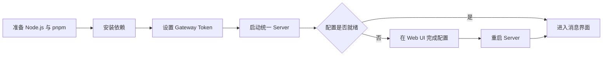

# 使用指南

Kaguya 是一个以持久化信息 DAG 组织运行事实、模块可插拔的 TypeScript AI Bot Runtime。当前唯一长期运行入口是 `apps/server`：它在同一进程、同一端口提供 Web UI、HTTP API，并可选连接 NapCat。

::: tip 推荐阅读顺序
第一次使用时，依次阅读“安装与启动 → 配置 Kaguya → 使用 Web UI”。如果需要接入模块或理解消息为什么这样流动，再进入开发文档。
:::

## Kaguya 当前能做什么

**接收消息** — Web UI 通过 HTTP 提交文本；NapCat 可以把 OneBot 消息标准化后交给同一个 Runtime。

**运行模块链** — 默认链以 Kind 显式连接入站、过滤、回复请求、LLM、assistant 和投递。模块也可以选择不回复，或注册自己的信息原子。

**管理模型配置** — Provider、API Key 和 light/heavy 模型目标保存在权限受保护的 profile store，不从浏览器构建变量读取。

**记录执行过程** — PostgreSQL information ledger 保存不可变原子和显式引用；每个 Core 事实只使用 `informationId`。

## 一次典型启动

## 继续阅读

### 安装与启动

查看[安装与启动](./installation)，准备固定版本工具链，并分别运行开发模式、生产模式或文档站。

### 首次配置

查看[配置 Kaguya](./configuration)，理解 setup mode、profile、模型层级和敏感文件边界。

### 浏览器界面

查看[使用 Web UI](./webui)，了解同源页面、Gateway Token 的保存位置以及当前响应边界。

## 需要提前知道的边界

Kaguya 当前没有持久订阅、离线补投、工作队列、自动重试、去重、模块热更新或沙箱。HTTP 消息接口返回 `202 accepted` 时只表示 Server 已开始异步提交，不返回模型回答，也不提供 SSE。Core 不按用户、群聊或来源自动组织上下文；后续数据关系需要由显式信息引用和模块逻辑表达。旧 SQLite 数据不会自动迁移。
