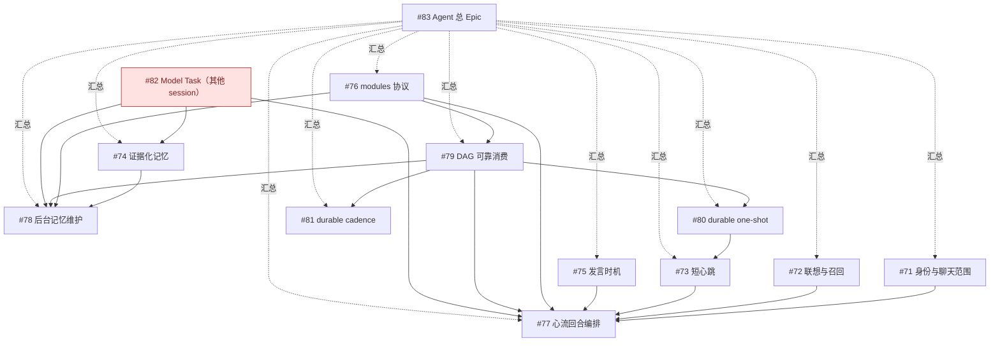

# Kaguya 未完成 Issue 依赖关系

数据来源：GitHub `posanbu/Kaguya` 的 open issues（2026-09-06）。当前其他 session 正在处理或评估的 #82（以及围绕 #76/#79/#82 的评估任务）从可执行清单中排除；#82 仍保留为依赖节点，便于显示完整关系。

## 依赖图

## 可执行的未完成 Issue

建议基础设施优先顺序为 **#76 → #79 → (#80 → #73) → #77**；身份、记忆、联想和发言策略可并行设计，但 #77 的集成验收依赖 #71、#73、#75 以及 #79。后台链路为 **#71 → #74 → #78**，并复用 #79 与 #82。#81 应在存在真实周期维护消费者后实施，依赖 #79；它不是在线心流前置条件。

较早的 #25、#34、#44、#65、#7、#8、#9 之间没有在 issue 正文中形成足够明确的新主线依赖；其中 #44 明确依赖 #25，#65 明确依赖 #34。
