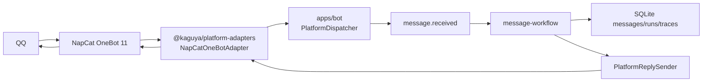

# NapCat Platform Adapter And Dispatcher Design

## Goal

Build Kaguya's first production platform integration slice: a reusable
`@kaguya/platform-adapters` package with a NapCat/OneBot 11 adapter, plus a
production bot dispatcher that turns QQ messages into Kaguya workflow events and
sends generated replies back to QQ.

This work targets the real platform minimum loop:

1. NapCat receives QQ private or group messages.
2. Kaguya normalizes those messages into a validated `message.received` event.
3. The existing message workflow persists the user message, routes, generates,
   and persists an assistant reply.
4. The production sender sends that assistant reply through NapCat to the
   original QQ conversation.

## Current Context

Kaguya already has the foundations needed for this slice:

- `@kaguya/schema` defines validated event envelopes and message records.
- `@kaguya/sdk` defines events, nodes, and workflows.
- `@kaguya/engine` validates and executes workflows.
- `@kaguya/database` persists messages, runs, memories, and LLM traces.
- `apps/demo` owns the current message workflow composition.
- `apps/api` proves an injectable ingress boundary through `MessageIngress`.

Kaguya does not yet have:

- a production platform adapter package;
- a production dispatcher composition root;
- a sender port from workflow replies to a real chat platform;
- a stable platform session and trace mapping for QQ.

MaiBot's implementation is useful as a reference for the boundary shape:
platform protocol code should normalize inbound messages and expose a send
port, while the core dispatcher should own routing into the business workflow.
Kaguya should not copy MaiBot's Python implementation or its full broker scope
yet.

## Architecture

Add `packages/platform-adapters` as a reusable TypeScript package. It owns
platform adapter interfaces, normalized message contracts, OneBot 11 schemas,
NapCat mapping, and NapCat transport. It must not import Kaguya workflow code.

Add `apps/bot` as the production bot composition root. It owns database,
workflow, event bus, LLM lifecycle, configured adapters, and shutdown. It
converts normalized platform messages into `message.received` events through
the existing `dispatchEvent` boundary.

Extend the message workflow with an optional sender service. The workflow still
persists assistant replies first. If a `PlatformReplySender` is configured, a
new send node sends the persisted assistant message to the platform target
captured from inbound metadata. Without a sender, existing local demo behavior
continues to persist only.



## Package Boundaries

### `@kaguya/platform-adapters`

Responsibilities:

- define platform-neutral adapter and sender contracts;
- normalize OneBot 11 private and group message events;
- normalize OneBot 11 send responses into delivery receipts;
- implement NapCat forward WebSocket transport;
- expose test fakes for dispatcher tests.

Non-responsibilities:

- choosing workflows;
- opening Kaguya databases;
- constructing `WorkflowContext`;
- logging message body content;
- implementing product policy for when to reply.

### `apps/bot`

Responsibilities:

- read production bot environment configuration;
- open and migrate the SQLite database;
- construct `EventBus`, `WorkflowEngine`, `PromptCompiler`, and LLM services;
- start configured platform adapters;
- dispatch inbound platform messages into the message workflow;
- provide the workflow sender service;
- close adapters, database, and logger on shutdown.

Non-responsibilities:

- OneBot protocol parsing internals;
- platform-specific message segment construction beyond calling the adapter
  sender;
- exposing HTTP endpoints.

### Existing `apps/demo`

The deterministic local demo remains supported. It may reuse the same optional
sender-aware workflow, but its local ingress should not require platform
configuration or send replies to any external service.

## Normalized Contracts

`PlatformInboundMessage`:

```ts
interface PlatformInboundMessage {
  readonly platform: "qq";
  readonly adapterId: string;
  readonly selfId?: string;
  readonly sessionId: string;
  readonly traceId: string;
  readonly platformMessageId: string;
  readonly occurredAt: string;
  readonly text: string;
  readonly target: PlatformMessageTarget;
  readonly sender: PlatformMessageSender;
  readonly raw: Record<string, unknown>;
}
```

`PlatformMessageTarget`:

```ts
type PlatformMessageTarget =
  | { readonly kind: "private"; readonly userId: string }
  | { readonly kind: "group"; readonly groupId: string };
```

`PlatformMessageSender`:

```ts
interface PlatformMessageSender {
  readonly userId: string;
  readonly nickname?: string;
  readonly card?: string;
}
```

`PlatformDeliveryReceipt`:

```ts
interface PlatformDeliveryReceipt {
  readonly ok: boolean;
  readonly adapterId: string;
  readonly platform: "qq";
  readonly target: PlatformMessageTarget;
  readonly platformMessageId?: string;
  readonly error?: string;
  readonly raw?: unknown;
}
```

The adapter package should keep these as narrow as possible. Add fields only
when a test or production flow needs them.

## Session And Trace Mapping

QQ private messages use:

```text
sessionId = qq:private:<user_id>
```

QQ group messages use:

```text
sessionId = qq:group:<group_id>
```

Trace IDs must be stable per platform message and include the adapter scope:

```text
traceId = napcat:<self_id-or-unknown>:<message_id>
```

The dispatcher must use the normalized `traceId` directly. It must not generate
a different trace ID for the same platform message.

## OneBot 11 Mapping

Inbound message events:

- accept only `post_type: "message"`;
- accept `message_type: "private"` and `message_type: "group"`;
- require a non-empty `message_id`;
- require `user_id` for both private and group messages;
- require `group_id` for group messages;
- use `time` seconds when present to build `occurredAt`; otherwise use the
  dispatcher clock;
- ignore events that produce blank normalized text.

Message segments:

- `text`: append `data.text`;
- `at`: append `@<qq>` and preserve target in raw metadata;
- `reply`: preserve target message ID in text as `[reply:<id>]`;
- `image`: append `[image]`;
- `face`: append `[face:<id>]`;
- unknown segments: append `[<type>]`.

This first slice intentionally degrades rich content to text. It does not
download media or perform image analysis.

Outbound replies:

- private target calls OneBot action `send_private_msg`;
- group target calls OneBot action `send_group_msg`;
- `params.message` is a OneBot segment array with one `text` segment;
- each request carries a unique `echo`;
- successful responses expose `data.message_id` when present.

## Dispatcher Behavior

For each accepted inbound message:

1. create `message.received` with source `adapter:<adapterId>`;
2. set `sessionId` and `traceId` from `PlatformInboundMessage`;
3. set payload `{ text }`;
4. set metadata with platform details:
   - `adapterId`;
   - `platform`;
   - `platformMessageId`;
   - `selfId` when present;
   - `target`;
   - `sender`;
5. create workflow services including `platformReplySender`;
6. call `dispatchEvent` with `messageReceivedEvent` and the message workflow.

The dispatcher must not call workflow nodes directly. Validation errors should
fail the current inbound dispatch and be logged without acknowledging success to
the adapter caller.

## Sender Workflow Behavior

The message workflow persists the assistant reply before attempting platform
delivery. Then the send node:

- reads platform target metadata from the original `message.received` event
  metadata carried through the workflow context;
- sends only assistant replies;
- skips sending when `platformReplySender` is absent;
- returns delivery metadata from the send node and logs the delivery result with
  trace context.

For this slice, sending failure must not delete or rewrite the persisted
assistant message. The delivery failure should be visible in logs and the
workflow output. Updating existing message metadata after send is out of scope.

## Configuration

`apps/bot` reads environment variables:

- `KAGUYA_BOT_DATABASE_PATH`: SQLite path, default `.data/kaguya-bot.sqlite`.
- `KAGUYA_NAPCAT_ENABLED`: must be `true` to start NapCat.
- `KAGUYA_NAPCAT_WS_URL`: required when NapCat is enabled.
- `KAGUYA_NAPCAT_ACCESS_TOKEN`: optional token sent to NapCat.
- `KAGUYA_NAPCAT_SELF_ID`: optional expected QQ bot account.
- `KAGUYA_NAPCAT_RECONNECT_MS`: reconnect delay, default `3000`, minimum `100`.

OpenAI/model configuration is outside this slice unless an existing demo
deterministic model remains the only available local model path. Do not expose
model keys through platform adapter configuration.

## Error Handling

Adapter errors:

- malformed inbound events are rejected without dispatch;
- unsupported or blank inbound messages are ignored without error;
- WebSocket disconnect schedules reconnect when the adapter is still running;
- action responses with `status !== "ok"` become failed delivery receipts;
- timed-out action calls become failed delivery receipts.

Dispatcher errors:

- event validation errors fail the current message dispatch;
- workflow errors fail the current message dispatch;
- send failures do not roll back persisted messages;
- shutdown waits for in-flight dispatches to finish or cancel during process
  termination.

## Testing

Use TDD for production code.

Required tests:

- OneBot private message maps to `qq:private:<user_id>` and text payload.
- OneBot group message maps to `qq:group:<group_id>` and group target.
- non-message events and blank normalized messages are ignored.
- outbound private and group sends produce the correct OneBot action payload.
- failed OneBot action response returns a failed delivery receipt.
- dispatcher converts a normalized inbound message into a validated
  `message.received` event and runs the message workflow.
- dispatcher-provided sender sends the persisted assistant reply to the original
  target.
- local demo ingress continues to persist user and assistant messages without a
  configured platform sender.

## Out Of Scope

- reverse WebSocket server mode;
- HTTP webhook mode;
- media download, image recognition, file storage, or voice transcription;
- multi-adapter route arbitration;
- durable queue and replay after process crash;
- updating persisted assistant message metadata after a send attempt;
- real provider configuration UI;
- platform moderation and permission policy beyond basic message type support.

## Acceptance Criteria

- `pnpm test` passes.
- `pnpm typecheck` passes.
- A configured `apps/bot` process can connect to NapCat forward WebSocket.
- A QQ private text message produces one user record, one assistant record, two
  LLM traces in deterministic mode, and one `send_private_msg` action.
- A QQ group text message produces the same Kaguya workflow records and one
  `send_group_msg` action.
- Blank or unsupported inbound events do not create database records.
- NapCat credentials and message bodies are not written to structured logs.
