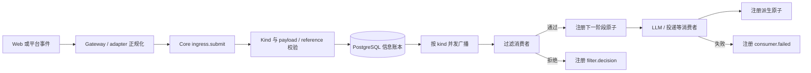

# Core 与模块 SDK 迁移到信息 DAG：设计规格

**状态：** 已确认，待实现  
**日期：** 2026-09-04  
**对应 Issue：** [#40 将 Core 与模块 SDK 迁移到信息 DAG](https://github.com/posanbu/Kaguya/issues/40)  
**上游依赖：** #37、#38、#39、#45

## 为什么必须一次完成切换

Kaguya 当前已经具备不可变 `InformationAtom`、Kind Registry、PostgreSQL 信息账本和全局 `selectedProfileId`，但实际消息路径仍以 `EventEnvelope`、`EventBus`、`defineEvent` 和 `emit` 为主。信息原子目前只是与旧事件系统并存的基础设施，因此一次入站处理仍可能同时拥有 message ID、event ID、trace ID 和 information ID。

本次改造把信息原子提升为运行时唯一事实。Gateway、Web 与平台 adapter 只负责把外部输入正规化并提交给 Core ingress；Core 为内容生成唯一 `informationId`，完成校验和持久化后才向当前订阅者广播。过滤、LLM、回复和投递均通过注册派生原子继续 DAG，不再由中心化事件拦截器隐式推进。

迁移采用破坏式切换。最终代码中不保留旧事件 API、Event 到 Atom 的桥接层、模块级 Profile 覆盖或过渡别名。

## 设计边界

本次实现包含：

- 入站内容到不可变信息原子的持久化优先路径；
- 按 kind 实时并发广播；
- `onInformation` 与 handler `context.register` 模块 SDK；
- 显式过滤、LLM、回复和投递 DAG；
- `consumer.failed` 故障事实；
- Runtime、Gateway、Web、NapCat adapter 和 demo 的切换；
- 旧事件模型和重复身份字段的删除；
- 与上述行为对应的并发及集成测试。

本次不实现持久订阅、自动补投、工作队列、消费者优先级、自动重试、TTL、权限系统、基于 Selector 的上下文选择或 Memory 聚合。这些能力若在后续 issue 中加入，必须继续以账本中的 `informationId` 为边界。

## 唯一身份与原子关系

Core 内的每项运行事实都由一个 `InformationAtom` 表达，并且只使用 `informationId` 作为身份。平台的 `platformMessageId`、用户 ID、群 ID 和请求 ID 仍可作为来源 payload 保存，但不得成为 Core 身份，也不得派生 `eventId`、`messageId` 或 `traceId`。

派生原子至少携带以下引用：

- `core:caused-by` 指向触发当前 handler 的输入 `informationId`；
- 若输入携带 `core:context`，派生原子继承同一引用；
- 模块可以声明额外的命名空间化 relation，但不能替换或重复 Core 保留 relation。

原子提交后不可修改。投递成功、投递失败、LLM 完成、过滤拒绝和消费者失败都通过追加新原子表达。

## 持久化优先的数据流



`InformationCore.register()` 的顺序固定为：检查 Core 状态、确认 kind 已注册、校验 payload 与引用、生成 `informationId`、提交账本、取得该 kind 的当前订阅者快照并并发调用。日志投影同样只能在提交后运行，其失败与消费者失败都不能撤销已经提交的原子。只有账本提交成功的原子才会广播。

持久化或校验失败时，调用方收到错误且不会广播。持久化成功后，即使没有订阅者，原子也保留并正常返回。Core 不记录离线订阅者，也不会在后来出现订阅者时补投历史原子。

## Core 与 ingress 契约

底层注册接口统一命名为 `register`：

```ts
interface InformationCore {
  register<K extends string, P extends JsonObject>(
    definition: InformationKindDefinition<K, P>,
    input: InformationRegistrationInput<K, P>,
  ): Promise<DeepReadonly<InformationAtom<K, P>>>;

  on<K extends string, P extends JsonObject>(
    definition: InformationKindDefinition<K, P>,
    consumer: InformationConsumer,
    handler: InformationHandler<K, P>,
  ): () => void;
}
```

`InformationRegistrationInput` 包含 `occurredAt`、`source`、`payload` 和 `references`，kind 由传入的 definition 唯一确定，并且不接受调用方提供 `informationId`。测试通过注入 `nextInformationId` 获得确定性 ID。

Runtime 组合层提供唯一的 `InformationIngress`：

```ts
interface InformationIngress {
  submit(input: PlatformInboundMessage): Promise<InboundReceipt>;
}
```

Gateway 和 adapter 只持有这个窄接口。它们不能接收数据库 repository、ModuleHost 或业务模块实例。`submit` 将正规化内容注册为入站 kind；adapter 产生的 `PlatformInboundMessage` 不再包含 `traceId`，其 `platformMessageId` 仅作为外部来源数据存在。

`InboundReceipt` 用根 `informationId` 表示已接收事实，可以附带当前调用内观察到的投递结果，但不能引入另一套 Core 身份。

## 模块 SDK 与消费者并发

模块只通过 `onInformation` 声明输入：

```ts
onInformation(inboundKind, async (atom, context) => {
  await context.register(nextKind, {
    payload: buildPayload(atom),
  });
});
```

handler context 暴露 `definitionId`、`instanceId`、不可变 `sourceAtom`、`now()` 和 `register()`。`context.register()` 自动填充 `source: module:<instanceId>`、`occurredAt`、`core:caused-by` 以及继承的 `core:context`；模块只能提供 payload 和非保留的额外引用。

模块 manifest 必须列出自己消费或产生的全部 kind definition。ModuleHost 启动前校验 definition 一致性和 settings；运行后不允许替换 kind schema。模块 settings 中不存在 `profileId`。

一个 kind 可以拥有多个消费者。Core 在每次广播时取得当前订阅者快照，并使用 `Promise.allSettled` 独立并发执行。数组位置、注册先后和模块配置顺序都不是业务语义，SDK 不提供 priority、interceptor、targeted subscription 或短路返回值。若业务确实需要阶段顺序，生产者必须注册一个新 kind，由下一阶段订阅该 kind。

## 过滤是一段显式 DAG

过滤器订阅自己的输入 kind，而不是注册到中心化过滤链：

- 通过时，过滤器调用 `context.register()` 产生约定的下一阶段 kind，例如由入站文本产生回复请求；
- 拒绝时，过滤器注册 `filter.decision`，payload 记录拒绝原因，并且不产生下一阶段原子；
- `filter.decision` 通过 `core:caused-by` 指向被拒绝的输入；
- Core 不解释 `shouldReply`、不寻找“下一个过滤器”，也不决定过滤器顺序。

`filter.decision` 仅表达拒绝事实，不再承担定向路由。旧实现中的 `targetInstanceId`、`onTargetedInformation` 和 `shouldReply: true` 路径会被删除。若多个模块订阅过滤后的同一 kind，它们全部并发执行。

## 派生消息、LLM 与投递

默认消息链至少包含以下阶段：

```text
入站文本
  -> 回复请求（过滤通过）
  -> LLM 请求
  -> LLM 完成 | LLM 失败
  -> assistant 文本
  -> 投递请求
  -> 投递成功 | 投递失败
```

每一箭头都由生产者显式 `register()` 新原子表达。LLM 与投递消费者不直接修改入站原子，也不向旧消息表写一份平行身份记录。需要展示或审计的信息由账本按引用读取。

平台 transport 仍由 Runtime 组合并执行外部发送，但触发条件只能是投递请求 kind。发送结果必须先注册为投递成功或失败原子；平台返回的 message ID 保存在结果 payload 中。

LLM 模型解析器只接收模块声明的 model tier。Server 在 Runtime 启动时读取一次全局 `selectedProfileId` 并构造共享 resolver；模块、消息 payload、信息原子及来源数据均不得携带 `profileId`。

## 消费者失败是不可回滚的事实

每个订阅注册都携带稳定的 consumer 标识，至少能定位模块 `definitionId` 与 `instanceId`；Runtime 内建消费者使用明确的系统 consumer 名称。

当 handler reject 或抛出错误时，Core 注册 `consumer.failed`。该原子通过 `core:caused-by` 指向输入原子，payload 保存 consumer 标识以及经过裁剪和脱敏的错误类型、固定错误摘要。它不保存 stack、凭据、数据库 URL 或 provider 原始错误对象。

一个消费者失败不会：

- 回滚已经提交的输入原子；
- 取消或等待后再启动其他同 kind 消费者；
- 使输入 `register()` 因消费错误而 reject；
- 自动重试失败消费者。

Core 会等待这一轮所有消费者 settle，并尽力提交对应的失败原子。若 `consumer.failed` 的消费者自身失败，或故障事实无法持久化，Core 只调用 bootstrap error sink，不递归生成另一条 `consumer.failed`，从而避免无限故障链。其他 `consumer.failed` 订阅者仍正常运行。

## 生命周期与关闭

Core、ModuleHost 和 transport 的启动顺序为：注册全部 kind、构造并注册模块、启动 Core 并封闭 registry、启动 ModuleHost 并订阅 handler、开放 ingress。关闭时先拒绝新 ingress，等待当前注册/消费链 settle，再取消订阅、停止模块、排空日志投影并关闭账本连接。

启动开放之前和账本关闭之后的诊断只进入 bootstrap sink；运行期可表达为信息原子的日志必须以账本为唯一真值。

## 删除范围

完成切换后，生产 TypeScript 中删除：

- `EventEnvelope`、`EventBus`、`defineEvent`、`emit`；
- event interceptor、priority、targeted event 与旧 observer API；
- event ID、message ID、trace ID 及它们的 causation/root metadata；
- Runtime 的 SQLite 消息/出站消息双写路径；
- 模块 settings、消息和信息原子中的 `profileId`；
- `append`、`getById`、`listByReference` 等为分阶段开发保留的 deprecated 信息 API 别名。

配置管理 API 路径中的 `:profileId` 和 Profile Registry 自身的 Profile ID 属于管理域，不在删除范围内。

## 验证策略

测试首先证明失败，再实现对应行为。重点覆盖：

- 入站提交必须先持久化再广播，且 Gateway/adapter 无数据库或模块依赖；
- 同 kind 多个消费者确实重叠执行，慢消费者和失败消费者不阻塞其他消费者启动；
- 无订阅者时原子仍可从账本读取，后来订阅不会收到历史原子；
- 过滤通过只产生下一阶段，过滤拒绝只产生 `filter.decision`；
- 每个派生原子的 `core:caused-by` 指向直接输入 `informationId`；
- 消费者失败产生一条 `consumer.failed`，输入和其他派生结果仍保留，并且没有重试；
- `consumer.failed` 消费者失败不会递归；
- Web 与 NapCat 入站、LLM、投递成功/失败均形成可遍历 DAG；
- 多个模块共享启动时冻结的全局 Profile，任何模块级 `profileId` 输入都会被 schema 拒绝；
- 生产源码禁用旧事件符号和重复身份字段。

最终验收执行 `pnpm lint`、`pnpm typecheck`、`pnpm test` 和 `pnpm build`。文档构建随公开 API 文档更新一起验证。

## 实施顺序

实现按可测试边界推进：先收敛 Core 注册和故障广播语义，再修正 SDK/ModuleHost；随后迁移过滤与 LLM 模块、Runtime 和 transport；最后切换全部 ingress、删除旧事件/SQLite 双写代码并更新公开文档。每一步都先提交失败测试，再写最小实现，且在旧模型删除前保持分支可构建。

现有 `origin/feat/issue-40-information-modules` 作为起点，但其中的 `context.append`、定向订阅和以成功 `filter.decision` 继续处理的设计只是未完成的过渡状态，不能作为最终兼容层保留。
