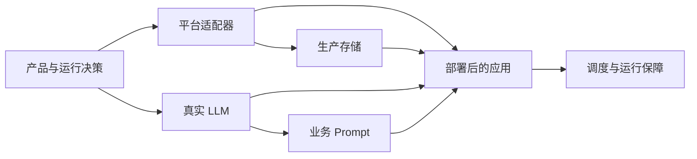

# Kaguya 仍需人工实现的部分

本文从 3.1 init commit 的现状出发，说明 Kaguya 从基础设施原型走向真实产品，还需要团队完成哪些人工决策和工程实现。

## 如何阅读本文

本文区分两类未完成工作：

- **人工决策**：需要产品、安全、运维或领域负责人确认的规则。它们不能靠生成代码自动得出。
- **工程实现**：决策确定后可以编码、测试和部署的能力。

优先级含义：

- **P0**：真实平台最小闭环。完成后才能称为一个可实际使用的 Bot。
- **P1**：可维护、可恢复、可评估。完成后才能承担稳定的长期运行。
- **P2**：按产品需要扩展。只有出现明确需求或容量信号后再投入。

优先级用于表达依赖和实施顺序，不是工期承诺。

## 已有基础，不需要重做

当前仓库已经提供以下可复用基础：

- `@kaguya/schema`：事件、消息、memory、Prompt、节点运行和 LLM trace 契约；
- `@kaguya/sdk`：事件、监听器、节点和工作流的声明 API；
- `@kaguya/engine`：带前置校验的进程内 EventBus、DAG 工作流执行和节点生命周期记录；
- `@kaguya/scheduler`：manual、interval 和 cron 触发器原语；
- `@kaguya/prompt`：稳定的多片段 Prompt 编译、转义和 provenance；
- `@kaguya/llm`：统一模型边界、结构化输出校验、错误归一化和 trace；
- `@kaguya/database`：SQLite 迁移和 messages、memories、event runs、LLM traces repositories；
- `apps/api`：Bearer 认证、严格消息校验、限流、OpenAPI 和可注入的 `MessageIngress` 核心入站 port；
- `apps/demo`：消息、心跳和定时记忆三条确定性工作流；
- `promptfoo`：route、reply、state、memory 的离线 Prompt 结构回归。

这些能力是后续实现应继续使用的基础，但不代表生产集成已经存在。尤其不要绕开现有的事件校验、`traceId/sessionId` 绑定、Prompt provenance、LLM 输出校验和运行记录，另写一套不兼容的入口。

## 总体实施顺序

这张图表达的是依赖关系：团队应先明确产品与运行边界，再完成真实入口、模型、Prompt 和存储，最后把它们装配为可部署、可持续运行的应用。

## P0：真实平台最小闭环

### P0.1 产品和运行边界

**当前基础**

demo 已经展示消息、心跳和定时记忆的流转方式，但 persona、policy、模型输出和触发方式都是确定性样例。

**为什么必须人工参与**

是否回复、何时主动回复、允许保存什么数据以及失败时如何表现，都是产品行为和责任边界，不能由框架自行决定。

**人工决策**

- 首个支持的平台、账号类型和目标用户；
- Bot 是私聊、群聊还是两者都支持；
- 回复时机、主动消息频率、静默条件和人工接管规则；
- 允许处理与保存的内容类型；
- 可接受的延迟、成本和可用性目标；
- 内测、灰度和正式发布的边界。

**工程交付物**

- 一份可版本化的产品行为规范；
- 开发、测试、预发布和生产环境的配置模型；
- 将产品规则映射到 route、reply、heartbeat 和 memory workflow 的配置接口；
- 对不允许场景的明确拒绝或降级行为。

**依赖**

无。其他 P0 任务都依赖这里的决定。

**推荐角色**

产品/领域负责人主责，AI/Prompt、平台集成、安全和后端负责人共同评审。

**验收标准**

- 每种消息场景都能回答“是否处理、是否保存、是否回复、由谁负责”；
- route 和 heartbeat 不再依赖未审阅的样例 policy；
- 环境之间的行为差异能由显式配置解释。

### P0.2 平台入站与消息发送适配器

**当前基础**

`apps/api` 能认证并校验 `sessionId/text`，再把 `{ sessionId, text, requestId }` 交给 `MessageIngress`；当前没有实现该 port 的 core dispatcher、持久队列或 consumer。`apps/demo` 能构造 `message.received` 并通过 `dispatchEvent` 进入工作流，但没有连接任何真实聊天平台，也没有真实发送出口。

**为什么必须人工参与**

平台权限、Webhook 验证、消息确认、群聊语义、限流和发送格式因平台而异，并涉及真实账号和平台审核。

**人工决策**

- 首个平台及其 SDK/API；
- Webhook、长连接或轮询接入方式；
- 用户、群组、会话和消息 ID 的映射规则；
- 文本之外的消息是否拒绝、忽略或降级；
- 平台重试与 Kaguya 重试的责任边界。

**工程交付物**

- 入站 gateway，将平台事件严格转换为 Kaguya `EventDefinition`；
- Webhook 签名、时间戳和重放校验；
- 平台 ID 到 Kaguya `sessionId` 的稳定映射；
- 出站 sender，将已持久化回复发送到对应平台；
- 入站/出站错误归一化、限流处理和契约测试；
- 平台 sandbox 或测试账号的端到端测试。

**依赖**

依赖 P0.1；与 P0.5 的幂等字段和消息状态设计共同完成。

**推荐角色**

平台集成工程师主责，后端工程师和安全负责人评审。

**验收标准**

- 一个真实平台文本消息经过签名校验后产生合法 `message.received`；
- 非法签名、过期请求和重复平台事件不会触发业务副作用；
- 回复通过平台 API 发回原会话，并记录平台 message ID；
- 平台限流、超时和发送失败具有确定的重试或失败状态；
- adapter 不直接调用 workflow 节点或绕过 `dispatchEvent`。

### P0.3 真实 LLM provider 与模型策略

**当前基础**

`@kaguya/llm` 已提供统一生成边界、四类响应 schema、错误分类和完整 trace；同时提供基于 Vercel AI SDK 的 OpenAI-compatible 动态 adapter，支持按次配置 URL、模型、鉴权、超时和重试。该 adapter 属于 core/application 层，不由应用 API 网关暴露；它尚未接入 `KaguyaLlmClient` 的业务 schema 与 trace，demo 仍只注入确定性 mock model。

**为什么必须人工参与**

模型选择会同时影响质量、成本、延迟、地域、隐私、配额和供应商依赖，需要真实数据和预算约束才能决定。

**人工决策**

- provider、模型和允许的备用模型；
- route、reply、state、memory 是否使用相同模型；
- 每类调用的超时、token、成本和延迟上限；
- 限流、配额耗尽和 provider 故障时的降级策略；
- 数据是否允许发往第三方模型及其地域要求；
- 密钥的申请、轮换、吊销和审计责任。

**工程交付物**

- 将 OpenAI-compatible 动态调用器或其他 provider adapter 接入 `KaguyaLlmClient`；
- 按 LLM kind 选择模型和参数的配置；
- secret manager 注入，不把密钥写入仓库或普通日志；
- 超时、取消、限流和受控重试；
- provider usage 到统一 usage/成本字段的映射；
- mock、contract 和受控集成测试。

**依赖**

依赖 P0.1；为 P0.4 的 Prompt 评估提供真实模型环境。

**推荐角色**

AI 工程师主责，SRE/安全和项目负责人共同确认成本与数据边界。

**验收标准**

- 四类 LLM 调用都能通过现有 `KaguyaLlmClient` 运行真实模型；
- 结构错误不会写入消息或 memory；
- 超时、取消、限流和 provider 错误保持正确的 retryable/cancelled 分类；
- 每次调用都能按 `traceId/workflowId/nodeId` 找到输入、输出、usage 和耗时；
- 密钥不会出现在 Git、错误响应或应用日志中。

### P0.4 人格、路由、回复、状态和 memory Prompt

**当前基础**

`@kaguya/prompt` 已支持稳定组装与 provenance，Promptfoo 已验证四类 Prompt 的结构；demo 文本只是用于跑通流程的固定样例。

**为什么必须人工参与**

人格、回复风格、主动性、关系判断和记忆提取标准直接决定产品体验，也可能带来安全、偏见和隐私问题。

**人工决策**

- persona 的身份、语气、禁区和一致性要求；
- route 的回复/静默原则及 reason 是否对外展示；
- heartbeat 主动回复的频率和条件；
- mood、relationship 和短时记忆的业务语义；
- 哪些内容可以成为长期 memory，哪些必须忽略或删除；
- Prompt 变更的评审人与发布门槛。

**工程交付物**

- 五类经过人工审阅、版本化的 Prompt/policy；
- Prompt fragment 的配置来源和版本字段；
- 正常、边界、对抗和隐私样例集；
- 每类输出的质量断言与拒绝条件；
- Prompt 版本与 LLM trace 的关联；
- Prompt 变更说明和回滚方式。

**依赖**

依赖 P0.1 和 P0.3；后续由 P1.3 建立发布门禁。

**推荐角色**

产品/领域负责人和 AI/Prompt 负责人共同主责，安全负责人评审敏感场景。

**验收标准**

- 每类 Prompt 都有明确负责人、版本和变更记录；
- 真实对话样例能覆盖回复、静默、主动回复和 memory 提取；
- Promptfoo 在约定数据集上达到团队批准的质量阈值；
- Prompt 注入和恶意内容不会改变系统边界；
- trace 能说明最终 Prompt 来自哪些片段和版本。

### P0.5 生产数据存储与数据治理

**当前基础**

`@kaguya/database` 提供事务化 SQLite migrations 和四类 repository，适合本地原型或单实例部署。

**为什么必须人工参与**

生产数据库、备份、保留、删除、加密和访问权限取决于部署规模、合规要求和用户承诺。

**人工决策**

- 单实例 SQLite 是否满足首个发布阶段，何时切换服务型数据库；
- 消息、memory、Prompt 和 trace 的保留期限；
- 用户查看、导出、删除数据的范围；
- 备份恢复目标、加密和数据库访问权限；
- 哪些字段属于敏感数据，哪些日志必须脱敏。

**工程交付物**

- 生产 repository adapter 或经验证的 SQLite 运行方案；
- 可重复的 schema migration 发布与回滚流程；
- 备份、恢复演练和完整性检查；
- 数据保留、过期清理、用户删除和审计任务；
- 数据库连接、并发、超时和故障监控；
- 平台消息 ID、发送状态和幂等键所需的数据模型。

**依赖**

依赖 P0.1；与 P0.2 的平台消息生命周期和 P1.1 的可靠投递设计对齐。

**推荐角色**

后端/数据工程师主责，SRE、安全和产品负责人共同确认数据治理。

**验收标准**

- migration 能在空库和上一生产版本上成功执行；
- 备份能在隔离环境恢复并通过数据完整性检查；
- 重复入站事件不会产生重复用户消息；
- 用户删除和保留任务可验证且有审计记录；
- 数据库不可用时不会把未持久化操作报告为成功。

### P0.6 常驻调度、部署和运行配置

**当前基础**

`@kaguya/scheduler` 提供触发器原语；demo 直接 dispatch heartbeat 和 memory tick，不运行常驻服务。

**为什么必须人工参与**

部署平台、时区、进程模型、发布方式、可用性和故障责任属于运维决策，错误配置可能导致重复主动消息或漏跑记忆任务。

**人工决策**

- 容器、虚拟机、serverless 或其他部署环境；
- heartbeat 和 memory schedule 的频率、时区与静默时段；
- 单实例还是多实例运行；
- 发布、回滚、维护窗口和故障值班方式；
- 健康检查和最低可用性目标。

**工程交付物**

- 独立应用入口及配置校验；
- 启动、优雅停止和信号处理；
- scheduler 的持久化装配或外部调度器接入；
- liveness、readiness 和依赖健康检查；
- 开发、预发布、生产部署清单；
- 自动发布和可回滚的部署流程。

**依赖**

依赖其他 P0 任务形成真实 composition root；多实例运行还依赖 P1.1 的协调与幂等。

**推荐角色**

后端工程师和 SRE 共同主责，产品负责人确认调度行为。

**验收标准**

- 新环境能仅凭文档和受控配置完成部署；
- 启动时缺少必需配置会立即失败且不产生业务副作用；
- 停机不会截断已确认但未记录的任务；
- heartbeat 和 memory schedule 在批准的时区与频率运行；
- 发布失败可回滚到上一可用版本。

### P0 完成定义

P0 只有在以下闭环同时成立时才算完成：

1. 真实平台消息通过合法身份验证进入统一事件边界；
2. 事件使用经过批准的 Prompt 和真实模型；
3. 消息、运行记录和 trace 写入生产存储；
4. 回复通过平台 API 发回原会话并记录结果；
5. heartbeat 和 memory 调度能在部署环境持续运行；
6. 所有失败都不会被误报为成功。

## P1：可维护、可恢复、可评估

### P1.1 持久化事件、幂等和故障恢复

**当前基础**

EventBus 和 WorkflowEngine 当前在单进程内执行；节点记录生命周期，但没有持久化队列、自动重试或崩溃后续跑。应用 API 网关虽然定义了 `MessageIngress` 交接 port，但生产 core dispatcher、持久队列和 consumer 均尚未实现。

**为什么必须人工参与**

投递保证、最大重试次数、死信处理和可接受的重复行为取决于平台语义与业务风险。

**人工决策**

- 使用 at-least-once 还是其他投递语义；
- 哪些事件/节点可以重试，最大次数与退避规则；
- 幂等键的来源和有效期；
- 死信由谁查看、重放或丢弃；
- 崩溃恢复时允许自动继续到什么程度。

**工程交付物**

- 持久化 queue/outbox/inbox 方案；
- consumer lease、ack、visibility timeout 和并发控制；
- 入站、LLM、数据库和出站发送的幂等保护；
- 基于结构化错误分类的重试策略；
- dead-letter 记录、检查和受控重放；
- 崩溃、超时、重复和乱序测试。

**依赖**

依赖 P0.2、P0.5 和 P0.6 的真实运行模型。

**推荐角色**

后端工程师主责，SRE 和平台集成工程师评审。

**验收标准**

- 进程在任意节点崩溃后，事件不会静默丢失；
- 重放同一入站事件不会重复保存或发送消息；
- retryable 错误按策略重试，non-retryable 错误不会无限循环；
- dead-letter 能通过受控操作重放并留下审计记录。

### P1.2 可观测性、告警和运行手册

**当前基础**

仓库已有基于 Pino 的统一 JSON 日志包、模块命名空间、AsyncLocalStorage 关联 ID、默认脱敏和可选 worker transport；API 网关已传播 `requestId/sessionId`，OpenAI-compatible adapter 已能写入 Pino。事件总线、工作流、scheduler、database 和平台 adapter 尚未全部接入，指标、跨服务 trace、日志采集、告警或值班手册也未实现。

**为什么必须人工参与**

告警阈值、数据可见范围、值班责任和故障优先级必须由团队根据服务目标确定。

**人工决策**

- 关键 SLI/SLO；
- 日志和 trace 的访问权限与保留周期；
- 哪些失败需要立即告警；
- 值班、升级和事后复盘流程。

**工程交付物**

- 结构化日志及 `traceId/sessionId/eventId/runId` 关联；
- 入站量、回复率、静默率、错误率、队列延迟、LLM 延迟/成本等指标；
- 跨 adapter、queue、workflow、LLM 和 sender 的 trace；
- 分级告警及去重；
- 常见故障的诊断、缓解、恢复和升级手册。

**依赖**

依赖 P0 真实链路；queue 指标依赖 P1.1。

**推荐角色**

SRE 主责，后端、AI 和平台集成工程师提供领域指标。

**验收标准**

- 任一生产回复能从平台 ID 追踪到 workflow、LLM 和发送结果；
- 模型、数据库、queue 或平台故障能在目标时间内触发告警；
- 告警包含可执行的 runbook 链接；
- 敏感 Prompt 和用户内容不会进入未授权日志。

### P1.3 Promptfoo 数据集与发布门禁

**当前基础**

现有四个离线用例验证 Prompt 结构，不代表真实业务质量，也没有阻止不合格变更发布。

**为什么必须人工参与**

正确回复、可接受风格、记忆质量和安全边界需要领域判断与人工标注。

**人工决策**

- 数据集来源、采样和脱敏方式；
- route/reply/state/memory 的质量维度；
- 发布阈值、允许波动和人工复核规则；
- 成本、延迟和质量的取舍。

**工程交付物**

- 版本化、脱敏的代表性回归数据集；
- 确定性断言、评分器和人工 rubric；
- 基线模型/Prompt 的质量、成本和延迟报告；
- CI 中的 Promptfoo 门禁；
- 新模型和 Prompt 的对比、批准与回滚流程。

**依赖**

依赖 P0.3 的真实模型和 P0.4 的批准 Prompt。

**推荐角色**

AI/Prompt 负责人主责，产品/领域负责人标注与审批，工程师接入 CI。

**验收标准**

- 数据集覆盖正常、静默、主动、敏感、对抗和 memory 场景；
- 同一候选版本能重复产生可比较报告；
- 未达到批准阈值的模型或 Prompt 变更不能发布；
- 评估数据不包含未经授权的生产敏感信息。

### P1.4 Memory 检索、排序和生命周期

**当前基础**

当前 repository 能保存和按时间读取 memory，demo 只把最近结果拼入 Prompt，没有语义检索、质量排序、冲突处理或用户控制。

**为什么必须人工参与**

什么值得记、保存多久、何时引用以及如何允许用户纠正，决定产品体验与隐私风险。

**人工决策**

- memory 类型、来源可信度和重要性标准；
- 关键词、向量、混合或其他检索方式；
- 相关性、时效性、重复和冲突的排序规则；
- 用户查看、纠正、固定和删除 memory 的能力；
- embedding/向量存储是否允许使用外部服务。

**工程交付物**

- `MemoryStore`/retriever 应用边界及选定实现；
- 写入去重、冲突标记和质量字段；
- 检索、排序、token 预算和 Prompt 注入策略；
- 压缩、淘汰、过期和删除任务；
- 离线检索质量与隐私测试；
- 数据迁移和供应商替换路径。

**依赖**

依赖 P0.4 的 memory 语义、P0.5 的治理规则和 P1.3 的评估方法。

**推荐角色**

AI/检索工程师和后端/数据工程师共同主责，产品与安全负责人评审。

**验收标准**

- 给定测试会话能检索到人工标注的相关 memory；
- 重复、过期或已删除 memory 不会进入 Prompt；
- 检索耗时和 token 使用满足批准预算；
- 用户纠正或删除能影响后续回复并可审计。

### P1.5 管理 API 与 UI

**当前基础**

仓库已有一个经过 Bearer 认证、严格消息校验和限流保护的基础应用 API 网关，并提供 OpenAPI 文档与 `MessageIngress` 核心入站 port。网关不接收或路由模型配置；core dispatcher、持久队列和 consumer 尚未实现。初版 Web UI 仅支持健康检查和消息提交，不是管理控制台；运行状态仍只能通过数据库、测试和命令行检查，也没有角色授权或操作审计。

**为什么必须人工参与**

管理功能可能读取敏感内容或触发重放、删除、停用等高风险操作，需要明确角色与审批。

**人工决策**

- 哪些角色能查看消息、Prompt、trace 和 memory；
- 哪些操作需要二次确认或审批；
- 配置是即时生效还是通过发布流程生效；
- 用户自助能力与内部运维能力的边界。

**工程交付物**

- 经过认证和授权的管理 API；
- 服务、queue、scheduler 和 provider 状态页；
- 按关联 ID 查询 event run、LLM trace 和发送结果；
- 配置版本查看与受控修改；
- dead-letter 重放、用户数据删除等安全操作；
- 管理操作审计和端到端权限测试。

**依赖**

依赖 P1.1、P1.2 和 P1.6 提供可靠状态、身份与审计。

**推荐角色**

后端和 UI 工程师共同主责，安全、SRE 和产品负责人确认权限与流程。

**验收标准**

- 未授权用户无法读取或修改任何管理数据；
- 高风险操作具有确认、权限检查和审计记录；
- 一次失败能从 UI/API 定位到相应 run、trace 和 dead-letter；
- UI 不直接访问生产数据库。

### P1.6 安全、隐私和审计

**当前基础**

代码避免提交真实密钥，并对事件和 LLM 输出做结构校验；尚未完成真实部署的威胁建模、权限体系和隐私流程。

**为什么必须人工参与**

风险接受、数据分类、供应商审核、保留期限和事件响应都需要组织责任人批准。

**人工决策**

- 数据分类和允许的处理地域；
- 平台、模型、数据库和运维权限；
- 密钥轮换与紧急吊销流程；
- 内容安全、滥用和用户举报策略；
- 安全事件通知与响应责任。

**工程交付物**

- 覆盖 adapter、Prompt injection、LLM、存储、管理面和供应链的威胁模型；
- 最小权限的 service account 与 secret manager；
- 依赖、镜像和配置扫描；
- 敏感字段脱敏、访问审计和异常访问告警；
- 数据导出、删除和安全事件演练；
- 安全发布检查表。

**依赖**

贯穿全部 P0/P1；应在真实数据进入系统前完成最低安全基线。

**推荐角色**

安全/隐私负责人主责，所有子系统负责人共同整改。

**验收标准**

- 高风险威胁有明确缓解措施和负责人；
- 生产服务只拥有完成职责所需的权限；
- 密钥轮换不会要求修改代码或提交仓库；
- 数据访问和管理操作可审计；
- 删除、泄露和密钥失效场景经过演练。

### P1 完成定义

P1 只有在以下条件同时成立时才算完成：

- 关键事件不会因进程崩溃静默丢失，重复投递不会重复产生业务结果；
- retryable、non-retryable 和 cancelled 错误按批准策略处理；
- 关键链路可观察、可告警、可按 runbook 恢复；
- Prompt 或模型变更未达到回归阈值时会被发布流程阻止；
- memory、管理入口和生产数据具备经过审核的权限与生命周期。

## P2：按产品需求扩展

P2 不是已经承诺的范围。只有出现明确产品信号或容量瓶颈后，再为对应方向单独设计和排期。

| 扩展方向               | 进入条件                                                   | 实施时必须保留的边界                                          |
| ---------------------- | ---------------------------------------------------------- | ------------------------------------------------------------- |
| 更多消息平台           | 已有平台闭环稳定，且有可量化的新平台用户需求               | 新 adapter 仍转换为统一事件，不把平台逻辑写进 engine          |
| 图片、音频、表情、文件 | 产品已定义支持的媒体、大小、存储期限、审核与降级行为       | 媒体元数据进入 schema；二进制存储与 Prompt/trace 访问受控     |
| 工具、插件、外部服务   | 有明确任务需要模型调用外部能力，并完成权限与误操作风险评估 | 工具输入输出结构化；授权、超时、幂等和审计在应用边界完成      |
| 权限和租户隔离         | 单一信任域已不能满足组织、团队或商业客户需求               | tenant ID 贯穿事件、存储、queue、trace 和管理权限             |
| 多实例与水平扩展       | 单实例经过测量无法达到吞吐、延迟或可用性目标               | scheduler leader/lease、queue consumer 和数据库并发语义先明确 |

选择具体供应商或框架前，应先记录需求、约束、退出成本和验收基准，不因现有 demo 的实现细节过早锁定方案。

## 需要团队先确认的决策

| 决策主题     | 必须回答的问题                                           | 主要负责人            |
| ------------ | -------------------------------------------------------- | --------------------- |
| 平台与账号   | 支持哪个平台、私聊/群聊、需要哪些权限、平台审核由谁负责  | 产品、平台集成        |
| 回复行为     | 什么情况下回复/静默/主动回复，哪些内容拒绝，何时人工接管 | 产品、AI/Prompt、安全 |
| 模型策略     | provider、模型、成本/延迟目标、备用方案、允许传输的数据  | AI、项目负责人、安全  |
| 数据治理     | 数据分类、保留、删除、导出、备份恢复目标和访问权限       | 产品、数据、安全、SRE |
| 部署与可用性 | 环境、地域、时区、发布回滚、SLO、值班和故障升级          | SRE、后端、项目负责人 |
| Memory 体验  | 什么值得记、何时引用、如何纠正/删除、质量如何衡量        | 产品、AI/检索、安全   |
| 评估与发布   | 数据集、质量阈值、成本/延迟阈值、审批人与回滚条件        | 产品、AI、工程负责人  |

重要决策应形成版本化的 ADR、产品规范或安全记录，并在相应代码、配置或 Prompt 变更中引用。

## 可直接转为 GitHub Issues 的检查表

### P0

- [ ] 确认首个平台、账号类型、私聊/群聊范围和平台权限。
- [ ] 形成 route、heartbeat、memory、数据保存和人工接管的产品行为规范。
- [ ] 实现入站 adapter 的签名、重放和事件转换契约测试。
- [ ] 实现稳定的 platform ID → `sessionId` 映射及重复事件幂等。
- [ ] 实现出站 sender 并记录平台 message ID、发送状态和错误。
- [ ] 确认真实 LLM provider、各 kind 模型、预算、超时和降级规则。
- [ ] 通过 secret manager 注入模型和平台密钥并完成轮换演练。
- [ ] 版本化 persona、route、reply、state 和 memory Prompt。
- [ ] 建立经过人工审阅的真实模型 Prompt 基线用例。
- [ ] 确认生产数据库、迁移、备份、保留、删除和恢复目标。
- [ ] 为平台消息和发送状态补齐生产数据模型及 migration。
- [ ] 实现生产 composition root、配置校验和优雅停止。
- [ ] 装配 heartbeat/memory scheduler 并确认时区和静默时段。
- [ ] 建立预发布端到端测试：真实入站 → LLM → 存储 → 真实发送。
- [ ] 建立可回滚的生产部署流程。

### P1

- [ ] 确认投递语义、幂等键、重试矩阵和 dead-letter 责任人。
- [ ] 实现持久化 inbox/outbox 或 queue，并通过崩溃恢复测试。
- [ ] 验证重复、乱序、超时和 provider 限流不会重复发送消息。
- [ ] 统一结构化日志字段并贯通平台 ID、event、run、LLM 和发送结果。
- [ ] 建立错误率、队列延迟、LLM 延迟/成本和 scheduler 漏跑告警。
- [ ] 为关键告警编写并演练 runbook。
- [ ] 建立脱敏、版本化的真实 Promptfoo 数据集和评分规则。
- [ ] 把质量、成本和延迟阈值接入发布门禁。
- [ ] 定义并实现 memory 检索、排序、去重、过期和用户删除。
- [ ] 验证 memory 检索质量、延迟、token 预算和隐私约束。
- [ ] 定义管理角色、权限和高风险操作审批规则。
- [ ] 实现经过认证授权的管理 API/UI 与操作审计。
- [ ] 完成威胁建模、最小权限、secret 轮换和数据删除演练。
- [ ] 完成一次生产故障恢复和安全事件桌面演练。

### P2

- [ ] 在出现明确需求后，为第二个平台单独编写 adapter 设计与契约测试。
- [ ] 在媒体产品规则和存储策略批准后设计图片/音频/文件事件。
- [ ] 在完成权限与误操作评估后设计工具/插件调用边界。
- [ ] 在出现多租户需求后设计 tenant 隔离、迁移和审计方案。
- [ ] 在测量证明单实例不足后设计多实例 scheduler 与 consumer 协调。

## 建议的角色分工

| 角色             | 主要责任                                                        |
| ---------------- | --------------------------------------------------------------- |
| 项目/产品负责人  | 产品边界、优先级、验收、成本和发布决策                          |
| 平台集成工程师   | 平台认证、入站事件、ID 映射、发送出口和平台限流                 |
| AI/Prompt 负责人 | 模型策略、Prompt、评估数据、质量阈值和模型回归                  |
| 后端/数据工程师  | composition root、repository、queue、幂等、migration 和管理 API |
| AI/检索工程师    | memory 检索、排序、压缩、质量评估和 token 预算                  |
| SRE              | 部署、scheduler、可观测性、告警、备份恢复和故障响应             |
| 安全/隐私负责人  | 威胁模型、权限、secret、数据治理、审计和事件响应                |
| UI 工程师        | 在权限和 API 明确后实现管理与用户控制界面                       |

一人可以承担多个角色，但每个决策和交付物仍应有唯一明确的负责人。

## 完成定义

- **P0 完成**：真实平台的入站、真实模型、批准 Prompt、生产存储、出站发送和常驻调度形成可验证闭环。
- **P1 完成**：系统面对重复、失败和崩溃时可恢复，面对 Prompt/模型变更时可评估，面对生产事件时可观察和审计。
- **P2 单项完成**：只有对应需求的设计、实现、迁移、测试、运维和退出方案全部满足时，才视为该扩展能力完成。

在 P0 和 P1 完成前，不应仅凭 demo 跑通、单次真实模型调用成功或 UI 可展示，就宣称系统已经生产就绪。
