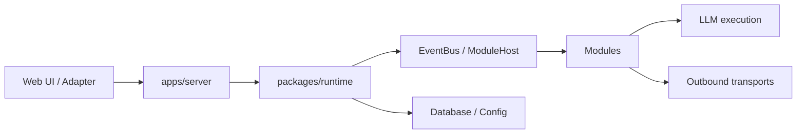

# 开发文档

本分区面向贡献者，描述系统为什么这样设计、各包承担什么职责，以及修改后需要验证什么。

## 架构总览

## 文档分层

### 设计说明

解释关键决策、职责边界、数据流和安全约束。

### 实现指南

说明目录、公共接口、测试策略和常用开发命令。

### 参考资料

稳定 API、schema 和配置字段放在[参考资料](../reference/)中，避免与教程混写。

## 贡献要求

新增或修改中文内容时同步英文镜像；新增页面时同步更新两套侧边栏。完整格式见[文档编写规范](./markdown-features)。
