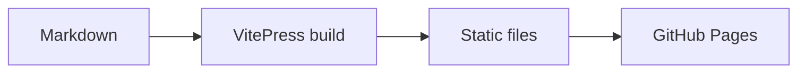

# 文档编写规范

本页既是写作约定，也是主题能力的可视化验收页。中文是事实来源，英文必须保持相同的章节、代码和术语。

## 页面结构

每页只使用一个一级标题。二级和三级标题会自动进入右侧“本页目录”，因此标题应表达信息层级，而不是只用于放大文字。

::: info 内容页不使用表格
字段说明优先采用“粗体字段名 — 解释”的定义式写法，保证移动端可读性。首页可以按需使用表格。
:::

## 提示容器

::: tip 建议
用于不会影响正确性的推荐实践。
:::

::: warning 注意
用于安全、兼容性或不可逆操作前的提醒。
:::

::: danger 风险
用于可能导致数据损坏、凭据泄露或服务中断的操作。
:::

## Mermaid 图表



图表应解释文本难以清楚表达的流程、关系或状态变化；简单事实不需要画图。

## 代码组与图标

独立代码块使用代码组，并在标签中显式指定 Iconify 图标。

::: code-group

```bash [本地开发 ~vscode-icons:file-type-shell~]
pnpm docs:dev
```

```bash [生产预览 ~vscode-icons:file-type-shell~]
pnpm docs:build
pnpm docs:preview
```

:::

## 时间线

::: timeline 框架阶段
- 建立中英文镜像目录。
- 配置顶部导航、左侧章节导航和右侧页内目录。
:::

::: timeline 内容阶段
- 用当前代码和 schema 填充事实内容。
- 为截图、链接和命令补充自动检查。
:::

## 静态资源

文档图片放在 `public/images/`，正文使用 `/images/...` 引用。站点 Logo、角色头像和标题图应分别保持固定目录，避免散落在内容文件旁。
