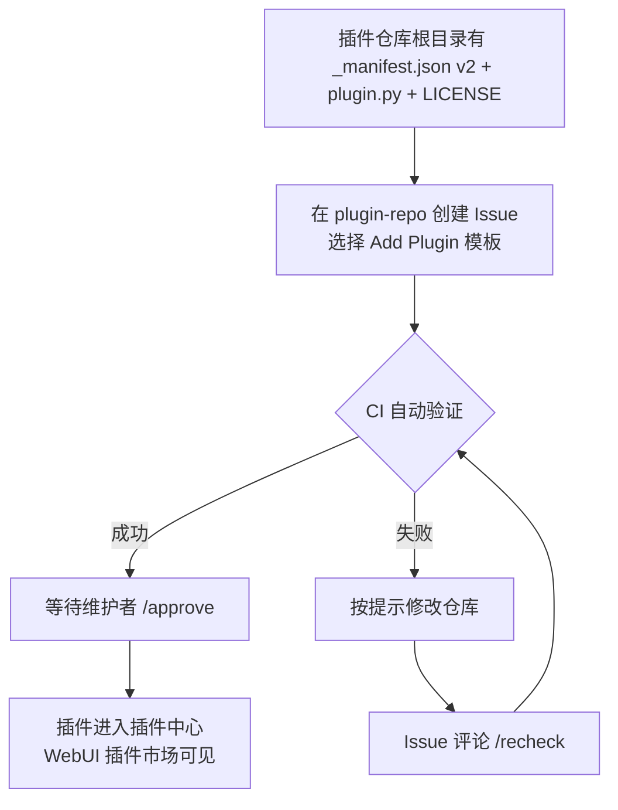

# 提交插件

写完插件并验证本地运行正常后，就可以把它提交到麦麦官方插件中心，让所有用户都能通过 WebUI 插件市场搜索、安装你的作品。

## 插件中心是什么

插件中心（[plugins.maibot.chat](https://plugins.maibot.chat/)）由官方仓库 [Mai-with-u/plugin-repo](https://github.com/Mai-with-u/plugin-repo) 驱动。插件本身以**独立的公开 GitHub 仓库**形式存在，插件中心只维护一个 `plugins.json` 索引，通过自动化工作流验证每一个提交。

提交插件**完全开源免费**，不需要任何费用或邀请。审核通过后，你的插件会出现在插件市场的搜索结果中。

## 提交前：插件仓库要求

你的插件必须是一个**公开的 GitHub 仓库**，且根目录包含以下文件：

**`_manifest.json`** — 插件清单，使用 **manifest v2** 结构，字段规范见 [Manifest 系统](./manifest.md)
**`plugin.py`** — 插件入口文件，包含 `create_plugin()` 工厂函数
**`LICENSE`** — 许可证文件，类型应与 `_manifest.json` 中的 `license` 字段一致
**`README.md`** — 建议包含功能介绍、安装方式、配置说明和使用示例

::: tip 什么是插件仓库
插件仓库是**独立于 MaiBot 主仓库**的你的个人/项目仓库（例如 `https://github.com/you/my-plugin`），不是 MaiBot 的 `plugins/` 目录。插件中心通过 `_manifest.json` 的 `urls.repository` 字段定位它。
:::

## 提交方式：Issue 提交（推荐）

通过 Issue 模板提交，**无需 Fork、无需本地 Git 操作**，也能避免多人同时修改 `plugins.json` 带来的合并冲突。

1. 打开 [plugin-repo 仓库](https://github.com/Mai-with-u/plugin-repo) 的 [New Issue](https://github.com/Mai-with-u/plugin-repo/issues/new/choose) 页面，选择 **「Add Plugin / 添加插件」** 模板。
2. 填写信息：
   - **插件 ID**：建议与 `_manifest.json` 中的 `id` 保持一致。
   - **仓库地址**：填写完整的公开 GitHub HTTPS URL，例如 `https://github.com/username/my-plugin`。
3. 提交 Issue 后，CI 会自动读取你插件仓库根目录的 `_manifest.json` 并校验，结果会评论在 Issue 中。
4. 验证通过后，维护者会审核并使用 `/approve` 批准，你的插件就会被加入插件中心。

### 状态标签

**`pending-validation`** — 等待自动验证
**`validated`** — 验证通过，等待维护者批准
**`validation-failed`** — 验证失败，请根据提示修复
**`approved`** — 已批准并添加到插件中心
**`rejected`** — 被维护者拒绝

### 验证失败怎么办

1. 根据 Issue 中的错误提示修改你的插件仓库。
2. 修改完成后，在 Issue 中评论 `/recheck`。
3. CI 会重新验证，结果会再次评论在 Issue 中。

## 提交流程全览

## 提交清单

提交前对照检查一遍：

- [ ] 插件仓库是**公开**的 GitHub 仓库
- [ ] 根目录包含 `_manifest.json`（`manifest_version: 2`）、`plugin.py`、`LICENSE`
- [ ] `id` 稳定唯一，无空格、无路径字符
- [ ] 所有版本号都是三段式（`x.y.z`）
- [ ] `author` 是 `{ name, url }` 对象
- [ ] `urls.repository` 是公开 HTTPS 地址，无 `.git` 后缀
- [ ] `capabilities` 只声明实际需要的能力
- [ ] 本地已用真实 MaiBot 验证过插件能正常加载运行

## 更多信息

- [插件市场](https://plugins.maibot.chat/) — 浏览所有已收录插件
- [plugin-repo 仓库](https://github.com/Mai-with-u/plugin-repo) — 插件索引与贡献指南
- [Manifest 系统](./manifest.md) — `_manifest.json` 完整字段定义
- [开发指南](./) — 从零开始编写插件
